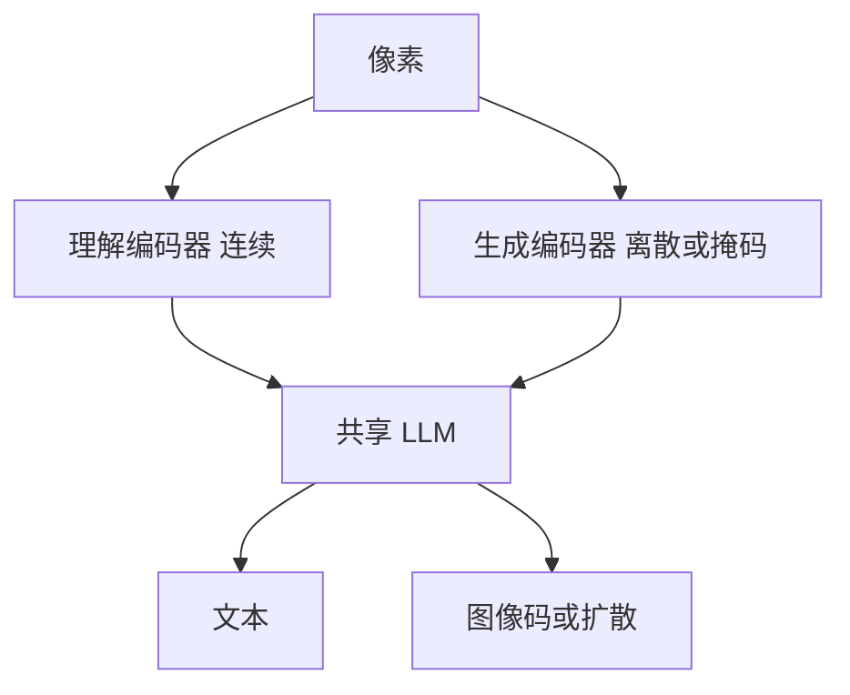

# 统一理解与生成 Janus / Show-o

同一套语言模型权重既要谈图又要造图。视觉编码器若为理解优化，量化码就伤 OCR；若为码本优化，谈图又变盲。

<footer>—— Wu 等 Janus（解耦视觉编码）；Xie 等 Show-o；对照 Chameleon 的统一离散 token</footer>

[上一课](/llm/mar-masked-ar)表明生成可以走连续。[连续对离散](/llm/continuous-vs-discrete-vision-tokens) 已把轴钉死。缺口是产品形态：一个模型、两套任务。Janus 拆视觉编码；Show-o 在一个 Transformer 里混自回归与离散扩散。后课 Transfusion 用「下一步 + 扩散」写进同一前向。

## 问题

理解要 [CLIP](/llm/clip) / SigLIP 式连续 patch + [LLaVA 投影器](/llm/llava-projector)，好绑定与 OCR。生成若用同一连续向量，没有 softmax 词表；若共用 VQ 编码器，理解掉细节。强行单编码器是零和。Janus 的回答是解耦：理解走连续视觉塔，生成走离散塔，语言骨干共享。Show-o 把理解当 AR 文本（含连续或离散视觉），生成用掩码离散扩散，仍一张网。

Chameleon 把图文都离散化进同一词表，接口干净，理解侧付量化税。

「统一」要声明统一的是权重、词表，还是训练混合。只把两个专家接在一个聊天入口，不是本课的统一模型。

## 方法

选接口：双塔（Janus）、混合目标单塔（Show-o / 后课 Transfusion）、全离散词表（Chameleon）。训练必须两任务混合，否则共享 LLM 会被一方洗掉。评测分列：POPE / VQA 与 FID / 文生图，禁止用单一「全能分」。视觉前端理解侧仍应是 [ViT](/llm/vit-as-encoder) 连续特征。

## 机制

解耦让梯度不再穿越同一视觉瓶颈：理解损失更新连续塔，生成损失更新码塔，LLM 学两套前缀语法。代价是参数与协议双份，以及「图既当输入又当输出」时两塔要对齐语义。单塔混合则靠目标加权，避免一种损失主导。

## 边界

双塔不是端到端世界模型。下一课把文本 CE 与图像扩散写进同一次 Transformer 计算。

## 小结

- 统一模型必须显式处理理解连续与生成离散的冲突。
- Janus 解耦编码器；Show-o 混合 AR 与掩码扩散。
- 评测必须分列理解和生成。
- 出处：Janus；Show-o；Chameleon。
