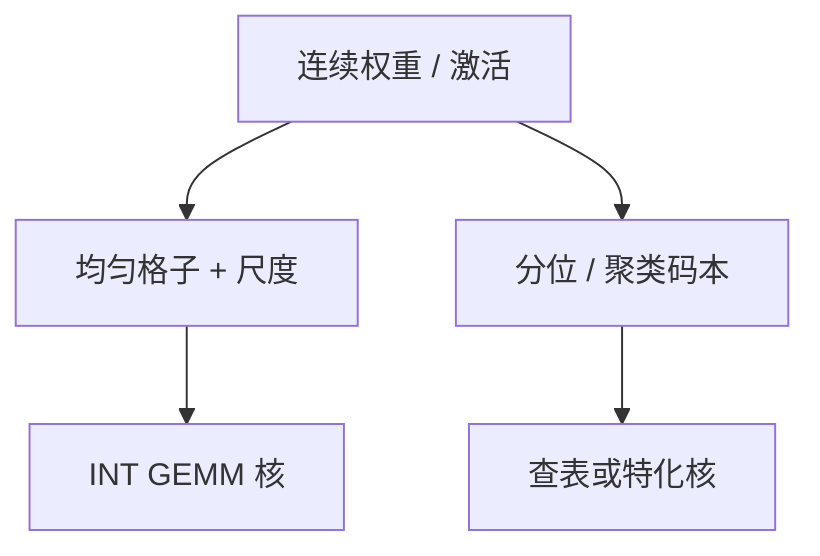

# 均匀与非均匀量化

均匀格子把动态范围等分成 $2^b$ 份；非均匀格子把码字堆到概率质量高的地方。两者都叫量化，误差曲线对离群与对正态权重完全不同。

<footer>—— 对照经典标量量化与 LLM 里 INT 网格 / 分位码本；部署实例见 GPTQ</footer>

[加速器对比](/llm/accelerator-comparison-method) 把「有没有低精度核」写成硬件维。本课打开「压缩进阶」：先讲格子本身。缺口不是从信息论第一课重讲率失真，而是 **均匀与非均匀在 LLM 权重/激活上各自伤害哪一段分布**。后课对称性、粒度、校准都假定你会：量化是一个编码器 $q$ 加一个反编码器，误差在连续值与有限码本之间。[GPTQ](/llm/gptq) 默认均匀分组格子；[QLoRA](/llm/qlora) 的 NF4 是非均匀分位——后课再展开，本课只把对立建清。

## 问题

记实数 $x$，码本 $\mathcal{C}=\{c_0,\ldots,c_{2^b-1}\}$，$q(x)=\arg\min_c |x-c|$（或带随机舍入）。均匀：$\mathcal{C}$ 是等差，由尺度 $s$ 与可选零点决定。非均匀：间距随 $x$ 变，或由分位数 / k-means / 手工码本给出。LLM 权重大致零峰、近似正态；激活常有[离群通道](/llm/why-activation-outliers)。均匀格子为覆盖离群把 $s$ 拉大，中间的质量挤成几个台阶；非均匀把台阶堆在零附近，离群要么单独码字、要么饱和。

硬件喜欢均匀：INT8 GEMM 是整数乘加再乘 $s$。非均匀要查表或分段，核少、吞吐差，除非码本极小且实现成对表。问题是 **统计上更优的码本，部署上可能没有核**——对比方法课的软件/硬件维在此落地。

本站「量化」在金融栏是微观结构，与权重量化无关。本课程只指数值离散化。

## 方法

均匀：选 $s$（常按 max 或百分位）、可选 clip，然后 round。实现与 Tensor Core INT 路径对齐。[GPTQ](/llm/gptq) / AWQ 主线都在这张网上改「取哪一个台阶」或「如何保护通道」，并不换码本几何。

非均匀：分位码本（后课 NF4）、对数量化、k-means 聚类码本（早期 Deep Compression）。训练期可学码本，推理就要把码本存下来并有核。PTQ 里对一层做 k-means 往往过拟合校准集，且 175B 上算不起——这是 GPTQ 坚持均匀的工程原因之一。

混合：多数值均匀，离群通道留高精（LLM.int8() 一类）——这是非均匀的极端：码本在通道维上不共享。它不是新的 $b$ bit，是粒度与混合精度，后课再写。

## 机制

均匀误差在 $[-s/2,s/2]$ 量级（未饱和时）。$s$ 由极值决定时，误差被离群绑架。非均匀若按输入分布的分位切，量化噪声在高密度区更小，等效提高「中间权重」的信噪比；尾部误差更大或靠饱和。权重近似高斯时，分位码本接近对正态最优的标量量化；激活离群时，任何全局码本都不够，必须先拆通道。

随机舍入让均匀量化无偏，利于训练（QAT）与某些梯度通信；推理 PTQ 多用确定 round-to-nearest，好复现。不要混。

对数格子对动态范围极大的激活有旧文献；现代 LLM 更常做迁移平滑或混精，而不是真的对数 ALU。没有核的对数量化只是分析工具。

## 边界与工程取舍

不要把「非均匀一定更准」写成部署结论。不要在没有反量化约定时交换均匀 INT4 检查点与 NF4 检查点。不要用权重直方图的最优码本去量化激活。下一课在均匀格子内部再切一刀：对称还是带零点。

## 小结

- 均匀：等差码本 + 尺度，对齐 INT 核；离群绑架 $s$。
- 非均匀：码字跟分布走，常需查表；NF4 是后课的分位实例。
- GPTQ 类 PTQ 主线是均匀网格上的误差补偿，不是换码本。
- 统计最优与硬件核可能冲突；验收用最终核路径。
- 出处：标量量化常识；GPTQ 均匀网格；QLoRA NF4 作对照入口。
