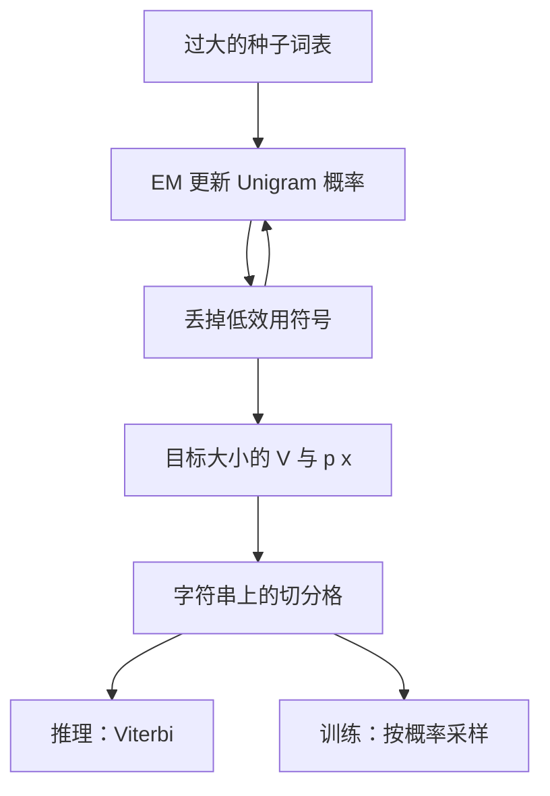

# Unigram 切分

子词正则化用从 Unigram 语言模型里概率采样的多种切分来训练，使模型不再绑死在某一种贪心分割上。

<footer>—— 据 Kudo, Subword Regularization: Improving Neural Network Translation Models with Multiple Subword Candidates, ACL 2018 整理</footer>

[上一课](/llm/bpe-merge-rule)给出了频率驱动的有序合并表：推理时贪心焊对，一条字符串一条切分。本课不重讲合并、也不重讲 token 是什么。缺口是：同一字符串在 $V$ 上通常有许多合法分割，BPE 只走其中一条由训练期计数决定的路径，既没有子词的生成概率，也不能在训练时把替代切分当作噪声。Kudo 的 Unigram 语言模型把切分写成似然问题，SentencePiece 把它做成可训练的词表加 Viterbi 解码。

## 问题

[BPE 合并规则](/llm/bpe-merge-rule)的确定性在部署时是优点，在估计时是限制。若 `unhappiness` 只能被焊成某一种碎片序列，模型从未见过另一种同样能拼回原文的分割，对拼写变体和噪声就脆。更根本的是：BPE 从不给每个子词一个 $P(x)$，因此无法问「在这张词表下，哪一条分割的联合概率最大」，只能问「合并表里哪一对更早」。

要把切分从程序变成模型，需要两样东西。第一，词表里每个符号带一个概率，使一条分割的质量可以相乘。第二，一种从语料估计这些概率、并删掉不怎么降低损失的符号的算法，否则 $|V|$ 无法收缩到预算内。Kudo 把符号当作独立的 Unigram，忽略切分内部的条件依赖——粗糙，但恰好能用动态规划穷举或近似穷举所有分割。

### 多种切分不是标注错误

对子词系统来说，多种切分是定义里就有的。`hello` 可以是一个原子，也可以是 `he`+`llo`，只要两者都在 $V$ 里。BPE 用合并历史消歧；Unigram 用似然消歧。训练时还可以故意不消歧，按概率抽样，强迫后续的嵌入与块对同一原文的不同离散序列都给出相近的预测。这就是子词正则化，BPE 做不到，除非另接一套随机切断规则。

Unigram 里的「独立」是建模假设，不是事实。相邻子词当然相关。这个假设的用处是让格（lattice）上的和积可以用前向算法算，而不是声称语言真是 Unigram。

## 方法

给定词表 $V$ 与概率 $p(x)\gt 0$（$\sum_{x\in V}p(x)=1$ 在实现里常做成损失归一），字符串 $X$ 的一条分割 $\mathbf{x}=(x_1,\ldots,x_m)$ 的概率是

$$
P(\mathbf{x})=\prod_{i=1}^{m} p(x_i).
$$

推理取 Viterbi 分割 $\arg\max_{\mathbf{x}} P(\mathbf{x})$，即在所有能拼回 $X$ 的分割里选联合概率最大的。训练时，Kudo 用 EM：E 步在当前 $p$ 下对语料的切分格求期望计数，M 步把计数归一成新的 $p$；再丢掉损失贡献最小的一批符号，缩小 $V$，迭代到目标大小。初始 $V$ 往往很大，从种子词和高频子串填满，再剪枝——方向与 BPE 相反。

SentencePiece 把这套流程做成对原始 unicode 字符串直接操作的工具，不必先按语言分词。采样切分时，从格上按概率抽出不是 Viterbi 的路径，温度或 $l$ 最佳列表控制多样性。推理仍可改回 Viterbi，以保持稳定。

### 与 BPE 的算法对照

BPE：从小表长到大表，每步加一个焊住的对，没有 $p(x)$。Unigram：从大表剪到小表，每步有 $p(x)$，切分是优化问题。两者最后都给你一张 $V$ 和一套把字符串变成 id 序列的规则，但规则的语义不同。BPE 的规则是「按冻结的合并优先级贪心」；Unigram 的规则是「在当前概率下做最短描述（最大似然分割）」。概率一变，Viterbi 路径可以变；合并表一冻，BPE 路径不变。

实践里常把 Unigram 的 Viterbi 结果当成「标准切分」存下来。真正吃到正则化好处的是训练期采样。若训练与推理都只走 Viterbi，Unigram 就退化成另一种确定性分词器，只是词表来源不同。

## 机制

Unigram 的动态规划把字符串看成可以在任意允许边界切开的格。节点是字符下标，边是 $V$ 中一个能覆盖这段跨度的符号。Viterbi 找一条边权乘积最大的路径；前向算法把所有路径的概率加起来，得到 $P(X)$ 的边际。EM 用这条边际做责任分配：经常出现在高概率路径上的符号得到保留，几乎只出现在差路径上的符号被剪掉。

这解释了它与频率合并的经验差别。BPE 会焊住「经常相邻」的对，即使这个对作为原子并不比拆开更省描述长度。Unigram 会留下「单独带着也能解释很多字符串」的符号，即使它们不是最高频相邻对。数字、词缀、汉字单字，常常在 Unigram 表里以不同的生存方式出现。谁更好，要看下游任务对稳定性与正则化的需要，而不是看哪张表更像语言学。

### 正则化如何进入损失

训练一个翻译或语言模型时，每次看到 $X$，先从 $P(\mathbf{x}\mid X)$ 抽一条分割，再把这条离散序列送进网络。网络必须对几种碎片化程度不同的输入都预测对。这把一部分切分不确定性从分词器挪到了模型容量里。推理若改回 Viterbi，等于在测试时取众数切分；若仍采样，则生成会多一重噪声，通常只用于分析，不用于对照实验的主结果。

子词正则化不是 dropout。它改的是输入的离散序列，不是隐单元。长度会变，位置对齐会变，后面的注意力看到的「谁是邻居」也会变。这是刻意的。

## 边界

Unigram 仍假设切分块独立，长程的「这两个词素总是一起出现」只能间接反映在 $p(x)$ 里，不能像高阶模型那样显式建模。格的边数随 $|V|$ 和字符串长度增长，需要剪枝或长度限制，否则中文长句上的动态规划会慢。与 BPE 的质量差距在大词表、大数据上往往小于词表大小和预分词选择带来的差距；换算法不是调 $|V|$ 的替代品。

SentencePiece 的实现细节——是否对空白做元符号、是否 byte fallback、NFKC 规范化——会同时影响 BPE 模式与 Unigram 模式。那些问题属于覆盖与往返，下一课起才定量讨论。本课只要求：当你看见「Unigram tokenizer」时，想到的是带概率的词表加格上的最优化，而不是另一张合并表。

## 小结

- BPE 用冻结合并表贪心焊对；Unigram 用 $p(x)$ 在切分格上做最大似然分割。
- 词表生长方向相反：BPE 自底向上合并，Unigram 自顶向下剪枝。
- 训练可采样多种切分做子词正则化；推理通常改回 Viterbi。
- 独立 Unigram 是为了让动态规划可行，不是语言事实。
- 与 BPE 的差别是切分语义，不是「什么是 token」；后者上一课已经钉死。
- 出处：Kudo, ACL 2018；Kudo & Richardson, *SentencePiece*, EMNLP 2018。
