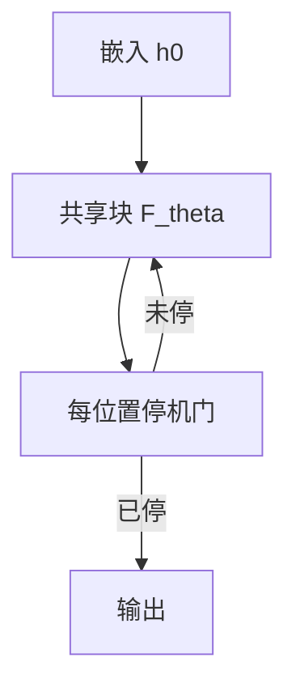

# Universal Transformer 与循环深度

与其堆互不共享的层，不如反复应用同一块 Transformer，并用自适应计算决定每步停在哪一跳。

<footer>—— Dehghani et al., Universal Transformers, ICLR 2019</footer>

[上一课](/llm/attention-head-roles)把功能放在「第 $\ell$ 层第 $h$ 头」。加深模型的默认办法是再复制一组不共享的参数，深度与参数量绑死。本课把深度改成**对同一块的循环次数**：参数按块计，计算按步计。Dehghani 等人的 Universal Transformer 还加上每位置的 ACT（自适应计算时间）。后课 looped Transformer 会把这件事收到更干净的「固定循环次数」；本课先保留 ACT 这条原论文设定。

## 问题

加层能叠功能，但第 1 层与第 24 层各养一套权重，浅层的注意力电路无法在深层以同一套参数复用。算法类任务往往需要「同一规则应用许多次」，参数复制不是规则复用。缺口是：把 Transformer 块当成 RNN 的转移函数，序列长度仍由注意力处理，**深度变成时间维上的迭代**。

这与 [ALBERT](/llm/albert-param-sharing) 的跨层共享相近，但 Universal Transformer 明确把迭代次数当成可学习或自适应的计算预算，而不是训练时绑死 $L$ 再微调。ALBERT 课在后，因为先要有循环深度这个概念，再谈「为了参数量去共享」。

这里的循环不是沿 token 的 RNN，沿 token 仍是并行注意力。循环轴是块的应用次数，对每个位置可以不同（ACT）。

## 方法

共享块 $F_\theta$，状态 $h^{(0)}$ 为嵌入（加位置）。$h^{(t+1)}=h^{(t)}+F_\theta(h^{(t)})$，注意力在当前 $t$ 的整段序列上算，仍是双向或因果，取决于任务。位置编码在每次迭代可以重新加入，以免迭代把绝对位置冲掉。

ACT：每个位置输出一个停机标量，用 Graves 的自适应计算时间累加，直到质量超过阈值或达到最大步数 $T_{\max}$。未停机的位置继续迭代；已停机的位置拷贝状态。训练用停机损失防止所有位置跑满 $T_{\max}$。

### 与普通 $L$ 层的计算对比

固定 $T=L$ 且无 ACT 时，FLOPs 与 $L$ 层不共享模型同阶，参数却只有一块。收益在参数与规则复用，不在单次前向变便宜。ACT 才可能让简单 token 早停、难 token 多迭代，这是后课早退要接的线。

## 机制

同一套 $W^Q,W^K,W^V$ 在不同迭代看见的残差流不同，头的功能随 $t$ 变，而不是随层号变。这要求块足够通用，能在「先做局部混合、再做长程检索」之间切换——功能分化从空间上的不同层，改成时间上的不同步。若块太弱，迭代只是把同一种错误重复 $T$ 次。

ACT 让计算分配跟内容走：标点可能一步够，嵌套结构要多步。停机门若学崩，要么全早停（欠计算），要么全满转（退回固定深度）。与后课固定 $T$ 的 looped 相比，ACT 把预算当成每位置的隐变量；与后课早退相比，这里的出口在共享块内部，而不是在互不共享的层号上。

推理延迟由最慢位置的迭代次数决定，除非实现真正跳过已停位置。批里一个难 token 会拖住整步，这是自适应深度的系统税。

## 边界

共享块训练更难：深度等效很大时，梯度穿过 $T$ 次同一参数，与 RNN 的梯度问题同类，需要残差与初始化约束。Universal Transformer 原文在算法与小规模翻译上示意，不是直接替代今日千亿解码器的配方。下一课去掉 ACT，只保留固定循环，便于与现代「looped」工作对齐。不要把本课写成已经解决了长推理链——那是提示与推理课的对象，这里只改块的复用。

## 小结

- Universal Transformer 沿深度循环同一块，参数与层数解绑；注意力仍沿序列。
- ACT 让每位置的迭代次数成为计算预算，停机失败则退回固定 $T_{\max}$。
- 功能随迭代步变化，要求块通用；弱块迭代无益。
- 批延迟由最慢位置决定；训练有 RNN 式梯度风险。
- 出处：Dehghani et al., ICLR 2019；ACT 见 Graves, 2016。
