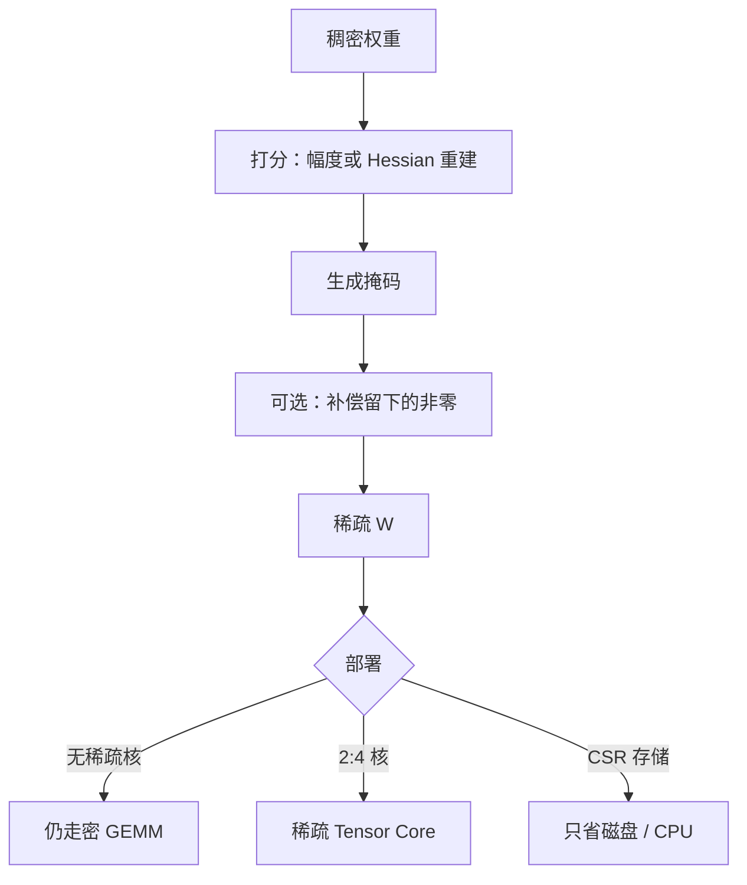

# 非结构化稀疏

按幅度把单个连接打成零，参数计数可以降一个数量级；没有匹配的稀疏核或固定模式，加速器仍按密矩阵计费。

<footer>—— Han et al., Learning both Weights and Connections, NeurIPS 2015；Han, Mao, Dally, Deep Compression, ICLR 2016；Zhu & Gupta, To prune, or not to prune, 2017</footer>

非结构化稀疏允许任意位置的权重为零，只要求一张与 $W$ 同形的掩码。Han 等人 2015 年先学后剪：训练稠密网，按幅度删小连接，再微调，反复几次。2016 年的 Deep Compression 把剪枝、量化、霍夫曼编码串成端侧存储配方。Zhu 与 Gupta 2017 年系统比较逐步幅度剪枝：在相同参数预算下，大网剪到稀，常常优于一开始就训小密网。大模型时代，Frantar 与 Alistarh 的 SparseGPT 把一次性、基于重建的剪枝做到千亿权重。本篇写掩码怎么来、为何精度可以高、以及为什么这和 [结构化剪枝](/llm/structured-prune) 不是同一张加速账单。

## 问题

稠密 GEMM 把很多接近零的乘加也做了。若这些项对输出贡献可忽略，理论上可以跳过。非结构化剪枝的希望是：重要性沿权重值高度不均，删掉最小的那一半，函数几乎不变。存储上，可以用稀疏格式（CSR 等）只存非零与索引；Deep Compression 再叠加量化与熵编码，手机上的体积可以降一个数量级。

索引本身是开销：每个非零要带列号，稀疏度不够高时，CSR 比密矩阵更大、更慢。GPU 上不规则稀疏的 gather 会打碎 Tensor Core 的规则 tile。于是出现分裂：研究表上的「90% 稀疏、精度几乎不掉」可以是真的；生产表上的 tokens/s 可以完全不动。问题收成两问：如何在 LLM 上找到这么一张掩码而不做三周重训；如何让掩码变成墙钟——后者往往要求 2:4 那种**结构化的非零模式**，已经滑向半结构，而不是任意位置。

### 幅度剪枝的假设

「小权重不重要」假设损失对参数的一阶、二阶与 $|w|$ 相关。早期 ReLU 网里这大致成立。LLM 里有通道异常值：小权重乘大激活可以很大，AWQ 在量化里已经强调过同一点。纯幅度剪枝会误删「权小、激活大」的连接，也会保留「权大、激活长期为零」的死通道。校准激活上的重建目标（SparseGPT 把 GPTQ 那套 Hessian 补偿改成剪枝）比纯 $|W|$ 更对齐层输出，代价是要校准数据，并仍不保证有核。

Zhu & Gupta 的标题是问句：该不该剪。他们的观察是逐步剪到高稀疏可以，但不是免费的精度；自动搜索稀疏度调度比一次剪到位稳。把 2017 年的结论写成「永远该剪」是断章。

## 方法

幅度迭代：训练 → 按 $|w|$ 设掩码 → 冻结零元 → 再训未掩码元 → 提高稀疏度。Zhu & Gupta 用三次多项式把稀疏度从 0 爬到目标，避免早期就把后期才变重要的连接掐死。最终掩码通常冻结，部署要么稀疏核，要么仍密存但乘掩码（后者只对精度实验有意义）。

一次性重建：对一层 $\min\|\hat{W}X-WX\|$ 且 $\hat{W}$ 满足稀疏约束。SparseGPT 按列（或块）决定哪些位置保留，并用 Hessian 把删掉的质量补偿到留下的权重上，类似 GPTQ 把量化误差 squirt 到未量化列。校准一小批文本，不回传全网，使 175B 级也可以「剪完」而不是「再训完」。它产出的仍是非结构化（或块稀疏）掩码加更新过的非零值。

半结构 2:4：每 4 个连续元素保留 2 个非零。这是 NVIDIA Ampere 稀疏 Tensor Core 能加速的模式。选哪两个可以用幅度或重建；一旦服从 2:4，加速才有硬件承诺。它比任意 50% 稀疏严，精度通常略差，但是少数能把非结构化思路变成墙钟的档。

量化可以在剪之后做：Deep Compression 的顺序是剪 → 量化 → 编码。LLM 上更常见是二选一做深（要么 4-bit 稠密，要么高稀疏 16-bit），两边都做时误差相乘，需要联合校准，不能默认可加。

## 机制

掩码选定后，函数落在坐标稀疏的子空间里。补偿步骤（SparseGPT）在该约束下做一次局部最小二乘，使层输出在校准分布上尽量回到 $WX$。这解释了「一次性剪还能准」：准的是校准域的重建，不是任意下游。换代码或指令分布，被删的连接可能刚好是长尾功能，与 GPTQ 校准过拟合同构。

逐步重训让活着的连接接手被删连接的功能，表示可以旋转，不要求功能轴对齐——这是非结构化相对结构化的精度优势。接手发生在微调数据上；没有恢复训练的一次性剪枝，不能声称享有 Han 2015 那种「反复剪再训」的精度。

存储压缩与计算压缩必须分开报。霍夫曼编码后的文件小，decode 仍要把索引解成可乘的布局，CPU 端侧有时划算，GPU 服务常不划算。Deep Compression 的目标机是嵌入式，不是 HBM 上的 70B decode。

### 稀疏度与精度的调度

过早达到 90% 稀疏，网络还没把信息迁到留下的连接上，会塌。过晚，训练预算浪费在即将为零的权重的优化器状态上。Zhu & Gupta 的立方调度是一种被反复验证的默认，不是定理。LLM 一次性方法把「调度」收成校准时间，用二阶补偿代替时间维上的迁移；稀疏度上限仍然存在，2-bit 量化碰到的「网格太粗」在剪枝里对应「留下的自由度不够」。

## 边界与工程取舍

没有 2:4 或厂商块稀疏核时，非结构化剪枝对 GPU LLM 服务几乎只是研究与存储实验。NPU 若声明非结构化加速，要看是否其实要求块内模式。MoE 专家内部的非结构化同样，除非专家本身变小到换一种核。

与量化竞赛：同样的 4× 存储，W4A16 稠密核成熟；50% 稀疏 FP16 体积只减半，还可能更慢。非结构化作为压缩，今天更常出现在「必须保持 16-bit 数值语义、又要减磁盘」或「硬件承诺了 2:4」的夹缝，而不是默认取代 GPTQ。

### SparseGPT 不是 GPTQ 的稀疏版别名

两者都用层输出 Hessian 补偿，对象不同：一个把值钉到格子，一个把位置钉到零。检查点一个是 INT4+尺度，一个是掩码+FP16 非零。服务引擎不能混加载。写「我们用了 GPTQ 做稀疏」是错的。

Han 2015/2016 的实验网远小于 LLM，连接剪完可以在桌面 CPU 上用稀疏 BLAS。把「13 倍压缩」写到 LLaMA-70B 的 GPU 延迟上，是把存储论文当成系统论文引用。

## 小结

- 非结构化稀疏按位置掩码置零，精度上往往优于同样比例的结构删除，因为功能可以迁到散落的大权重上。
- Han 系方法是剪与再训迭代；Zhu & Gupta 强调逐步稀疏度调度；SparseGPT 用校准重建做一次性剪。
- 无稀疏核则无 decode 加速；2:4 是少数能兑现墙钟的半结构模式。
- 小权重乘大激活会被幅度剪枝误伤；重建目标更对齐层输出，仍绑定校准域。
- 存储编码（Deep Compression）与计算跳过是两张账单。
- 与 4-bit 稠密量化相比，GPU 服务通常后者更易落地。
- 出处：Han et al., *Learning both Weights and Connections for Efficient Neural Networks*, NeurIPS 2015；Han, Mao, Dally, *Deep Compression*, ICLR 2016；Zhu & Gupta, *To prune, or not to prune*, 2017；Frantar & Alistarh, *SparseGPT*, ICLR 2023。
