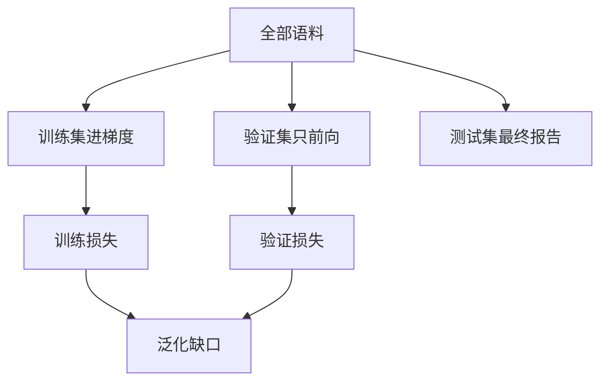

# 验证集与泛化缺口

训练损失只说明模型记住了用来更新参数的那些样本；要谈「换一批会怎样」，必须有从未进入过梯度的数据。

<footer>—— 据 Hastie, Tibshirani &amp; Friedman, The Elements of Statistical Learning；Goodfellow et al., Deep Learning, 2016 整理</footer>

[动量与自适应学习率](/llm/momentum-adaptive-lr)让训练损失可以稳定下降。本课不重写 Adam。缺口是：下降的那条曲线用的样本，正是梯度来源。它变小，可能是学会了规律，也可能是记住了这批句子的编号。方法是划出验证集：不参与 $\theta$ 的更新，只定期前向。训练损失与验证损失之差，本课称为泛化缺口。

## 问题

小批量 SGD 最小化的是经验风险 $\hat R(\theta)=\frac{1}{N}\sum_{i=1}^N\ell(x_i,y_i;\theta)$。我们真正关心的是同一分布上的期望风险 $R(\theta)=\mathbb{E}[\ell]$。两者不必一起走。容量足够时，$\hat R$ 可以到接近 $0$，而 $R$ 停在一个平台甚至回升。缺口不是再换一个优化器，而是承认经验风险不是目标本身，并给出一个可计算的代理。

验证集 $D_{\mathrm{val}}$ 从同一数据流程里留出，且与训练集不相交。在 $D_{\mathrm{val}}$ 上算平均损失或下游指标，得到 $R$ 的粗糙估计。测试集再留一层，只在最终报告时用一次；反复用测试集调 $\eta$、调早停，测试集就变成了第二验证集，缺口的估计会偏乐观。本课把「调参用验证、报告用测试」写成纪律，不把交叉验证的全部折法铺开。

### 验证损失不是「没见过的训练损失」这么含糊

关键是**从未进入过任何一次** $g_{\mathcal{B}}$。若某条样本曾经在某个 epoch 里更新过 $\theta$，它就不是验证。从训练集里随机再抽一批来画「验证曲线」，测到的仍是经验风险的另一份平均，缺口会被缩小。数据泄漏的更隐蔽形式包括：按句打乱但同一篇文章的两句分属训练与验证、用验证文本做过子词词表、用验证指标选了检查点再在同一验证集上报数。本课要求划分发生在一切拟合之前。

语言模型里两条曲线常用同一交叉熵。单位必须一致：都是按 token 平均，还是按序列平均。填充、不同长度、不同领域混在验证里，都会让缺口的数值不可比。先固定计分协议，再谈差距。

## 方法

划分确定后，训练循环每隔固定步数：切到 eval 模式（关掉 dropout 等随机层），在 $D_{\mathrm{val}}$ 上前向，记录 $L_{\mathrm{val}}$。不反向、不更新。比较 $L_{\mathrm{train}}$ 与 $L_{\mathrm{val}}$ 要用相近的滑窗，避免把瞬时小批量噪声当成缺口。$L_{\mathrm{val}}$ 持续下降：还在拟合规律。$L_{\mathrm{train}}$ 仍降、$L_{\mathrm{val}}$ 升：缺口在扩大，下一课的早停与权重衰减针对的就是这一段。

分布是否相同是假设。验证若来自另一领域，缺口混进了域移，不能只当过拟合读。本课默认独立同分布抽样；域移是数据课的缺口。

## 机制

参数更新在 $\hat R$ 的几何里走。验证曲线是在问：走的这条路径，在没见过的样本上是否同一方向。缺口扩大，说明路径在利用训练集的特异结构——编号共现、模板套话、标注伪影。优化器越强、容量越大，越容易走这条路，所以「训练更顺」不是成功标准。

选择检查点时应用 $L_{\mathrm{val}}$（或验证集上的任务指标），不要用 $L_{\mathrm{train}}$。这会引入对验证集的轻度过拟合：早停时刻本身是用验证信息选的。只要测试集仍封存，报告仍有意义。把验证、测试混用，机制就坏了。

## 边界

本课不给出泛化界，不把 VC 维请进来。下一课[过拟合、权重衰减与早停](/llm/overfit-wd-earlystop)才谈如何把缺口压回去。后课默认：说到「模型变好」，指验证（或封存测试）上的指标；训练损失只是优化是否在工作的诊断。

## 小结

- 训练损失是经验风险；泛化要看从未进入梯度的验证损失。
- 验证与测试必须分开；用测试集调参会把报告变乐观。
- 划分要在拟合之前，避免篇章级泄漏与词表泄漏。
- 缺口扩大是下一课正则与早停的信号，不是再降 $\eta$ 就能解释。
- 出处：Hastie et al., ESL；Goodfellow et al., Deep Learning, 2016。
