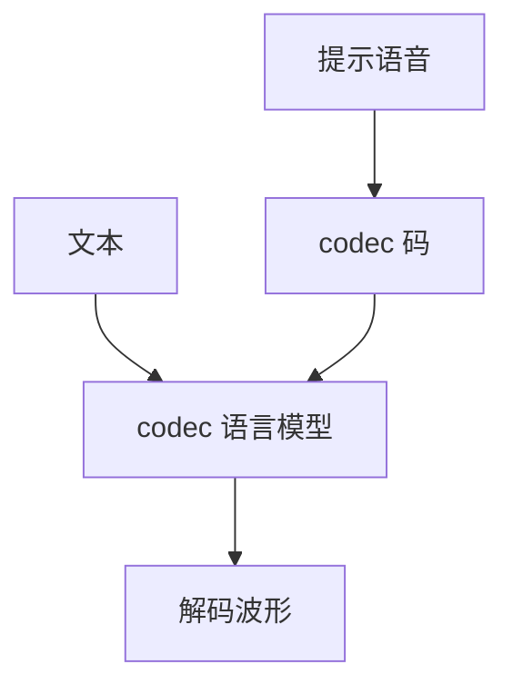

# VALL-E 式 TTS

语音也可以是 codec 下标。给三秒提示音加文本，语言模型在离散声学 token 上续写，零样本克隆音色。

<footer>—— Wang 等 Neural Codec Language Models are Zero-Shot Text to Speech Synthesizers（VALL-E）；码流见 Défossez 等 EnCodec</footer>

[上一课](/llm/video-gen-spatiotemporal)收束像素生成。本单元问说与听。图像侧 [VQGAN](/llm/vqgan) 把图变成码；语音侧神经 codec 把波形变成多码本下标。缺口是把 TTS 写成 in-context 语言模型，而不是再训说话人嵌入流水线。后课全双工默认：VALL-E 仍是一轮合成，不是边听边说。

## 问题

传统 TTS：文本分析 → 声学模型 → 声码器，换说话人要数据。EnCodec 等 RVQ 把波形压成若干层离散码。VALL-E 把「提示语音的码 + 音素或文本」当前缀，自回归预测目标句的 codec token，再解码成波。零样本来自上下文：音色在提示码里，不必显式 ID。

与 [CLIP](/llm/clip) 无关：这里没有图文空间。和文本 LLM 同构的是损失：码上的 CE。

RVQ 多层码不能天真地当单一词表：粗层先决定内容，细层补残差。VALL-E 用分层 AR / 非 AR 组合，而不是一个扁平 softmax 包打天下。

## 方法

训练：大规模语音的 codec 语言建模，条件为文本对齐。推理：提示波 → codec，与文本拼接，采样码 → codec 解码。评测：说话人相似度、WER、自然度；不要用图像 FID。安全：零样本克隆可被滥用，产品必须验证授权，这是后课 omni 对齐的前奏。

## 机制

提示码提供说话人与声学条件，文本提供内容。LM 若更跟提示的内容而非音色，就会内容泄漏或音色漂。分层码让内容主要走粗 token，类似图像金字塔把布局放粗层。

## 边界

合成是离线、单向的。下一课 Moshi 把听与说叠在同一时间轴上。

## 小结

- VALL-E 把 TTS 写成 codec token 上的零样本语言模型。
- 音色在提示上下文里，不是分类说话人 ID。
- 多层 RVQ 要分层建模。
- 出处：Wang 等 VALL-E；EnCodec。
