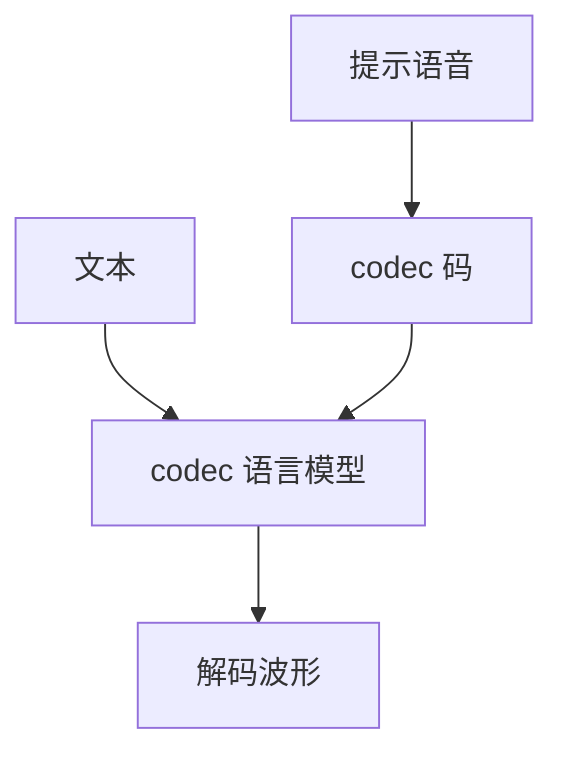
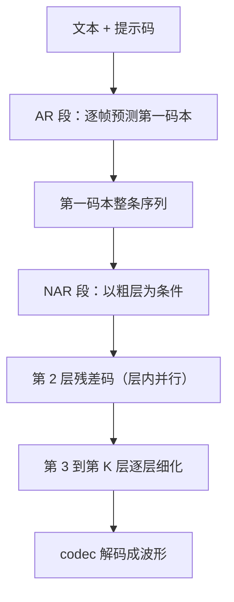

# VALL-E 式 TTS

语音也可以是 codec 下标。给三秒提示音加文本，语言模型在离散声学 token 上续写，零样本克隆音色。

<footer>—— Wang 等 Neural Codec Language Models are Zero-Shot Text to Speech Synthesizers（VALL-E）；码流见 Défossez 等 EnCodec</footer>

[上一课](/llm/video-gen-spatiotemporal)收束像素生成。本单元问说与听。图像侧 [VQGAN](/llm/vqgan) 把图变成码；语音侧神经 codec 把波形变成多码本下标。缺口是把 TTS 写成 in-context 语言模型，而不是再训说话人嵌入流水线。后课全双工默认：VALL-E 仍是一轮合成，不是边听边说。

## 问题

传统 TTS：文本分析 → 声学模型 → 声码器，换说话人要数据。EnCodec 等 RVQ 把波形压成若干层离散码：第一层量化最粗的帧级结构，第二层量化「原信号减第一层重构」的残差，逐层嵌套，合成时各层重构相加还原波形。VALL-E 把「提示语音的码 + 音素或文本」当前缀，自回归预测目标句的 codec token，再解码成波。零样本来自上下文：音色在提示码里，不必显式 ID。

RVQ 的分层不是工程凑数：语音信息天然按带宽分层，第一码本的帧级包络已带内容与韵律主部，后面的层补高频与音色残差。这决定了建模切面。联合词表走不通：$K$ 层各 $N$ 码的联合是 $N^K$，8 层各 1024 即 $10^{24}$ 量级，softmax 无从估计。各层独立的 CE 也错：它忽略依赖，第二层的正确值以第一层为条件，边缘分布不是要学的对象。VALL-E 的解法分两段：第一段自回归，按帧预测第一码本下标，历史是已生成的帧；第二段非自回归，把第一码本整条序列当条件，其余各层从粗到细逐层预测、层内时间并行。为什么这样切：给定粗层，细层的时间相关性已大半被解释，剩下的残差接近逐帧独立，层内一次前向即可并行出整条序列，推理代价从 $K$ 倍 AR 降到近两段。不这么做会错在哪：全 AR 则步数乘 $K$，延迟不可用；全并行不给层间顺序，细层只能猜边缘分布，合成发浊。

与 [CLIP](/llm/clip) 无关：这里没有图文空间。和文本 LLM 同构的是损失：码上的 CE。

数字实例：8 层 RVQ、每层 1024 码，若拼成联合词表，一帧的组合数是 $1024^8\approx 10^{24}$——比地球上所有沙粒还多，softmax 根本无法估计。拆成「先第一层、再逐层」后，每一步只是在 1024 个类里做分类。

RVQ 多层码不能天真地当单一词表：粗层先决定内容，细层补残差。VALL-E 用分层 AR / 非 AR 组合，而不是一个扁平 softmax 包打天下。

## 方法

训练：大规模语音的 codec 语言建模，条件为文本对齐。两个模型两个切面：AR 模型看「文本 + 提示 + 已生成帧的第一码本」；NAR 模型看「文本 + 提示 + 全部第一码本 + 已生成的细层」，各层都是 CE，但输入切面不同。推理：提示波 → codec，与文本拼接，先 AR 出第一码本，再 NAR 补齐其余层，采样码 → codec 解码。评测：说话人相似度、WER、自然度；不要用图像 FID。安全：零样本克隆可被滥用，产品必须验证授权，这是后课 omni 对齐的前奏。

术语翻译：自回归（AR）就是「一个一个往下写，每写一个都看前面已写的」；非自回归（NAR）就是「看定条件后一次性整批写出」。VALL-E 用 AR 写粗层（内容与节拍），用 NAR 一次补齐细层（纯残差、近似逐帧独立），兼顾质量与延迟。

```mermaid
flowchart TD
  PR["提示语音"] --> C["codec 码"]
  TXT["文本"] --> LM["codec 语言模型"]
  C --> LM
  LM --> WAV["解码波形"]
```

## 机制

提示码提供说话人与声学条件，文本提供内容。LM 若更跟提示的内容而非音色，就会内容泄漏或音色漂：提示里若出现与文本相同的词，模型可能把提示的读音续进目标句，评测要专门盯「提示词混入」这一类失败。分层码让内容主要走粗 token，类似图像金字塔把布局放粗层；错误也沿这个梯度分布——粗层错一帧，细层整体跟错，粗层的小错细层只能局部修补，所以第一码本的采样质量比其余层更值得花计算，AR 段保留也正是为此。

```mermaid
flowchart TD
  IN["文本 + 提示码"] --> AR["AR 段：逐帧预测第一码本"]
  AR --> C1["第一码本整条序列"]
  C1 --> NAR["NAR 段：以粗层为条件"]
  NAR --> L2["第 2 层残差码（层内并行）"]
  L2 --> LK["第 3 到第 K 层逐层细化"]
  LK --> DEC["codec 解码成波形"]
```

## 边界

合成是离线、单向的：AR 段逐帧出、NAR 段整段补，流式要在两段之间切缓冲。下一课 Moshi 把听与说叠在同一时间轴上。

常见误区：以为零样本克隆是模型「记住」了某个说话人。它没有说话人库：音色完全由那 3 秒提示的 codec 码在上下文中给出，换提示就换音色。这也是滥用风险的来源——谁拿到三秒录音都能伪造，产品必须验证授权。

## 小结

- VALL-E 把 TTS 写成 codec token 上的零样本语言模型。
- 音色在提示上下文里，不是分类说话人 ID。
- 多层 RVQ 要分层建模：第一码本自回归，其余层非自回归。
- 出处：Wang 等 VALL-E；EnCodec。
