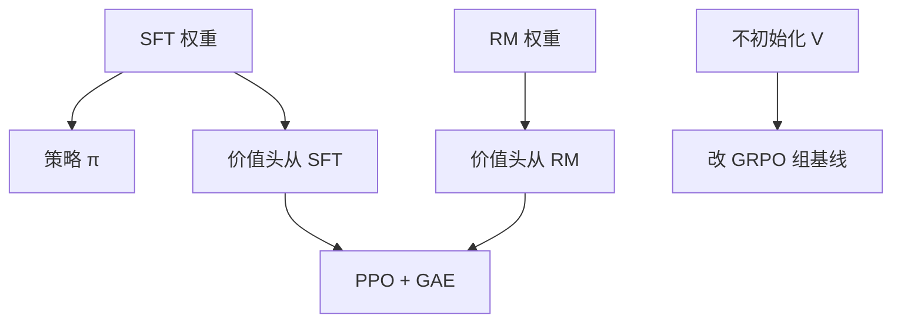

# 价值模型初始化

critic 与策略同规模时，它从哪份权重长出来，决定前几万步的 δ 是信息还是噪声。

<footer>—— 对照 InstructGPT 的价值头；开源栈里常见的「从 RM 拷贝」与「从 SFT 拷贝」</footer>

[上一课](/llm/ppo-clip-higher)改的是策略侧信任域。PPO 还要一个 $V_\psi$。缺口是：**随机初始化的价值头在长地平线上长期乱给 $\delta_t$，GAE 再怎么调 $\lambda$ 也是在噪声上混合。** 本课写 $V$ 从哪来、是否与策略共享主干。[GRPO](/llm/grpo) 去掉 critic，等于用组基线回避这个问题；本课只对还在用 PPO 的栈。

## 问题

$V(s_t)$ 要预测从当前前缀到结束的回报。$s_t$ 是尚未写完的回答，回报却常是整段 RM 或校验器分数。从头训 $V$，等于在稀疏标签上拟合一个与策略同样大的回归器。常见做法：主干拷贝 SFT 或拷贝 RM，只随机一个标量头，再与策略联合训。拷贝 RM 的直觉是：RM 已经看见完整 $y$ 的分数，前缀表示或许靠近价值；但 RM 训练目标是成对 logit，不是 $\mathbb{E}[R\mid s_t]$，迁移只是启发式。

共享主干（actor-critic 一头两用）省显存，价值损失会干扰语言表征，稳定性见已有的 AC 课。分开的 $V$ 干净、贵。初始化选择在共享设定里更敏感：RM 头的特征可能带着长度捷径，价值会把「更长」学成高 $V$。

### 初始化不是预训练价值函数

没有「在离线轨迹上先做行为价值迭代再 PPO」的默认工序。LLM 的离线 $y$ 来自旧策略，与当前 $\pi$ 不一致。最多做几个 epoch 的价值预热：冻结策略，用当前 rollout 回归 $V$。预热不足就开 clip，早期优势符号会错。

不要用 RM 分数直接当 $V$ 而不回归。RM 看完整序列；$V$ 必须在前缀上可评。把 RM 当 $V$ 会泄漏未来 token。

## 方法

配方 A：策略与 $V$ 都从 SFT 初始化，分头，$V$ 头小学习率。配方 B：$V$ 从 RM 初始化（同词表同模板），策略从 SFT。配方 C：GRPO，无 $V$。预热：先采一批，只更新 $V$，直到解释方差不再涨，再联合。GAE 目标与价值 clip（独立于策略 clip）按 Schulman PPO 原文可选。

模板必须与策略一致。RM 若用另一套聊天模板，拷贝来的表征看的是「另一个字符串」，$V$ 从第一步就偏。

## 机制

早期 $V$ 若系统性高估，负优势被吞，策略不敢改；系统性低估，正优势泛滥，一步冲出 clip。从 RM 拷贝常见的偏置是长度：RM 爱长，$V$ 在前缀阶段就预测高回报，模型更爱写长。从 SFT 拷贝则 $V$ 接近常数，GAE 更接近蒙特卡洛，方差大但偏差小——长链上不一定更差。

价值损失权重过大时，共享主干会把语言模型练成回归器，KL 爆炸。权重是一等超参。

## 边界与工程取舍

可验证 0/1、组大小足够时，优先 GRPO，本课的初始化问题消失。偏好 RM + 真正需要逐步优势时，才值得养 critic。异步 rollout 下 $V$ 版本落后，预热结论过期，需重算或提高 $\lambda$。下一课处理奖励本身的尺度：白化，避免 $V$ 去拟合漂移的 $r$ 量纲。

## 小结

- critic 应从 SFT 或 RM 拷贝主干并预热，不要随机长地平线回归。
- RM 当 $V$ 会泄漏未来；只能当初始化。
- 共享主干省显存、价值损失干扰表征。
- 组基线可绕开 $V$；需要逐步优势时再养 critic。
- 出处：Schulman PPO；Ouyang InstructGPT；开源 RLHF 栈的 critic 初始化实践。
