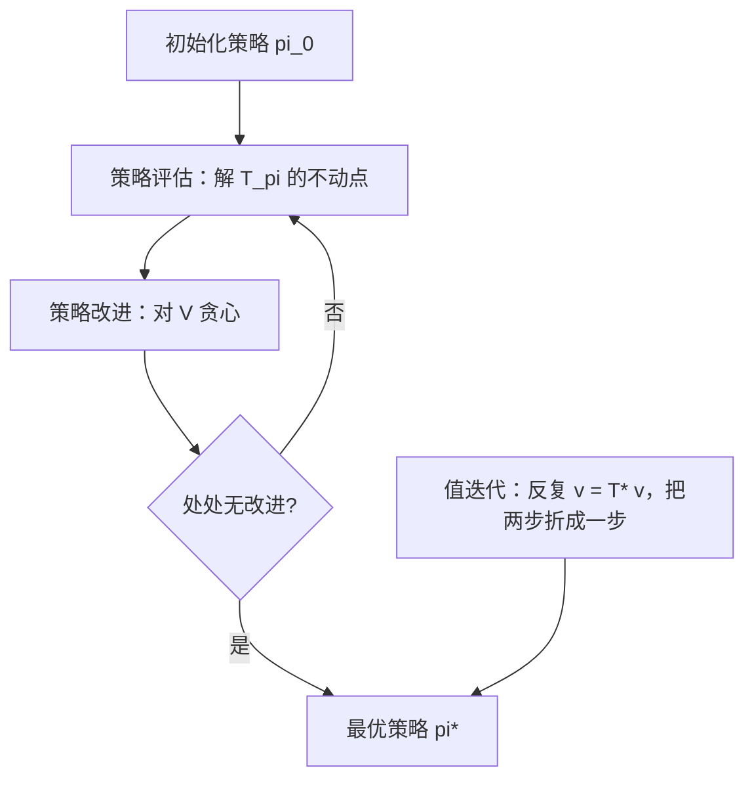
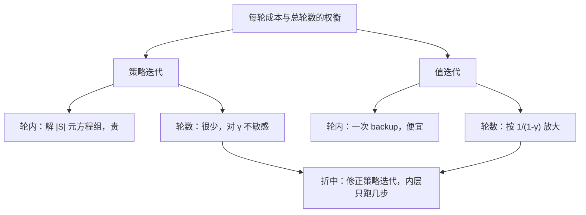

# 值迭代与策略迭代

先评估你现在的做法，再在每个状态换上更好的动作；两步交替到不动，就是最优——前提是转移和奖励写在你的手里。

<footer>—— 据 Bellman, Dynamic Programming, 1957；策略迭代见 Howard, Dynamic Programming and Markov Processes, 1960；Sutton &amp; Barto 2018 第 4 章整理</footer>

[上一课](/llm/bellman-equations-rl)把 $V^\pi$ 与 $V^*$ 证明成压缩算子的唯一不动点、从任意初值迭代必收敛；但那只给出「极限存在」，没有给出算法的组织：评估该用哪支方程、何时换策略、迭代到什么时候停。本课补齐：策略评估、策略改进、策略迭代与值迭代，收敛速度与停止判据；最后指出这一切的前提「模型已知」在 LLM 里几乎不成立，为无模型单元铺路。

## 问题

价值与最优价值的方程有了，怎么把它们变成程序？天真的做法是枚举策略逐一评估再比较——策略随状态数指数多，枚举不可行。真正可用的组织只有两个迭代：一支只逼近当前策略的价值（评估），一支在每个状态贪心地换动作（改进）。怎么交替、各自多快、何时敢停，是本课的问题。

直觉类比：策略迭代像「先完整复盘这盘棋现在下到什么水平，再据此把每一步换成更好的走法」；值迭代像「每想一步，就当场按最优标准修正这步的价值」。前者轮次少但每次复盘贵，后者每步都轻、但要磨很多轮。

## 方法

**策略迭代**循环两步。其一，策略评估：解 $T_{\pi_k}$ 的不动点，得 $V^{\pi_k}$——直接解线性方程组，或内层迭代到收敛。其二，策略改进：对每个状态贪心，

$$\pi_{k+1}(s)=\arg\max_a\Big[r(s,a)+\gamma\sum_{s'}P(s'\mid s,a)V^{\pi_k}(s')\Big]$$

策略改进定理保证换法不降价值：$V^{\pi_{k+1}}\ge V^{\pi_k}$ 逐状态成立；若处处无改进，当前策略已对 $V^*$ 贪心，即最优。有限状态与动作下策略只有有限个、每次改进严格变好，所以策略迭代**有限步**终止。

**值迭代**不区分两步，直接对最优算子做不动点迭代 $v_{k+1}=T^*v_k$；它可以读成「评估只做一步的策略迭代」，也可读成逐状态套用最优方程。轮数上每轮误差至少乘 $\gamma$；停止判据要经过几何级数折算：

$$\|v_k-v_{k-1}\|_\infty\lt\frac{\varepsilon(1-\gamma)}{\gamma}\quad\Longrightarrow\quad\|v_k-V^*\|_\infty\lt\varepsilon$$

数字实例：$\gamma=0.9$ 时每轮误差至少缩成上一轮的 0.9 倍，压到百分之一约需 $\ln 0.01/\ln 0.9\approx 44$ 轮；$\gamma=0.99$ 时同样的精度要约 459 轮。折扣因子越接近 1，值迭代的轮数惩罚越狠。

## 机制

两支迭代的分工来自成本结构。策略迭代每轮要解一个 $|S|$ 元方程组，但轮数对 $\gamma$ 不敏感——策略改进常在很少几轮内不再变化；值迭代每轮只是一次 backup（$O(|S|^2|A|)$），轮数却按 $1/(1-\gamma)$ 放大。大状态空间下实践者取折中：内层评估只跑若干步再改进（修正的策略迭代）。停止判据的折算是易错点：残差 $\|v_k-v_{k-1}\|$ 小**不**等于价值误差小，中间差着 $\gamma/(1-\gamma)$ 的放大——$\gamma=0.99$ 时残差 $0.01$ 只保证误差在 $1$ 以内，而 $1$ 的价值误差对视界百步的问题是巨大的。

把残差阈值直接当精度用是最常见的 DP 错误：$\gamma=0.99$ 时，「相邻两轮差小于 $0.01$」留给 $V^*$ 的误差上界是 $1$。阈值必须除以 $\gamma/(1-\gamma)$ 再叫精度。

然后是本课真正的转折。整套流程要求 $P$ 与 $r$ **写在手里**：评估要逐状态算 $\sum_{s'}P\cdot V$，改进要逐状态对每个 $a$ 算期望。在语言生成里逐项检查：状态是前缀，数量 $|V|^{T}$ 量级，一张表都存不下；$P$ 是 delta（下一课细说）但 $r$ 依赖外部验证器，回合末才给出、不可枚举。「模型已知」这个在教科书里一行带过的前提，在 LLM 里两项全塌。于是课程转向：只从采样出的轨迹学——无模型。下一课先把生成正式写成 MDP，把「塌在哪」逐项钉死。

## 边界

不讲异步 DP 与线性规划解法；收敛速度是最坏情形的几何率，实际问题常更快，但拿它报预算是安全的。另外「模型已知但状态太大」与「模型完全未知」是两个缺口：后者才是无模型单元的主题，不过二者共享同一个处境——逐状态 backup 不可用，这就是衔接点。

常见误区：以为这套迭代「慢一点总能用」。它不是慢，是开不了工：$P$ 要逐状态查询、$r$ 要逐动作枚举，而 LLM 的前缀状态连表都存不下。无模型方法因此不是提速优化，而是换前提——从查表改成从采样轨迹里学。

后课默认：评估与改进是两支可分离的迭代，策略迭代有限步收敛，值迭代按 $\gamma$ 几何收敛。

## 小结

- 策略迭代 = 评估（解 $T_\pi$ 不动点）+ 改进（贪心），不降价值、有限步终止。
- 值迭代 = 直接迭代 $T^*$，每轮误差乘 $\gamma$，阈值要除 $\gamma/(1-\gamma)$ 才是精度。
- 轮数与每轮成本的权衡：策略迭代轮少步贵，值迭代轮多步贱，折中是修正策略迭代。
- 一切前提是 $P$、$r$ 可逐状态查询；LLM 里状态 $|V|^T$ 量级、奖励在回合末，前提塌方。
- 塌方把课程推向无模型：从采样轨迹学，不查表。
- 出处：Bellman, *Dynamic Programming*, 1957；Howard, *Dynamic Programming and Markov Processes*, 1960；Sutton &amp; Barto 2018 第 4 章。
