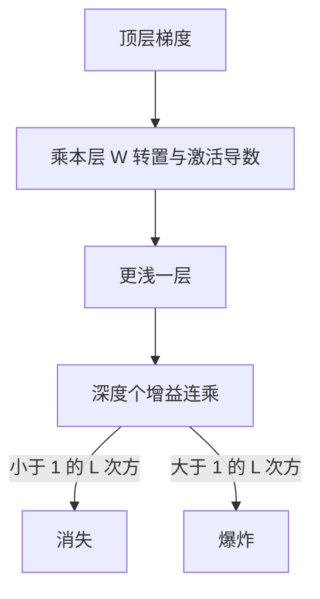

# 梯度消失与爆炸

反向路径是一串局部增益的乘积；每层略小于 $1$ 则深层梯度消失，每层略大于 $1$ 则爆炸。

<footer>—— 据 Hochreiter, Untersuchungen zu dynamischen neuronalen Netzen, 1991；Bengio, Simard &amp; Frasconi, IEEE Trans. Neural Networks, 1994；Pascanu, Mikolov &amp; Bengio, ICML 2013 整理</footer>

[自动微分的正向与反向模式](/llm/autograd-two-modes)说明训练走反向。本课不比较 AD 模式。缺口是：反向即使实现正确，深层参数仍可能收到接近 $0$ 或 Inf 的梯度。原因是局部 Jacobian 的奇异值沿深度连乘。本课把这一乘法结构钉住；残差、合适的初始化、非饱和激活、门控，是后面若干课分别补的洞，这里不提前讲完。

## 问题

一层的反向把 $\mathrm{d}h^{(\ell+1)}$ 乘上 $W^\top\odot\sigma'$ 一类增益，得到 $\mathrm{d}h^{(\ell)}$。$L$ 层之后，最浅层看到的是 $L$ 个矩阵的乘积作用在 $\mathrm{d}h^{(L)}$ 上。若这些矩阵的典型增益 $\rho<1$，则 $\rho^L\to 0$；若 $\rho>1$，则 $\rho^L\to\infty$。缺口不是链式法则写错，而是深度把「每层一点点」放大成指数。浅层参数几乎收不到有效更新，或一步就被打飞——两者都会让深层网络训不动。

循环网络沿时间展开后，深度等于序列长度，问题更尖锐：那是[RNN 与长程依赖](/llm/rnn-long-range)的缺口。本课先在前馈深度上把同一乘法说清，避免后课把 LSTM 当成全新魔法。

### 梯度裁剪不是「消失的对称解」

爆炸时，$\|\nabla L\|$ 超过阈值就缩放，能让一步更新有限。消失时，梯度已经是 $0$，裁剪不改变 $0$。两者不是同一旋钮的两端。裁剪是爆炸的工程闸门，对消失无效。消失要改增益结构：激活不要把导数长期压在 $0$ 附近、初始化不要让 $\|W\|$ 过小、深度路径上要有增益接近 $1$ 的旁路。后课残差专门提供这条旁路。

诊断应分层看梯度范数，不要只看全局 $\|\nabla L\|$。全局范数可能被某一层的爆炸主导，而另一层已经消失。日志里按层打印 $\mathrm{d}W$ 的 RMS，比只打印损失更早暴露。

## 方法

粗诊断：记录各层 $\mathrm{d}h$ 与 $\mathrm{d}W$ 的 RMS 随深度的变化。单调掉到数值噪声：消失；随深度指数上升或频繁 Inf：爆炸。饱和激活（sigmoid、tanh 在幅值大时 $\sigma'\approx 0$）提供 $<1$ 的逐元素增益；随机初始化若 $\|W\|_2$ 期望偏离 $1$，提供矩阵增益。两者相乘。梯度裁剪：若 $\|g\|>c$，令 $g\leftarrow g\cdot c/\|g\|$，再交给优化器。它改变步长，不改变方向（在欧氏范数下）。

## 机制

反向是线性化。每层在当前点的一阶近似是一个矩阵；深度复合的一阶近似是矩阵乘积。乘积的谱半径偏离 $1$ 时，只有指数可以描述深度效应。这与前向信号的消失 / 爆炸是对偶现象：前向 $\|h\|$ 崩掉时，反向往往一并崩掉，因为 $\sigma'$ 与 $W$ 是同一组量。初始化课将管前向方差；残差课将管「至少有一条增益为 $1$ 的路径」；LSTM 将管时间轴上的增益。本课只提供共同语言：看连乘，不要只看某一层。

softmax 饱和也是一种局部增益接近 $0$（见交叉熵课的 $p-y$ 在 $p$ 极尖时）。它发生在最后一层，会让整个反向变弱，但不随深度指数恶化。深度连乘与末层饱和要分开诊断。

## 边界

本课不引入 BatchNorm / LayerNorm 的公式，不写残差 $h+f(h)$。下一课起进入前馈网络，从[线性层与偏置](/llm/linear-layer-bias)把仿射补全。后课默认：深层训不动时，先分层看梯度范数，再决定是裁剪、改激活、改初始化还是加旁路。

## 小结

- 反向是局部增益连乘；$\rho^L$ 在深度上指数地消失或爆炸。
- 裁剪只对付爆炸，不对付消失。
- 饱和激活与 $\|W\|$ 偏离 $1$ 是两类增益来源，诊断要按层。
- 循环展开把深度换成时间，同一乘法稍后会再出现。
- 出处：Hochreiter, 1991；Bengio et al., 1994；Pascanu et al., ICML 2013。
