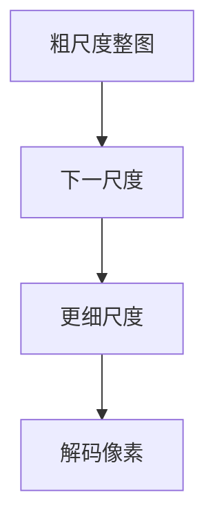

# VAR 尺度自回归

下一格是局部的。下一尺度是整张图从粗到细。把自回归定义在分辨率金字塔上，布局先于纹理。

<footer>—— Tian 等 Visual Autoregressive Modeling（next-scale prediction）</footer>

[上一课](/llm/autoregressive-image-gen)在 raster 码上逐步写格。缺口是分解顺序：人看图是先轮廓后细节，不是先左上角一个 patch。VAR 把 $p$ 定义在多尺度 token 图上：先预测最低分辨率整图，再条件于它预测更高一层。后课 MAR 默认：仍可自回归，但不必须离散码。

## 问题

raster AR 的因果掩码与二维邻域冲突，长程竖直依赖要绕一整行。多尺度向量量化（或残差尺度）给出 $r_1,r_2,\ldots$：每层是该分辨率的完整离散图。Next-scale 预测整层，层内可并行（训练用双向或块掩码，推理按尺度步进）。这把「先布局后纹理」写进似然分解，而不是指望深层注意力自己学出来。

与理解侧原生分辨率不同：这里的多尺度是生成课程，不是阅读任意 $H\times W$。

层内并行使训练吞吐高于纯 raster，但尺度数目、每层码本与上采样器都是新超参。尺度对不齐会棋盘或结构错位。

## 方法

构造尺度金字塔 tokenizer，按粗→细训练自回归（或块自回归）目标。采样必须从最粗层开始，不能随机从中层插入。验收看全局结构（对称、物体完整）是否优于同预算 raster，而不只是 FID 小数。

## 机制

条件链是 $p(r_{k}\mid r_{<k})$。粗层错误会变成细层的错误布局，但粗层很短，布局被提前钉死，细层只补纹理。这与扩散从纯噪声同时出布局和纹理不同，也与 raster 把布局拖到序列中段不同。

## 边界

VAR 仍吃离散量化损失。下一课用掩码自回归在连续表示上生成，避开码本。

## 小结

- VAR 用 next-scale 代替 next-token raster。
- 布局在短粗序列上先决定，纹理后补。
- 仍受离散 tokenizer 天花板约束。
- 出处：Tian 等 VAR。
