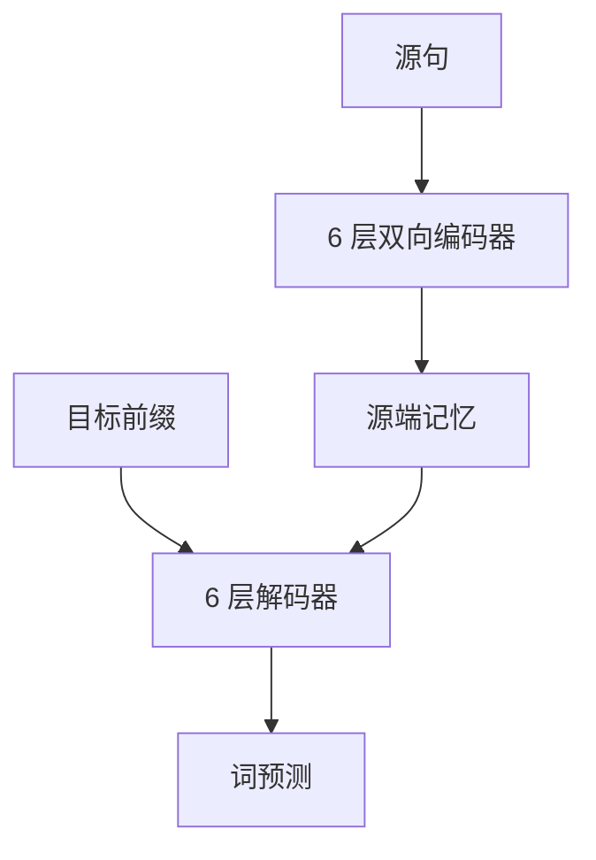

# Attention Is All You Need

我们提出一种新的简单网络架构，完全基于注意力机制，彻底抛弃循环和卷积。

<footer>—— Vaswani et al., Attention Is All You Need, NeurIPS 2017</footer>

2017 年的这篇论文要证明的不是「注意力有用」——对齐已经在 RNN 翻译里用过——而是：**序列到序列可以只靠注意力和逐位置前馈来堆深度**，训练因而能按序列长度并行。Vaswani、Shazeer、Parmar、Uszkoreit、Jones、Gomez、Kaiser 与 Polosukhin 给出的 Transformer，后来被拆成许多专文：[缩放点积](/llm/sdpa)、[多头](/llm/mha)、[编码器–解码器注意力](/llm/encoder-decoder-attention)、[正弦位置编码](/llm/sinusoidal-pe)、[Post-LN](/llm/pre-ln-post-ln)。那些零件的公式本篇不重复。这里写原文作为一篇系统论文的贡献：它删掉了什么、用什么配方在 WMT 上站稳，以及它没有承诺的边界。

## 问题

2017 年前后，神经机器翻译的主干仍是循环：隐状态沿时间逐步更新，时间步之间有数据依赖，训练难以把序列维摊成矩阵乘。卷积模型（ConvS2S、ByteNet）能并行，但远距离依赖要靠层数或膨胀把感受野堆出来。注意力已经作为 RNN 的对齐模块存在，却还不是主计算。论文把问题收成一句工程命题：若注意力能同时提供全局交互与可并行的密集运算，循环和卷积是否还是必需的归纳偏置。

要回答这个问题，必须交出一个完整可训练的系统，而不是一个打分函数。系统包括：源端双向、目标端自回归的不对称如何维持；位置如何在没有时间步递推时注入；深度如何在残差上叠到当时够用的 6+6 层；以及在 WMT 14 英德、英法上，质量与训练墙钟是否同时打过当时的 RNN 与卷积基线。

### 论文真正删掉的是循环与卷积

「Attention Is All You Need」里的 *all* 针对的是序列建模里的递推与局部卷积核，不是针对前馈、残差、归一化或位置编码。词嵌入、逐位置 MLP、残差与层归一化都还在。删掉循环之后，任意两个位置的交互路径长度变成一层，这是表达力上的卖点；代价是注意力图随长度二次增长，原文用翻译句长把这笔账暂时压住。把这句话理解成「以后不再需要 FFN」或「不再需要位置」，是后来的误读。

标题很容易被读成注意力取代了一切归纳偏置。原文比较的是 RNN 与 CNN 作为 *序列组合器*。位置编码、掩码、编码器–解码器槽位，都是为了在删掉递推之后把顺序与条件化补回来。那些补丁不是附属，是命题能成立的条件。

## 方法

整体是 6 层编码器加 6 层解码器。编码器层：自注意力 + 逐位置前馈，残差与层归一化取 Post-LN。解码器层多一个读编码器输出的子层，自注意力带因果掩码。宽度 $d_{\mathrm{model}}=512$，头数 8，前馈中间宽 2048；Big 模型提到 1024 宽、16 头。Dropout 0.1 用在残差分支与注意力权重上。位置用无参数的正弦编码，论文也报告了可学习位置表，翻译质量接近，正弦被保留是因为它对更长句「公式上有定义」。零件细节见上列专文。

训练配方同样是贡献的一部分，后来常被忘掉。优化器 Adam，$\beta_1=0.9$，$\beta_2=0.98$，$\varepsilon=10^{-9}$，学习率

$$
\mathrm{lr} = d_{\mathrm{model}}^{-0.5}\cdot\min\bigl(\mathrm{step}^{-0.5},\;\mathrm{step}\cdot\mathrm{warmup}^{-1.5}\bigr),
$$

warmup 约 4000 步。标签平滑 0.1。批按 token 而非句数凑。共享源–目标–输出嵌入。这些选择让 Post-LN 的 6 层在当时的翻译设定里能收敛；它们不是注意力公式的推论，而是系统能跑起来的超参契约。

### 训练配方与翻译数字

主结果写在 WMT 2014 英→德与英→法：Base 用 8 块 P100 量级的算力在明显短于当时 GNMT、ConvS2S 的墙钟内达到可比较或更好的 BLEU；Big 在英德上报到 28.4，英法 41.8 一类当时的新高（以论文表为准）。宣称的不只是「分数高」，而是「分数高且训练更并行」。消融包括：头数、键维、是否用正弦位置、是否用标签平滑。消融服务于「这些零件缺一不可」的叙事，并不试图探索解码器-only 语言模型。

数据与评测协议是机器翻译的：子词、BLEU、束搜索、长度惩罚。这对 2017 年是正确的战场，却意味着原文**没有**报告语言建模困惑度、长上下文针测、或多任务指令。后文把 Transformer 当通用骨干，是社区做的外推，不是这张表已经证明的事。

## 机制

机制上，全局点积注意力让一层之内的感受野等于全句，深度用来组合表示而不是用来爬距离。这与卷积「深度换半径」相反。多头提供多套路由，交叉注意力提供源端对齐，因果掩码维持自回归分解——三件事各管一截，拼起来才等于一个可并行的 seq2seq。残差让 6 层叠得下去；Post-LN 在这个深度上还能工作，是因为翻译模型并不深，warmup 又写进了学习率公式。后来百层解码器把 LN 挪到子层前，见 Pre-LN 专文，那是深度换来的修订，不是对 2017 年配方的否定。

并行性来自「没有时间步依赖」：训练时目标侧教师强制，整句注意力可一次算完。推理仍是逐步的，这一点原文没有也不可能取消。墙钟优势主要在训练。把「Transformer 更快」说成解码也必然更快，忽略了自回归逐步读取 KV 的事实。

原文的注意力是稠密的。稀疏、线性、核化、Flash 分块，都是在二次代价重新成为瓶颈之后才出现的后继论文。2017 年的句长还撑得住 $n^2$。引用本文去论证长上下文方案，是把后继工作的问题倒填进原命题。

### 模板如何被拆成后来的零件

社区把编码器栈拿去预训练（BERT 一类）、把解码器栈拿去语言模型（GPT 一类），交叉注意力在解码器-only 里消失，源与目标变成同一条因果前缀。这些都是合法的特化，但每特化一次，原文的某条假设就被拿掉：双向源、交叉槽位、翻译目标。读 2017 年论文时，应把「完整编码器–解码器翻译系统」当成贡献的边界，把后来的只编码器、只解码器当成引用该模板的新论文。正弦位置、Post-LN、绝对下标，也在后来被 RoPE、Pre-LN、相对偏置替换；替换的是零件，不是「用注意力组合序列」这一条命题。

## 边界与工程取舍

二次复杂度、绝对位置、以 BLEU 为中心的评测、6+6 的浅堆叠，都是原文的工作点。它没有提供长度外推理论，没有提供稳定训千层的归一化分析，没有讨论 KV 缓存与服务延迟。标签平滑与共享嵌入是翻译技巧，搬到现代指令模型上不是默认。Adam 的 warmup 公式与 $d_{\mathrm{model}}$ 挂钩，换宽度要重算，不能当与架构无关的常数。

「完全基于注意力」也不禁止局部归纳偏置再次进入后继模型：滑窗、卷积前馈、状态空间，都是在长序列或硬件约束下把全局注意力打折。那些工作与原文不矛盾——原文证明全局注意力 *足以* 做当时的翻译，没有证明它在所有长度和所有硬件上 *必须* 稠密。

复现时最容易混的是 Base 与 Big 的表、以及后来社区实现里的 Pre-LN。对照论文数字应固定 Post-LN、正弦 PE、翻译数据与束搜索。用 LLaMA 块去「复现 Transformer 论文」会对不上 BLEU，那不是注意力公式错了。

## 小结

- 原文贡献是：用纯注意力加逐位置前馈替换 RNN/CNN 作为 seq2seq 组合器，并给出可并行训练的完整翻译系统。
- 零件（SDPA、MHA、交叉槽位、正弦 PE、Post-LN）应指向专文；本文的主线是它们如何被捆成 6+6 的编码器–解码器。
- 训练贡献包括与宽度挂钩的 Adam warmup、标签平滑与 token 批，使该深度在 WMT 上收敛。
- 经验主张绑定在 2014 WMT 翻译与当时墙钟，不自动覆盖语言模型与长上下文。
- 二次代价、绝对位置、浅 Post-LN 是工作点，不是被忽略的细节。
- 只编码器与只解码器是后继特化，拿掉了原文的部分假设。
- 出处：Vaswani et al., *Attention Is All You Need*, NeurIPS 2017。
