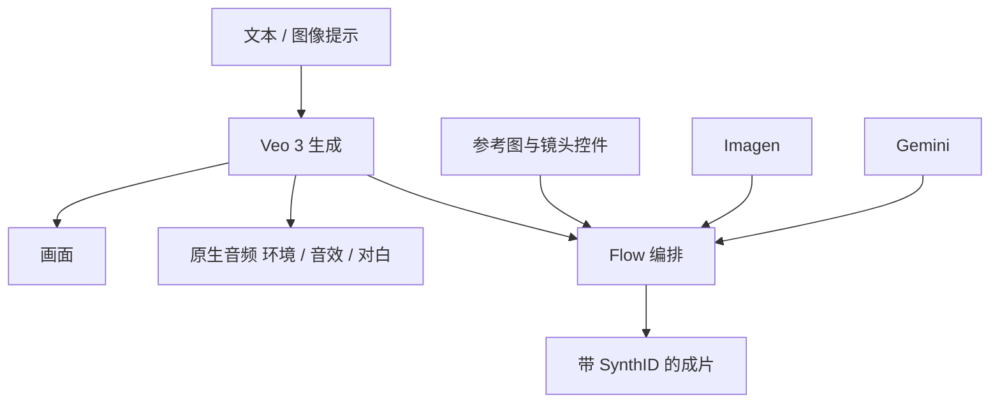

# Veo 3

    
Veo 3 不仅提升画质，而且第一次能生成带声音的视频——街景车流、公园鸟鸣，甚至角色对白。

    <footer>—— Collins, Fuel your creativity with new generative media models and tools, Google I/O, 2025-05-20</footer>

Google 在 2025 年 5 月 20 日 I/O 博客宣布 Veo 3：相对 Veo 2 提高质量，并**原生生成音频**。DeepMind 产品页把同一句话写成能力主轴：音效、环境声、对白都在模型内，而不是后期配音。Eli Collins 文中还写了物理、口型、把短故事提示演成镜头，以及 Ultra 订阅在美国经 Gemini 应用与 Flow 提供、企业经 Vertex AI 提供。Flow 把 Veo、Imagen 与 Gemini 收成面向创作者的制片工具。闭源视频模型只引公开博客与产品页，不引用非官方架构拆解，也不把内部论文当产品规格。

## 问题

到 2025 年春，主流视频模型仍常输出无声画面。创作者要另配音乐、音效与对白，时间轴与口型靠手工。DeepMind 在 2024 年 6 月 17 日的 *Generating audio for video* 里把「无声视频」写成下一步：V2A 用像素与可选文本提示生成声轨，可与当时的 Veo 配对。那是视频到音频的研究系统，不是 Veo 3 产品本身；但它说明 Google 把视听同步当成独立难题：扩散做音频、视觉编码器条件、正/负提示、SynthID 水印。

Veo 3 要解决的产品问题是：同一生成过程里同时出画面与声音，并在提示遵从、物理、口型上超过 Veo 2。工具链问题是：参考图、镜头运动、外扩、增删物体——I/O 文把若干项写在 Veo 2 更新与 Flow 上，产品页在后续版本里继续加长。写 Veo 3 时要分清「3 的新能力」与「同一工具家族里的剪辑控件」。

### 原生音频不是后期 V2A 的别名

V2A 博客：先编码视频，再从噪声扩散出音频波形，文本提示可选；可对同一视频出多条声轨。局限包括：视频伪影会拖累音频；对白口型若视频模型未以台词为条件，会对不齐。Veo 3 官方句子是模型**原生**生成音频，含对白。二者相关（都走视听对齐），但 2025 年 5 月的产品不是 2024 年 6 月那篇研究笔记的参数公开。不要把 V2A 的网络图写成 Veo 3 架构。

DeepMind Veo 页写明：自然、连贯的口语音频，尤其是较短语音段，仍是活跃改进区。宣传片里的对白成功，不能当成「口型问题已关闭」。SynthID 继续打在 Veo 3、Imagen 4、Lyria 2 的输出上；同日发布 SynthID Detector 供上传检测。

## 方法

公开方法只能按产品能力写。生成：文本或图像提示 → 视频，并带环境声、音效、对白。提示遵从：I/O 文称可把短故事写成提示，模型返还成片。物理与口型被列为相对 Veo 2 的全面提升。访问：发布当日美国 Ultra 用户在 Gemini 应用与 Flow；Vertex AI 面向企业。Flow：用自然语言描述镜头，在一处管理角色、场景、物体、风格等「配料」，再织成片段。Imagen 4、Lyria 2 同场，但分属图像与音乐，不并进 Veo 3 的权重叙事。

Veo 2 同日更新（服务创作者反馈）：参考图驱动的角色/场景/物体/风格一致性；镜头控制（旋转、推拉、变焦）；外扩以改画幅；按理解尺度、互动与阴影来增删物体。参考与镜头控制当时在 Flow 上线，Vertex API 称随后数周。产品页后来还列出延长镜头、首尾帧、风格参考、角色/运动控制、1080p 与 4K 等；引用时要标页面当时版本，不要把 3.1 的 MovieGenBench 偏好表写回 5 月 20 日的 3.0 发布稿。

### 安全与工作流

I/O 文：自 2023 年起 SynthID 已给超过 100 亿图像、视频、音频与文本打水印；Veo 3 输出继续带 SynthID。Detector 门户识别整文件或片段是否含水印。与 Aronofsky 的 Primordial Soup 合作在产品页出现，属于创作者合作，不是技术报告。提示指南（DeepMind *How to create effective prompts with Veo 3*）建议把声音设计写进提示或单独 Audio 段，例如对白与环境分层——这是用法，不是损失函数。

## 机制

能讨论的机制只有官方承认的输入输出合同。原生音频意味着时间上的声画联合：车过有声、鸟叫在公园、对白贴角色。这消除「先出无声视频再配音」的产品缝，但不公开联合扩散是否共享骨干、是否分阶段。物理更好，表示运动与接触更符合常识观感，不是可查询的牛顿解算器。口型更好，表示唇动与语音更齐，仍被产品页列为未完成。

相对 [Sora](/llm/sora) 2024 年 2 月那篇：Sora 公开的是时空 patch 与压缩网络，音频不是当时主轴；Veo 3 公开的是原生音频与制片工具，骨干未写。两者都不可复现。评测若要比，只能比官方演示与各自安全声明，不能比未公开的 FID/FVD。

V2A 研究明确试过自回归与扩散做音频，扩散在视听同步上更真实。那是 2024 年研究选择，不能写成「Veo 3 已证实为音频扩散」。企业与消费通道（Vertex、Gemini、Flow）的配额、分辨率、时长以当时控制台为准，博客只给可用性。

### Flow 是编排层

Flow 不替代模型：它把提示、配料库、镜头与多模型（Veo 出视频、Imagen 出静帧、Gemini 出文本与调度）排成一条创作者工作流。角色一致性来自参考图能力，不是公开的 ID embedding API。延长镜头用上一段末秒作条件，官方强调视听连贯——失败模式仍会在接缝上出现，博客没有给定量断裂率。

## 边界与工程取舍

无公开权重、损失、数据或采样器。物理与口型是定性。对白连贯性官方未关闭。音频质量绑定视频质量，V2A 已指出伪影传导，产品未否定这一点。水印可检测，不等于内容安全或版权清清。地区与订阅档限制访问。

不要把 Veo 1（2024-05）或 Veo 2（2024-12，4K 叙事）的指标写进 3 的能力表，除非官方写明 3 继承该指标。不要引用第三方定价页当 Google 报价。DeepMind 另有 *Video models are zero-shot learners and reasoners* 等研究论文，那不是本篇允许的产品博客来源，能力若未写进 I/O 文或 Veo 页，就不写进本文。

出处：Eli Collins，*Fuel your creativity with new generative media models and tools*，blog.google，2025-05-20。对照 DeepMind Veo 产品页与 *Generating audio for video*（2024-06-17）。Flow、SynthID、Imagen 4、Lyria 2 同场但不等于 Veo 3 骨干。

## 小结

- Veo 3 是 DeepMind 在 I/O 2025 发布的视频模型，主轴是原生音频加画质、物理与提示遵从。
- 消费端经 Gemini 与 Flow，企业经 Vertex AI；输出带 SynthID。
- Flow 是多模型制片编排；参考图、镜头、外扩等控件要按发布稿区分 2 的更新与 3 的生成。
- 口语音频连贯仍是官方承认的未完成项；架构未公开。
- 与 Sora 比较只能比双方博客写过的接口，不能比未公开网络。
- 出处：Google / DeepMind 公开博客与 Veo 产品页，2025-05-20 为主，V2A 文为音频研究前情。
