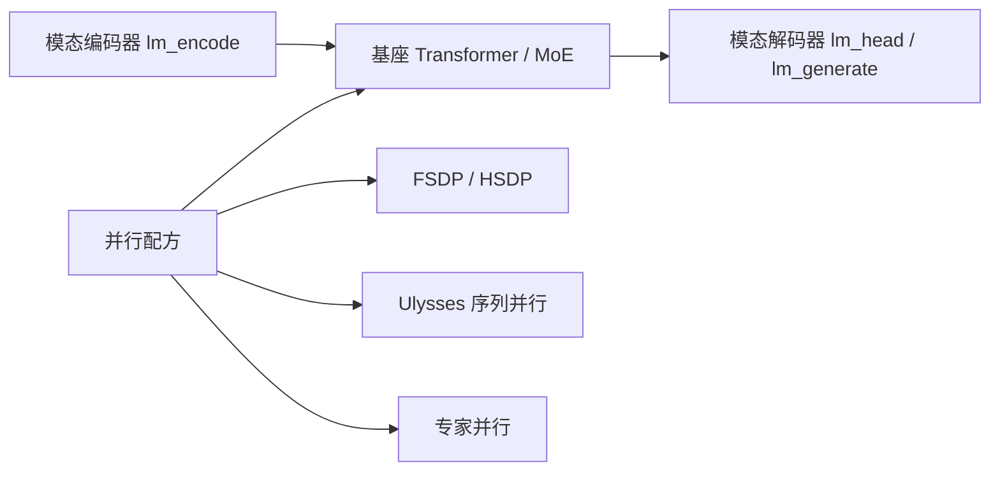

# VeOmni

    
把分布式策略从模型定义里拆出去：编码器、基座、解码器各管自己的模态；FSDP、序列并行、专家并行按配方贴到块上，而不是改每一层的前向。

    <footer>—— Ma 等，VeOmni: Scaling Any Modality Model Training with Model-Centric Distributed Recipe Zoo，arXiv:2508.02317</footer>

字节跳动 Seed 的 **VeOmni**（Ma、Zheng、Shi 等，2025）要解决的不是「再快一点的纯文本三维并行」，而是 **omni-modal**：任意模态进、任意模态出，架构异构，现有训练框架却把通信写进模型代码。论文命题是 *model-centric distributed recipes*——计算模块不感知切分，并行计划通过高层 API 贴到块上。代码开源在 `ByteDance-Seed/VeOmni`。本篇按 2508.02317 写框架合同与实验数字，不把某一版 Qwen-Omni 的层表当成 VeOmni 自己的模型。

## 问题

文本预训练框架（Megatron、[Nanotron](/llm/nanotron)、TorchTitan）默认一层是自注意力加前馈。全模态模型在基座两侧挂视觉编码器、音频编码器、图像生成解码器，序列长度随分辨率与帧数跳变，专家层与稠密层混用。把张量并行硬编进 `LlamaDecoderLayer` 之后，换一个 ViT 就要重写通信。DistMM、Optimus 一类多模态系统多半停在 any-to-text；any-to-any 的端到端训练仍缺可组合的并行配方。

论文把失败模式写成纠缠：模型定义与并行逻辑耦合，导致负载不均、扩展性差、加模态要改周。需要同时成立的三条是：新模态只实现编码/解码协议，不必改集合通信；长序列（图像块、视频、音频）能走序列并行而不是把整段复制进每张卡；MoE 基座能走专家并行，且 All-to-All 不要靠死绑流水线来隐藏。

### 全模态不是「多一个视觉塔」

理解模型通常是编码器 → 投影 → 语言模型。生成模型还要在输出侧接扩散或离散码本解码器。训练时编码器把原始模态变成嵌入插入基座；推理时解码器逐步把隐状态变成下一模态 token 的嵌入，全部生成后再 `lm_generate`。并行策略若假设「所有层形状相同」，编码器的空间轴与基座的时间轴会对不齐。VeOmni 把架构拆成三个解耦模块：encoder、foundation、decoder，各自实现统一接口（Hugging Face `PreTrainedModel` 加任务 mixin），流式流水线不绑死某一种 ViT。

实验里冻结模态编解码器、全量微调基座与投影，是为了测框架吞吐与收敛，不是声称「从零预训练 72B omni」。对照时不要和端到端预训练论文抢同一张 MFU 表。

## 方法

并行配方的元件是 [FSDP](/llm/fsdp) / HSDP、序列并行（DeepSpeed-Ulysses，并做 Async-Ulysses：All-to-All 与注意力前的线性投影重叠）、专家并行。组合例子：稠密视觉–语言用 FSDP+SP 的二维；MoE 基座再加 EP 成三维。论文强调 **非侵入 API**：换 HSDP 只改配置，不改模型；Ulysses 切在序列维，注意力仍可走 FlashAttention。全局设备网格统一管理进程组，避免手工维护多套 `ProcessGroup`。

模态侧协议：编码器实现 `lm_encode`，把原始输入变成插入基座的 token 嵌入；训练时解码器同样 `lm_encode` 提供目标侧嵌入，基座输出经 `lm_head` 映射到目标模态。推理逐步调用解码器的 `lm_embed` 作为基座下一步输入，结束时 `lm_generate`。特殊分隔符（如 `<image_start>`）切模态边界。数据上动态组批：缓冲区内拼到目标长度，减少为对齐而做的 padding，正确性靠变长注意力的 `cu_seqlens`。

### 论文报告的规模数字

环境是 8 到 128 GPU。稠密对照用 Qwen2-VL 7B / 72B；MoE 对照用基于 Qwen3-30B-A3B 的 omni 变体。数据混合包括 FineWeb（文本）、ShareGPT4V（图）、LLaVA-Video、语音助手数据、ImageNet（生成）。7B 在 8 卡上把上下文拉到 192K 时 MFU 约 **61.5%**；72B 在 128 卡上到 96K 时 MFU 约 **54.8%**。30B 级 omni MoE 在 128 卡、三维并行下上下文到 **160K**，吞吐超过 **2800 tokens/s/GPU**。摘要里的「30B、2800、160K、128 GPU」指这条 MoE 设定，不要套到 7B 的 256K 尝试上。

系统附件还包括：liger-kernel 的 RMSNorm / RoPE / SwiGLU、FlashAttention、层内重计算、激活与优化器卸载、ByteCheckpoint 做 omni 组件的弹性检查点、meta device 初始化后再转 DTensor 分片加载。MoE 的通信隐藏走算子级重叠（论文引用 Flux / COMET 一类），明确不依赖 DualPipe 那种流水线绑定，理由是模态间气泡不规则，管道方案发脆。

### 收敛实验不是榜首声明

文中三条 omni 结构——Janus 式图理解+图生成、LLaMA 基座+Qwen2.5-Omni 编解码、Qwen3-MoE 基座同样挂接——在理解（文本/图/视频/音频）与生成（文本与图像 token）上损失都下降。这证明框架能把不同损失接到同一训练循环，不是证明某个新基座打败了 GPT-4o。生成侧「decoder loss」是图像离散 token 的交叉熵，与扩散 MSE 不是同一指标。

## 机制

配方能组合，是因为切分轴不同。FSDP 切参数与优化器，救的是单卡放不下的权重。Ulysses 切序列，注意力前 All-to-All 把序列维收成头维上的完整片段，通信体积在「序列与卡数同比放大」时近似常值，这才撑得住视频长上下文。EP 切专家，救的是 MoE 宽度。视觉编码器可以只 FSDP，基座 FSDP+SP+EP，不必全网同一度。图 3 的数据流是：各模态编码器本地算完，再 All-to-All 把特征散射到持有对应序列分片的 rank——编码器输出长度不均时，这里会出现模态特有的负载问题，论文把它列为后续「modality-aware balancing」而未做完。

Async-Ulysses 能涨吞吐，是因为 Ulysses 的 All-to-All 与 $W_Q,W_K,W_V$ 投影在时间上可重叠：通信等的是下一层注意力，计算等的是当前线性。重叠不改变数学，只改变墙钟。HSDP 则在节点内深切、节点间复制，减少跨机 All-Gather，这与纯文本 FSDP 多机经验相同，只是 omni 的激活形状更怪，预取窗口更要限。

VeOmni 的「3D」是 FSDP×SP×EP，不是 Megatron 的 DP×TP×PP。把 Nanotron 的 `tp,pp,dp` 填进 VeOmni 配置会文不对题。流水线并行被论文放进未来工作，作为「下一步非侵入 PP」。

### 和 DistTrain、Megatron、纯 FSDP 的边界

多模态专用系统往往假设 any-to-text、固定视觉塔。Megatron 的 TP 要求头数可整除、层形状整齐，ViT 与扩散 U-Net 不满足。纯 FSDP 能训 72B，但 160K 上下文会在注意力激活上爆，必须 SP。VeOmni 的卖点是这三者可配在同一网格上，并且加一个音频编码器不必改网格代码。

## 边界与工程取舍

### 数字绑定形状与是否冻结编码器

2800 tokens/s/GPU 含冻结的重编码器时，基座看到的是已经算好的嵌入，墙钟结构与从像素训起不同。72B 的 96K 与 7B 的 192K 不能外推到「任意 72B 都能 192K」。动态组批改变的是 padding 浪费，不改变注意力的二次计算；超长视频仍要靠 SP 度。检查点跨切分恢复依赖 ByteCheckpoint 扩展，换回普通 `torch.save` 会丢 omni 子模块。硬件文档写 CUDA 13 / 特定 NGC 镜像，复现要按当时 `pyproject.toml` 的 extra，而不是假设 pip 默认就能 FA3。

不要把 Seed 内部生产栈与开源 VeOmni 画等号。论文是框架+配方+规模实验；模型质量来自所挂的 Qwen / LLaMA / Janus 组件。未来工作已写明：非侵入流水线、按模态的序列负载均衡。缺这两项时，极端异构 batch（一句文本配一段长视频）仍可能让部分 rank 空转。

引用：Qianli Ma 等，*VeOmni*，arXiv:2508.02317，2025；代码 ByteDance-Seed/VeOmni。不要写成「字节跳动的 Megatron」。

## 小结

- VeOmni 用模型中心的并行配方训全模态：编解码器插件化，FSDP / 序列并行 / 专家并行可组合。
- 30B omni MoE 在 128 卡上报 160K 上下文、超过 2800 tokens/s/GPU；7B / 72B 的 MFU 是另一组二维实验。
- 3D 指 FSDP+SP+EP，不是张量+流水线；PP 不在当前合同。
- 实验以冻结编码器、微调基座为主，测的是框架而不是新基座榜。
- 出处：Ma et al.，arXiv:2508.02317，2025。
