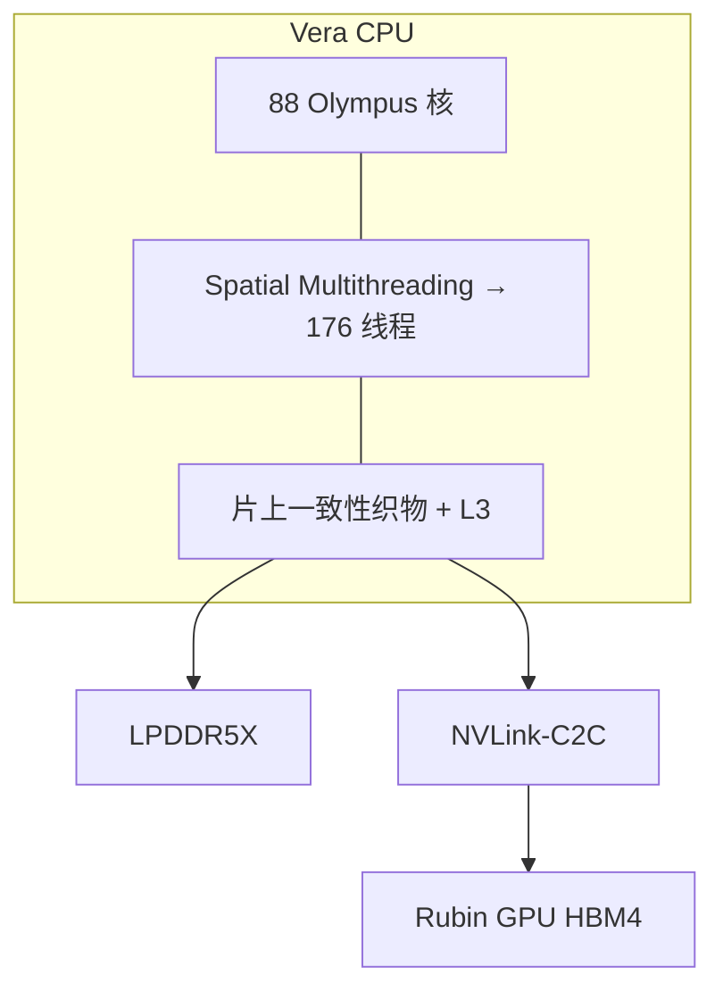

# Vera CPU：Olympus 核与 Spatial Multithreading

    
GPU 吃不满，常常是主机侧的编排、数据搬运与 agent 控制面先堵住；Vera 被写成这块数据引擎，而不是又一颗通用服务器 CPU。

    <footer>—— NVIDIA：88 个自研 Olympus 核，Spatial Multithreading 提供每核两线程、整颗 176 线程</footer>

[六芯片](/llm/rubin-six-chips) 里，Rubin 负责矩阵与注意力，Vera 负责让 GPU 别饿死。NVIDIA 公开把 **Vera CPU** 写成：88 个 NVIDIA 自研 **Olympus** 核，Arm 兼容；**Spatial Multithreading** 把每核资源做物理划分，跑两个硬件线程，整颗 176 线程。相对 Grace（72 个 Neoverse V2），Vera 还公开了更大的每核 L2、统一 L3、更高的 LPDDR5X 容量与带宽，以及翻倍的 [NVLink-C2C](/llm/nvlink-c2c-superchip)。本篇讲核与多线程模型对大模型系统意味着什么，不把「IPC 高 50%」一类厂商对照写成自己的 SPEC 分数。

## 问题

Agent 推理、RL 后训练、MoE 数据管道，都会在 GPU 核之间插入大量控制流：工具调用、沙箱、路由决策、KV 预置、批调度。这些工作延迟敏感、分支多、不太吃 Tensor Core。若仍用通用 x86 主机经 PCIe 喂 Rubin，控制面的尾延迟会变成 GPU 空闲。Grace Hopper 已经把 Arm CPU 推进超芯；Vera 要在核密度、内存带宽和多租户隔离上再推一档，使「始终在线的 AI 工厂」里 CPU 不再是被忽略的附件。

传统 SMT（时间切片共享执行资源）在满载时会让两个线程互相抢，尾延迟变差——而这正是多租户沙箱最怕的。Spatial Multithreading 公开强调：**物理划分**资源，而不是机会主义地抢同一套流水线，以便在「单线程要峰值」和「要线程密度」之间做运行时折中，并给出更可预期的隔离。

### Olympus 不是又一次贴牌 Neoverse

Grace 用的是 Arm Neoverse V2。Vera 的 Olympus 被写成 NVIDIA 自研、仍保持 Armv9.2 兼容，以便 Linux、编译器与 NGC 容器不加改动即可跑。自研的意义是：微结构（分支、预取、load-store、SIMD）可以按数据搬运与控制面调，而不必等待通用服务器核的路线图。公开表还列出每核 6×128b SVE2 FP8 等 SIMD 规格——这对预处理与部分向量例程有用，但不是与 GPU NVFP4 抢训练主路径。

88 核、176 线程、高达 1.5 TB LPDDR5X、高达 1.2 TB/s 内存带宽、C2C 1.8 TB/s，均来自 NVIDIA Grace vs Vera 对照表。规划用这些数量级理解「CPU 侧内存比主机 DDR 更像近端池」，不要把 1.2 TB/s 与 GPU HBM4 的 22 TB/s 加在同一行。

## 方法

把 Vera 当成三类角色来编配，而不是「多余的 88 核随便跑用户作业」。

1. **超芯宿主**：与两颗 Rubin 组成 [Vera Rubin 超芯](/llm/nvlink-c2c-superchip)，做数据预置、一致性 KV 卸载、启动与编排。
2. **Agent / RL 控制面**：工具调用、环境步进、奖励计算、沙箱。Spatial Multithreading 的隔离适合多租户突发。
3. **基础设施旁路仍让给 DPU**：存储、加密、虚拟交换应落在 BlueField-4，避免把 Olympus 核变成 NVMe 中断处理机。

调度上，延迟敏感的控制线程应绑到「单线程模式」更合适的核划分；吞吐型预处理可以开满双线程。具体如何在 OS 里切换划分，以 NVIDIA 与发行版文档为准，本篇不编造 sysfs 接口。NUMA：双路 Vera 经 C2C 被写成可呈现为更简单的域，软件仍应做亲和，只是不要按「两台独立 x86 主机」来切进程。

### Spatial Multithreading 与普通 SMT 的差别

普通 SMT：两个逻辑线程争用 ROB、执行端口、缓存；满载时单线程性能掉一截，且掉多少取决于对手。Spatial：公开描述是把宽核的资源划开，减少线程间干扰，换可预期延迟。代价是单线程能用的资源在双线程模式下变少——这是显式折中，不是「免费 2×」。多租户 agent 沙箱更吃可预期，不吃偶发的单线程峰值。训练数据加载若是吞吐型，也可以用双线程换 vCPU 密度。

## 机制

88 核做在单一计算裸片上，经第二代 Scalable Coherency Fabric 连统一 L3 与内存控制器。NVIDIA 强调避免 chiplet 跳数带来的延迟抖动，并给出片上织物分带宽、L3 容量等规格。对软件，这意味着核到共享数据的延迟更齐，适合调度器、路由表、小规模聚合这类「到处碰共享结构」的控制面。内存子系统用 LPDDR5X（公开提到 SOCAMM 可维护形态），带宽按 CPU 计已经很高，但仍远低于 HBM4——大 KV 仍应优先留在 GPU，CPU 内存是溢出租、预置缓冲和主机侧状态。

Olympus 的宽、深流水线服务单线程控制流：分支预测与 load-store 决定工具调用和解释器循环的墙钟。GPU 不等这些循环结束就会空转。把 Python 调度器、HTTP 网关无脑堆在同一颗 Vera 上与数据预置抢带宽，会重新制造「主机很忙、GPU 很闲」。应把数据路径留在 C2C 能看见的缓冲上，把杂务推到 DPU 或独立的服务机。

Confidential Computing 被写成 Vera 原生能力，覆盖 CPU–GPU 边界。这是平台安全叶子的对象。本篇只提醒：开启机密计算后的性能以官方文档为准，不要默认「与关闭时同一 C2C 带宽」。

### 不要用 Vera 替代 Rubin

Olympus 的 FP8 SIMD 做不了千亿参数的逐步 decode。把小模型「便宜地」放到 CPU 上跑，只适合控制面或真正的轻量预处理。主模型、注意力、专家 GEMM 必须在 Rubin 上。Vera 的成功标准是 GPU 利用率与控制面 P99，不是 CPU 自己的吞吐榜。

## 边界与工程取舍

不要把 176 线程理解成 176 个等价于满核的性能槽。不要在 x86 主机 + PCIe GPU 的机器上假设同一套 C2C 一致性。不要为未公开的 Olympus 流水线宽度、缓存延迟表编造数字。Arm 生态兼容不等于「所有 x86 专用二进制都能跑」——依赖 AVX 的数据加载器要重编。

双路与超芯是不同拓扑：双路是 CPU–CPU C2C；超芯是 CPU–GPU C2C。进程放置应区分。功耗与液冷随 NVL72 托盘，不按桌面 Arm 服务器估。

出处：NVIDIA *Inside the NVIDIA Vera Rubin Platform* 中 Grace vs Vera 表与 Olympus / Spatial Multithreading 节；Vera CPU 产品页与数据手册中的核数、线程数与 C2C 带宽。

## 小结

- Vera 是 88 个自研 Olympus 核的 Armv9.2 CPU，定位为 GPU 的数据引擎与 agent 控制面。
- Spatial Multithreading 物理划分每核两线程（176 线程），换可预期隔离，不是免费 SMT 加倍。
- LPDDR5X 与 C2C 提供近端主机内存池；大 KV 仍优先 HBM4。
- 基础设施卸载给 DPU，不要把 Olympus 当网卡中断处理器。
- 厂商 IPC / 带宽倍数按官方表引用，不作本站基准。
- 出处：NVIDIA Vera CPU / Vera Rubin 公开材料；一致性见 [NVLink-C2C](/llm/nvlink-c2c-superchip)。
