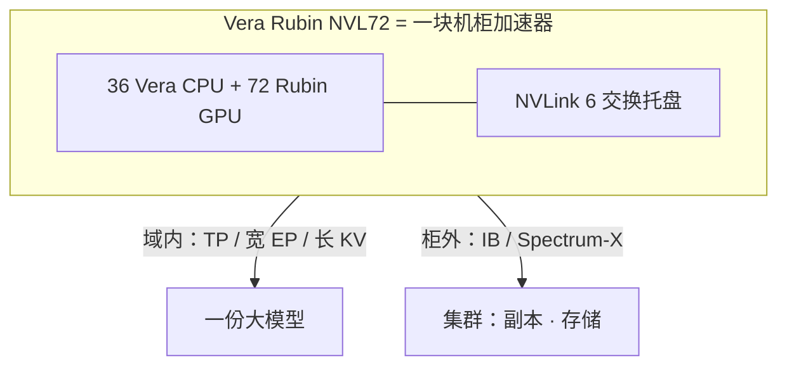

# Vera Rubin NVL72：72 GPU 一块机柜加速器

    
整柜 72 张 GPU 经 NVLink 6 全互连之后，软件应当把它当成一块机柜级加速器来切模型，而不是 72 台要互相打招呼的主机。

    <footer>—— NVIDIA 对 Vera Rubin NVL72 的公开表述：the entire rack operates as one rack-scale accelerator</footer>

上一篇把 [机柜作为逻辑加速器](/llm/rack-as-accelerator) 写成形态：NVLink 域覆盖整柜时，通信与调度按单域设计。本篇把对照物换成 **Vera Rubin NVL72**。NVIDIA 公开材料写：一柜集成 72 个 Rubin GPU 与 36 个 Vera CPU，由 [NVLink 6](/llm/nvlink-6) 连接，并配 ConnectX-9 SuperNIC 与 BlueField-4 DPU；柜外再走 Quantum-X800 InfiniBand 或 Spectrum-X 以太网。Blackwell 一代的 GB200 NVL72 已经把「72 GPU 一域」产品化；Rubin 一代把同一形态接到新的六芯片栈上，见 [六芯片共设计](/llm/rubin-six-chips)。本篇讨论这柜在编程模型里是什么，不把厂商营销里的训练 GPU 倍数或每 token 成本写成自己的测量。

## 问题

若调度器仍按「每 8 卡一个推理副本」切 NVL72，域内交换买了却闲着，宽专家、宽 TP、长上下文 KV 都跨不出去。若把 72 卡当成无差别设备却让集合通信跨出机柜，又把超节点用成了昂贵的 Scale-Out 节点。Vera Rubin 要回答的问题和 GB200 相同：一次 `all_reduce` 的通信子是整柜还是柜内某子集？HBM 是 72 份近端显存，还是一个能用 NVLink 做远程访问的域？Vera CPU 与 Rubin GPU 的亲和如何绑？

CUDA 仍然看见 72 个 device id。没有一种 `cudaSetDevice` 能把整柜 HBM 收成单一指针空间的魔法。公开产品页给出的机柜级容量是**相加**，不是自动统一寻址。逻辑加速器的意思是：通信与调度按单域设计，模型并行把整柜当一份权重来切。统一内存若存在，以 NVLink-C2C 与编程指南为准，见 [超芯](/llm/nvlink-c2c-superchip)，本篇不发明「机柜级 malloc」。

### 「一块加速器」覆盖计算托盘与交换托盘

NVIDIA 把 NVL72 写成计算托盘加 NVLink 交换托盘的机柜。计算托盘承载 Vera–Rubin 超芯、液冷、柜外网卡；交换托盘把 72 GPU 收成全互连域。第三代 MGX 公开强调无缆托盘与可热插拔交换，使维护窗口按柜级而不是按 PCIe 卡级来写。算法工程师可以不设计歧管，但不能在容量规划里假装功耗与风冷 8 卡机相同。

NVIDIA 2026 年 GTC 材料把 Vera Rubin 平台后补为七芯片（加入 Groq 3 LPU / LPX）。本篇的机柜对象仍是 NVL72：72 GPU + 36 CPU + NVLink 6 域。LPU 机柜是另一条推理加速形态，不要把 256 LPU 的公开规格抄进 NVL72 的 GPU 计数。

## 方法

把一个超节点编成一份模型并行组。TP 度可以超过 8，只要整组 rank 都在该 NVLink 域内。EP 可以把专家铺满 72 卡，decode 时 All-to-All 仍走域内交换。KV 池按整柜 HBM 规划长上下文或高并发。进程布局上，计算托盘仍跑 OS，编排系统应暴露「本柜 NVLink 域」为拓扑标签，禁止把跨柜 GPU 塞进同一 TP 组。

集合通信在域内走 NVLink Switch，并可把一部分归约卸到交换内的 [SHARP](/llm/nvlink-sharp)。对软件，这意味着 NCCL 的算法选择应针对「大域、高带宽、短距」。跨柜仍然用 Scale-Out 网卡做 DP 与存储，不要让检查点流量去抢 NVLink。DGX SuperPOD 一类公开蓝图用多柜 NVL72 加 Spectrum-X 组成可扩展单元；那是集群，不是把 72 再乘成一张更大的 NVLink 网。

### 训练、后训练与推理各吃域的哪一段

预训练的宽 TP 与 MoE All-to-All 最吃全互连：专家路由是突发、动态的，层次化 Clos 会引入跳数与拥塞。后训练的 RL rollout 与长思维链把 decode 步数拉长，域内带宽决定能否把大副本留在一柜而不拆成跨机 EP。推理服务适合在域内放**一个**大副本：DeepSeek 级 MoE 的专家铺在 72 卡上，避免跨机 decode 的逐步延迟；多个小模型则应显式切分，避免 72 卡被一个 7B 占满。OpenAI 兼容网关看到的仍是 `model` 字符串，后面是整柜一份还是柜内多份，属于调度。

Prefill / decode 分离可以发生在超节点内部，KV 走 NVLink 而不是柜外 RDMA。是否值得拆，取决于负载是否互相拖累，而不是因为机柜看起来像集群。

## 机制

逻辑加速器成立，靠的是域内任意 GPU 对之间不再经过数据中心叶子。交换托盘承担机柜脊：计算托盘连到交换托盘，而不是托盘两两直连成一张不完整的图。于是「机柜脊」是 NVLink 6，不是 Top-of-Rack 以太网。以太网 / IB 网卡仍在，职责是柜外。编程时若把套接字当域内默认路径，等于绕开这块加速器的脊。

每张 GPU 的 HBM 仍是近端最快；经 NVLink 读远端 HBM 有代价，但代价按加速器互连计。权重按 TP 分片常驻近端；KV 与激活是否远程，要看实现是否做了显式迁移。把每 GPU 的 [NVLink 6 卡间 3.6 TB/s](/llm/nvlink-6) 理解成「任意 kernel 都能以该速率扫完全柜 HBM」是错的——那是互连规格，不是单核访存屋顶线。HBM4 的容量与带宽见 [Rubin GPU](/llm/rubin-gpu-hbm4)。

Vera CPU 在公开配置里与 GPU 成对出现在超芯 / 托盘中，承担编排、数据搬运与部分 agent 控制面。逻辑加速器包含 CPU 内存与 GPU HBM 两层，不要只数 72 个 CUDA device。一致性模型以 NVLink-C2C 为准。

### 故障半径与液冷封装

交换托盘或背板故障影响的是整块逻辑加速器的带宽或连通性，而不是「少一台 8 卡服务器」。NVIDIA 公开写热插拔交换托盘、部分填充机柜仍可运行、以及故障时的动态改路；运维手册仍应按柜级爆炸半径来写：液冷、电源架、固件都是柜级。集群调度应能把该柜从副本集摘掉，而不是在半通的 NVLink 域上继续跑 64 路 TP 并抱怨 NCCL 超时。

液冷进水温度、功率平滑等设施特性属于机柜产品的一部分，本篇不把某一栏千瓦或摄氏度外推成机房通用定额。规划用当时产品页，并用自己的 NCCL 微基准验证域内集合通信。

## 边界与工程取舍

操作系统、容器、NUMA、PCIe 设备树仍然是分托盘的。Kubernetes 若按 Pod 绑 8 卡、不理解柜级域，会把逻辑加速器切碎。需要拓扑管理器把「NVL 域」当可分配资源。不要用 NVL72 当借口取消 Scale-Out：训练数据、多副本高可用、跨地域仍然要机柜间网络。不要填写未出现在 NVIDIA 文档里的铜缆单通道速率。

「一块 GPU」不能理解成可以忽略 TP 切分——72 卡仍要切，只是切完之后通信还在域内。厂商给出的「相对上一代少用若干 GPU 训练」或「推理吞吐倍数」依赖指定模型与精度，本篇不转述为一般定律。形态结论只依赖：72 GPU 一域、柜内 NVLink、柜外 IB / 以太网。

出处：NVIDIA 技术博客 *Inside the NVIDIA Vera Rubin Platform: Six New Chips, One AI Supercomputer* 与 Vera Rubin NVL72 产品页中的机柜与域描述。带宽数字以官方表为准，不在这里复制整张规格以免过期。

## 小结

- Vera Rubin NVL72 公开形态是 72 个 Rubin GPU + 36 个 Vera CPU，NVLink 6 收成一块机柜加速器。
- CUDA 设备仍是多 id；「一块」指通信域与调度单位。
- TP / 宽 EP / 长 KV 优先落在该域；DP、存储、多柜副本走 Scale-Out。
- 故障与维护按柜级爆炸半径写；交换托盘是机柜脊，不是 ToR 以太网。
- 不要把厂商加速比或未公开背板速率写进容量规划。
- 出处：NVIDIA Vera Rubin NVL72 公开文档；形态对照见 [机柜作为逻辑加速器](/llm/rack-as-accelerator)。
