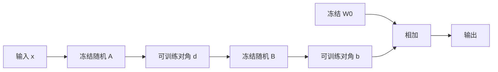

# VeRA

低秩矩阵可以冻结成共享随机投影，只学两条缩放向量；每任务参数降到与宽度同阶，而不是与 $r(d_{\mathrm{in}}+d_{\mathrm{out}})$ 同阶。

<footer>—— Kopiczko、Blankevoort、Asano，VeRA: Vector-based Random Matrix Adaptation，ICLR 2024</footer>

[rsLoRA](/llm/rslora)稳住了「可变的 $A,B$」在不同秩下的尺度。下一条极限是：**还要不要学 $A,B$**。Kopiczko 等人的 VeRA 把 $A,B$ 固定为随机矩阵（层间甚至可共享），只训练向量 $d$ 与 $b$ 去缩放行与列。缺口是：LoRA 的存储随任务 × 秩 × 层膨胀，服务成千上万适配器时，$A,B$ 本身成为瓶颈。VeRA 用随机特征换参数量。不把梯度投影（[下一课 GaLore](/llm/galore)）混进适配器公式。

## 问题

[LoRA](/llm/lora) 每层每任务存 $A\in\mathbb{R}^{r\times d_{\mathrm{in}}}$、$B\in\mathbb{R}^{d_{\mathrm{out}}\times r}$。$r=16$、宽 4096、几十层、注意力四投影，单任务已数百万参数；一万客户就要一万份。许多任务的更新也许能共用同一组随机方向，只在这些方向上的增益不同——类似随机特征 / 冻结投影。问题是：冻结随机 $A,B$ 是否还够指令适应；以及随机矩阵如何在层之间共享才不崩。

若不够，VeRA 会表现为学不动，需要退回可训练 LoRA 或加 $r$。若够，每任务只存两条向量，合并与分发成本接近「偏置级」。

### 随机投影不是压缩已学适配器

VeRA 不是把训好的 LoRA 做 SVD 再丢掉。它从一开始就不训 $A,B$。与 AdaLoRA 动态秩、rsLoRA 改 $\gamma$ 都不同。它押的是：适应发生在随机低秩子空间的对角缩放上。

论文在 GLUE 与指令设定上显示：参数远少于 LoRA 时仍可接近。主张是参数效率的另一端，不是普遍替代满秩 LoRA。

## 方法

一层的增量写成对角缩放夹随机低秩：

$$
\Delta W = \Lambda_b\, B\, \Lambda_d\, A,
$$

其中 $A,B$ 随机冻结，$\Lambda_d,\Lambda_b$ 由可训练向量 $d,b$ 生成对角。$A,B$ 可在层间共享同一份随机种子，以进一步压缩；每层仍有自己的 $d,b$。初始化使初始 $\Delta W$ 接近零（向量从合适常数起），以免第一步打歪 $W_0$。缩放与学习率仍要按[适配器逻辑](/llm/lora-vs-full-lr)取，通常大于全参。

训练与 SFT 契约不变：[模板](/llm/chat-template)、[仅回复](/llm/response-only-loss)。推理可把 $\Delta W$ 显式物化后合并，或保留向量在线乘；共享随机矩阵要在服务端存一份，任务只加载向量。

## 机制

可训练自由度约为每层 $r+d_{\mathrm{out}}$ 量级（视实现），远小于 $r(d_{\mathrm{in}}+d_{\mathrm{out}})$。表达力上限是：只能沿随机列空间做对角重加权，不能旋转到数据决定的子空间——LoRA 的 $A,B$ 能把子空间本身学出来。任务接近「在固定方向上增益」时差距小；需要发现新方向时差距大。这与[内在秩](/llm/lora-intrinsic-rank)课将讨论的「适应维数」一致：若内在维很小且与随机投影重叠良好，VeRA 够用。

共享层间 $A,B$ 等于假设各层可用同一组随机方向，层间差异全由 $d,b$ 承担。层间适应模式差很多时，应取消共享或回到 LoRA。

rsLoRA 的 1/√r 针对可训练因子的方差。VeRA 的随机矩阵尺度由初始化方差决定，应单独设定，使冻结投影的输出与基座激活同量级。

## 边界与工程取舍

领域适配要改很多方向（[DAPT](/llm/domain-adaptation-ft)）时 VeRA 往往不够。RFT 多轮自举需要容量，也不优先 VeRA。它适合：任务极多、每任务数据少、以风格/路由为主。随机种子必须与检查点一起版本化，否则向量无法对上 $A,B$。量化基座（QLoRA）可与 VeRA 叠加：基座 4-bit，向量 16-bit。

不要与 NVIDIA 芯片名「Vera」混淆：本课只指 Vector-based Random Matrix Adaptation。

## 小结

- VeRA 冻结随机 $A,B$，只学对角缩放向量，每任务参数接近向量级。
- 表达力低于可训练 LoRA：子空间不能学，只能在随机方向上增益。
- 层间共享随机矩阵进一步压缩，也进一步绑死层间几何。
- 适合海量轻量任务；不适合满秩领域改写。
- 随机种子是契约，必须与向量一起存。
- 出处：Kopiczko 等，VeRA，ICLR 2024。
