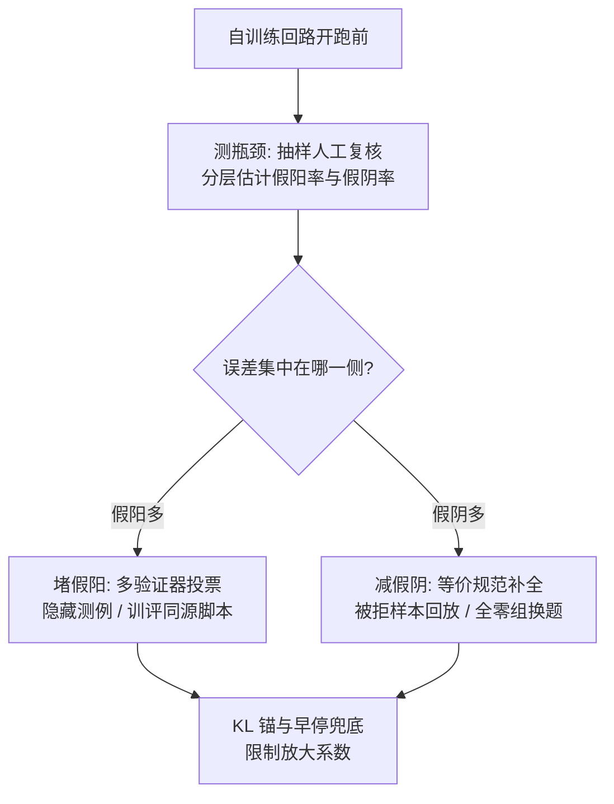
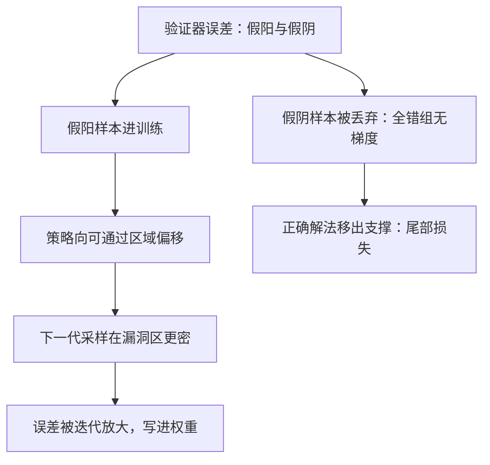

# 验证器瓶颈

自训练的上限不在生成侧——采样可以无限重试——而在验证侧：选择算子有多准，回路就能把策略推到多远。

<footer>—— 据 Gao 等 RM 过优化缩放律；Brown 等 Large Language Monkeys 整理</footer>

[上一课](/llm/model-collapse-empirics)把递归自食的后果钉在尾部丢失与熵收缩，并给了回混与累积两条不坍缩条件。本课把镜头对准回路里决定「什么算通过」的部件：即使分布不坍缩，自训练的上限也由验证质量决定。[数学验证器与等价](/llm/math-verifier-equivalence)与[代码验证器](/llm/code-verifier-unittests)已把假阳、假阴的具体来源讲清；本课讲这些误差如何顺着回路变成策略的偏移，以及为什么优化压力会放大它。

## 问题

生成侧与验证侧不对称：每题可以采样任意多条，覆盖随 $K$ 增长，而选择只有验证器那一步。Brown 等 2024 的大规模重采样实验口径：足够大的 $K$ 下，真实能力覆盖显著高于验证器选出的准确率——这个差距就是验证器瓶颈的宽度。误差两类，后果相反：假阳让错的解法被通过、进入训练数据；假阴把对的解法拒掉、正确的示范被丢弃。[可验证奖励](/llm/verifiable-reward)课的结论在这里兑现：抽取器与运行规范是 $R$ 的一部分，它们的系统性偏差不是噪声。

直觉类比：生成侧像撒一千张渔网出海，撒得越多总有网有鱼；验证侧是码头上只有一个质检员，他看走眼一条，那条鱼就永远定错了。渔网加倍救不了质检员的眼神——这就是「重采样填不平验证缺口」的直觉。

## 方法

治理按瓶颈位置分三步。测瓶颈：抽样人工复核通过样本（假阳率）与被拒样本（假阴率），按题型分层；用金标探针构造「满足判据但答案错」的样本测假阳。堵假阳：判据集成（多验证器投票）、隐藏与随机化测例（代码课结论：训练用例会被硬编码）、训练与评测同源脚本（数学课结论）、格式判据配内容复核。减假阴：等价规范声明完整（数值、符号、整数化三条口径）、被拒样本抽样回放人工判定、对全零组换题而不是硬训。兜底：KL 锚与检查点早停——[RLVR](/llm/rlvr)课测到真值验证器仍会过优化，误差非零的验证器只会更早。

数字实例：某题集上人工复核发现采样 200 条里有 120 条存在正确解法（覆盖 60%），而验证器最终选出的样本真确率只有 25%——缺口就是 35 个百分点。把采样数从 200 加到 2000 只会继续抬高覆盖，这道缺口一分都不会缩小；能缩它的只有修验证器本身。

## 机制

Gao 等 2023 的缩放律口径：代理奖励与金标的间隙随优化压力（KL 预算）放大。验证器误差不是恒定的背景噪声——回路施加的优化压力越大，同一条判据漏洞吃掉的份额越大。

偏移的因果链：假阳样本进入训练，策略分布向「能通过验证器」的区域移动，下一代采样在该区域更密，同型漏洞被更频繁命中，权重把漏洞学进去——回路把一次性的判据缺陷变成迭代放大的策略偏移。假阴走另一条链：组相对优势下，某题全组被误判为零则无梯度（[动态采样](/llm/dynamic-sampling-rl)课的无效组），正确解法的探索白做；系统性假阴（等价规范不认某类写法）把整类正确解法推离支撑——与坍缩课的尾部丢失同构，只是截断来自判据而非采样。两条链合流于一个事实：回路实际优化的是 $v$ 而非真值 $R^*$，收敛点是 $v$ 上的最优；$\|v-R^*\|$ 在支撑上的分布，就是策略与真实能力的距离。

治理三步分别插在这条链的环节上：测瓶颈量化入口误差，堵假阳与减假阴削弱偏移与截断两个分支，KL 锚限制放大系数——但都只能推迟与收窄，不能归零。

## 边界

本课假设验证器在迭代间固定；验证器自身随回路升级（自出测例、模型当裁判）引入新的循环依赖，属于下一单元。假阳与假阴的治理互相顶：更严的判据压假阳、抬假阴——权衡怎么摆，是下一课 RLVR 设计空间的主题。生成侧的覆盖测量（pass@k 与提交预算）见[pass@k](/llm/pass-at-k)课，不重复。

常见误区：初学者容易以为「多训几轮，回路自己会把验证器的误差磨掉」。实际上回路优化的是验证器 $v$ 而非真值 $R^*$：误差非零时，迭代只会把策略更快推向 $v$ 的漏洞区；KL 锚只能推迟与收窄，不能归零。

## 小结

- 生成可以重试，验证只有一次选择：瓶颈宽度是覆盖与选出质量之差。
- 假阳经回路变成策略偏移并被迭代放大；假阴把正确解法推离支撑。
- 回路优化的是 $v$ 而非 $R^*$；KL 预算放大间隙。
- 治理：测误差率、判据集成与隐藏测例堵假阳、规范完整与全零组换题减假阴、KL 锚兜底。
- 出处：Gao 等 2023 过优化缩放律；Brown 等 2024 重采样覆盖；Cobbe 等 GSM8K；数学与代码验证器两课。
