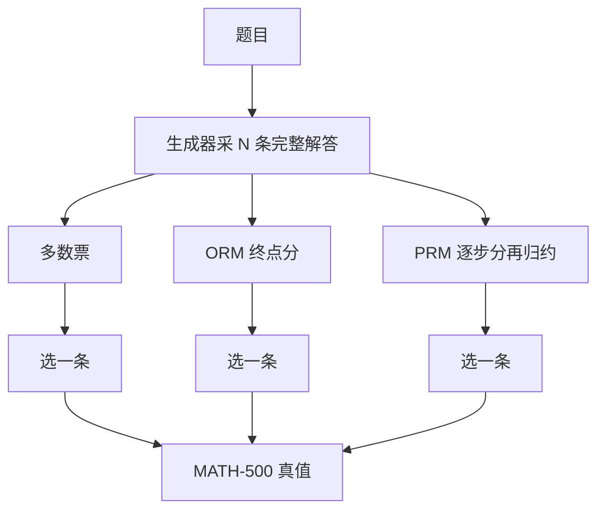

# Let’s Verify Step by Step

    
同一批候选越来越多时，过程验证器仍能把 MATH 准确率往上推，结果验证器先饱和；可靠的奖励模型，比再把生成器加大一档更值钱。

    <footer>—— Lightman 等，Let's Verify Step by Step，ICLR 2024</footer>

论文标题里的 verify 是实验主轴：生成器采样许多完整解答，用奖励模型当验证器做 Best-of-N，比较过程监督与结果监督谁更能随 $N$ 涨。PRM 怎么标、怎么训，见 [Process Reward Models Lightman](/llm/lightman-prm)；搜索侧接口见 [逐步验证](/llm/step-level-verify) 与 [PRM 引导搜索](/llm/prm-guided-search)。本篇按原文写验证命题、主表数字、以及「生成与验证分离」这条方法论。

## 问题

即使当时最强的解题模型，MATH 上仍会在中间步骤写错。改进有两条预算：继续训生成器，或把算力花在「同一题多写几份、再挑」。多写之后必须有一个排序器。多数票不看过程，只看最终数字的众数；ORM 拟合终点对错；PRM 拟合逐步对错。直觉上 $N$ 增大，覆盖上升，但「看起来像对的错解」也变多。若排序器吃这一类假阳性，Best-of-N 会先涨后平台。作者要量的就是这条饱和是不是监督类型的函数。

Uesato 等在更易的 GSM8K 上曾看到过程与结果反馈达到相近终点错误率、过程更省数据。换到 MATH、换到更强生成器、换到大规模人标之后，结论会不会翻？另外，人标贵，主动学习能不能让每一条标签更值？最后，把数据公开，让验证器研究不必从零标起。

### 评测切片必须先说清

PRM800K 训练用了 4.5K 道 MATH 测试题的解答标签，主曲线因此只在剩下 500 题上画。后来社区把这 500 题叫 MATH-500。N 的最大值是每题最多 1860 个样本（1024 token 内未给出答案的丢弃，Best-of-N 逻辑对此做了修正）。比较的是验证器，不是把 PRM 拿去 RL 微调生成器——原文没有把 PRM 当在线奖励做 PPO 的主结果。

「过程监督显著优于结果监督」在这篇里的操作化定义是：同一生成器、同一候选池、换验证器，Best-of-N 曲线更高、更晚饱和。不是「过程 RL 一定优于结果 RL」。R1 后来的规则奖励是另一条故事。

## 方法

大规模生成器（GPT-4 级，经 MathMix 与 MATH 微调）为每题采样候选。三个排序器：

- **多数票**：最终数字出现次数最多的赢。
- **ORM**：在每题 100 条均匀样本上按终点对错训练，给完整 $(x,y)$ 一个标量。
- **PRM**：PRM800K 逐步人标训练，轨迹分取逐步正类概率乘积。

Best-of-1860 在 MATH-500 上：多数票 69.6%，ORM 72.4%，PRM **78.2%**。作者强调随 $N$ 增大，PRM 与 ORM 的间隙加宽——多出来的候选里，「错步但终点像对」被 ORM 排前、被 PRM 压下。小规模实验用来拆两个混淆：训练集不可比、以及终点给分会奖到假阳性。他们还用大 PRM 给学生 RM 打伪标，做数据量消融；主动学习相对均匀标注约 $2.6\times$ 数据效率。

域外：把同一套验证器接到其它数学分布上，过程仍优于结果（公开叙述里有 Best-of-100 从约 63.8% 到 72.9% 一档的对照，精确数字以原文图为准）。这支持「PRM 学的是步骤合法性，不完全是 MATH 题型指纹」。

### 验证器比生成器更值得加数据

人标预算固定时，把标签给 PRM、让生成器保持采样，比把同等人力投入再写示范解，更能拉高 *已有候选池* 的选中准确率。这是标题的工程读法：先能检验，再谈更会写。生成器仍必须能偶尔写出正确轨迹，否则 $N$ 再大覆盖也是零。验证器不能发明预训练里没有的知识，只能在模型已经会采样到的模式里做筛选。

## 机制

### 为何 ORM 先饱和

$N$ 增大，正确轨迹的命中率按 $1-(1-p)^N$ 升，同时「欺骗终点分类器」的样本数也升。ORM 的特征——格式、\boxed{}、答案看起来像整数——在错解里同样可学。PRM 对局部错误敏感，覆盖收益更能体现为准确率。当 $N$ 大到开始系统攻击 PRM 盲点，同样会饱和，只是平台更晚。原文没有声称过程分数随 $N$ 单调至无穷。

生成器与验证器必须有余量。同源、同初始化、同盲点时，多采样只是把同一类错换顺序写出来。Lightman 用独立人标的 PRM，就是在买余量。用生成器自己的逐步对数概率当验证，测的是流畅不是合法。

### 假阳性是结果监督的结构性问题

最终数字对、中间符号错两次互相抵消，终点标签仍为正。ORM 被要求拟合这个标签，就会把抵消结构当正面特征。PRM 在第一处符号错误给负，整条乘积崩掉。这不是实现细节，是两种损失函数看见的随机变量不同。小规模里把终点假阳性 relabel 之后，ORM 会好些，但原文认为即使如此，过程路线在 MATH 上仍更强——难度和错误模式与 GSM8K 不同。

## 边界与工程取舍

主数字绑在一个极强生成器与 MATH-500、N=1860。小模型、小 N、开放域对话，曲线形状会变。验证器错误会被 Best-of-N 放大：过优化奖励模型是已知现象。原文几乎只做完整轨迹打分，不做生成中途剪枝；树搜索是后续工作对同一分数的在线用法。人标过程不可轻易换成「用终点回标中间步」而不改命题。

不要把 78.2% 写成「GPT-4 做 MATH 的 pass@1」。pass@1 低得多；78.2% 是验证器在 1860 份样本里挑出来的。服务上跑 N=1860 的代价是 decode，不是一张更好的表。产品若只能付 N=4，过程优势会缩小。

论文同时释放 PRM800K，是为了让验证器研究可复现。复现曲线仍缺大规模生成器权重；社区用公开样本仓库里的 1860 路打分可以核对接力，不能核对自己从零采样是否同分布。

### 何时不必上逐步验证

单测或符号引擎能硬判终点，多数票或程序检查器更干净。N=1 的延迟敏感聊天，验证器没有候选可挑。任务没有稳定步骤边界，先不要用这篇的协议。需要改生成器本身而不是挑候选，应做 RL 或 SFT，验证曲线回答不了「策略是否更新」。

## 小结

- 原文主结果：MATH-500 上 Best-of-1860，PRM 78.2%、ORM 72.4%、多数票 69.6%；间隙随 N 加宽。
- 命题是验证器类型，不是过程 RL；生成与验证分离。
- 主动学习提高人标效率；大 PRM 可给学生模型当自动标注。
- ORM 饱和来自终点假阳性随 N 增多；PRM 对错步敏感，平台更晚。
- 78.2% 必须带生成器、N、评测切片一起引用。
- 出处：Lightman, Kosaraju, Burda, Edwards, Baker, Lee, Leike, Schulman, Sutskever, Cobbe，*Let's Verify Step by Step*，ICLR 2024，arXiv:2305.20050。
