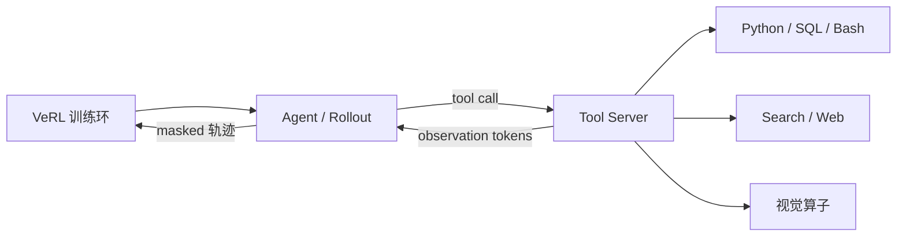

# VERLTool

    
把 RL 工作流和工具执行拆开：训练继续跟上游 VeRL，工具走独立服务器上的标准 API，轨迹按条异步跑，而不是整批在工具调用上对齐等待。

    <footer>—— Jiang 等，VerlTool: Towards Holistic Agentic Reinforcement Learning with Tool Use，arXiv:2509.01055</footer>

[RLVR](/llm/rlvr) 把可验证标量接进策略梯度，但默认仍是单轮：模型写完，验证器看终点，没有环境。一旦允许模型调代码、检索、SQL 或视觉算子，轨迹变成多轮，观察 token 来自工具而不是策略，系统还要在工具延迟上排队。TIGER-AI-Lab 的 **VerlTool**（Jiang、Lu 等，arXiv:2509.01055，仓库 `TIGER-AI-Lab/verl-tool`）把这件事命名为 **ARLT**（Agentic Reinforcement Learning with Tool use），并做成跟 VeRL 子模块对齐的插件层。本篇钉四条贡献怎么读：上游对齐、统一工具服务、异步 rollout 的近 2×、以及六个领域的「能用同一套基建追上专用仓库」。不把 ARLT 写成新的优势估计——损失仍是 PPO / GRPO 家族，变的是轨迹与掩码。

## 问题

Search-R1、Pixel-Reasoner、各类代码 RL 往往各写一份环境循环，工具协议写死，VeRL 一升级就分叉。同步 rollout 按 batch 对齐：一条样本还在等 Python 解释器，整批 GPU 空转。多模态工具会返回图像或视频 token，文本-only 的拼接假设崩溃。Jiang 等人把碎片化、同步气泡、跨域难扩展列为社区采用的三块石头。

概念上，单轮 RLVR 的状态是提示加已生成前缀；ARLT 的状态还包含环境与工具会话。动作是模型 token（常含 tool call），观察是工具返回，再经模板写回上下文。形式化后，轨迹是多轮、可多模态观察的序列。这要求训练侧能区分「该反传的模型 token」和「只做条件、不进策略损失的观察」，见 [多轮 loss mask](/llm/multiturn-loss-mask)。

### 表 1 不是排行榜

论文用一张工具覆盖表对照 OpenRLHF、VeRL、ROLL、RAGEN、slime、AReaL、SkyRL：检索、Python、Web、Bash、SQL、图像。VerlTool 六列都打勾。这是 2025 年 8 月 23 日截止的功能矩阵，不是吞吐或准确率排名。SkyRL 也覆盖终端与 SQL，但作者批评容器化部署重。缺勾的框架不代表不能接工具，只代表当时主仓库没有统一服务器。引用时写日期，避免用过期表格打后来的 slime / AReaL 版本。

VeRL 以 git submodule 接入。好处是跟 Sheng 等 HybridFlow 上游同步；坏处是你的插件必须跟 VeRL 的 DataProto / AgentLoop 契约一起变。这是维护策略，不是「我们 fork 后更稳」。

## 方法

架构拆成 **RL workflow**（VeRL 的训练、优势、更新）和 **Tool Server**（独立进程，标准交互 API）。Actor 在轨迹级与工具服务器通信，而不是「整个 micro-batch 一起 call_tool」。新工具是一个 Python 类：实现解析、执行、返回 observation。启动例：`python -m verl_tool.servers.serve --tool_type python_code --workers_per_tool 4`。无效动作可配 `done_if_invalid`；`finish` 工具负责清环境状态。

异步 rollout：各轨迹自己的工具延迟不再阻塞同批其他请求，论文报消除同步等待后 rollout 近 **2×**。这与 [AReaL](/llm/areal-async-rl) 的「训练–生成分池」不同：VerlTool 的 2× 主要来自**工具等待**，即使训练仍按 PPO 步同步，只要同一步内多轨迹不在工具上对齐，墙钟就会掉下来。六个任务：数学（代码执行）、知识 QA（检索）、SQL、视觉推理、网页搜索、软件工程（SWE-Bench 类），声称与专用系统可比，但统一在一套训练基础设施上。

### 插件只解决注册，不解决奖励

加一个 Python 文件能让轨迹跑通，不能告诉你 $r$ 怎么定义。SQL 任务的奖励可能是执行结果匹配；SWE 可能是测试通过率；搜索可能是答案 EM。ARLT 的「整体」指工具与多轮循环进同一框架，不是一个万能奖励。每个域仍要自己的验证器与数据清洗，否则 GRPO 只是在过拟合格式化的 tool call。

作者列表以 Jiang 为项目负责人，bibtex 作 Jiang et al. 2025，arXiv:2509.01055。代码 https://github.com/TIGER-AI-Lab/verl-tool。对照 HybridFlow / verl：Sheng 等 arXiv:2409.19256。

## 机制

上游对齐把「怎么切 DP/TP、怎么重切分 actor」留给 VeRL，VerlTool 只拥有环境边。这与 [Agent Lightning](/llm/agent-lightning) 的「harness 完全在训练外」不同：VerlTool 仍假设你在 VeRL 的 agent 循环里发 tool call，只是执行被卸到服务器。Lightning 连循环所有权都交给外部 harness。两者都要处理观察 token，但控制面不同。

异步的收益随工具时间占比上升。纯数学、验证器是正则匹配、几乎无 I/O 时，2× 不会出现。解释器冷启动、检索 RTT、浏览器，收益才大。服务器 `workers_per_tool` 过小会把气泡从 GPU 挪到工具进程队列；过大则打爆沙箱。多模态观察必须进入 tokenizer 的约定位置，并在 mask 上标 0，否则策略会学着模仿检索片段的文风。

### 与单轮 RLVR 的梯度差异

单轮里每个 token 的优势通常来自终点标量广播。多轮工具里，中间错误调用仍可能被终点成功掩盖（偶然搜到答案）。组相对基线能减方差，但不能替代过程奖励。VerlTool 提供轨迹结构，不强制 PRM。若你把工具失败写成负过程分，要自己接进奖励函数，并保证 mask 仍不在观察上反传。

## 边界与工程取舍

不要把六个域的「可比」写成全面 SOTA；专用仓库往往有未迁移的数据增强。不要在同步 VeRL 配置下期望论文的 2×。工具沙箱的安全与隔离是运维问题：Python 执行器等于在训练集群跑任意代码。VeRL 子模块升级可能改 AgentLoop API，插件要跟着改。若团队的 agent 已经在 LangChain 里写死、不愿重写成 Tool Server 类，Agent Lightning 的代理端点更合适。

SWE 与浏览任务的墙钟由环境主导，框架加速有上限。先 profile 工具 RTT，再决定值不值得上异步。沙箱失败（超时、OOM、网络策略）应返回可解析的错误观察并结束轨迹，而不是让 rollout 挂起；否则异步队列会被坏环境拖成同步。奖励函数必须能区分「工具崩溃」和「模型用错工具」，前者是系统噪声，后者才是策略该学的负信号。

Search-R1、ToolFormer（Schick 等）、OpenHands 是工具使用的前序，不是 VerlTool 的基线数字来源。引用 ARLT 时与 RLVR 分开：后者是奖励来源，前者是多轮工具交互范式。

## 小结

- VerlTool 在 VeRL 上拆出工具服务器，用标准 API 接代码、检索、SQL、视觉等，轨迹级异步减少工具对齐等待。
- ARLT 把单轮 RLVR 扩成带观察 token 的多轮轨迹，损失掩码必须把工具输出排除出策略梯度。
- 近 2× 钉在 rollout/工具等待设定；六域实验证明统一基建可行，不是一张总榜。
- 出处：arXiv:2509.01055；https://github.com/TIGER-AI-Lab/verl-tool。
