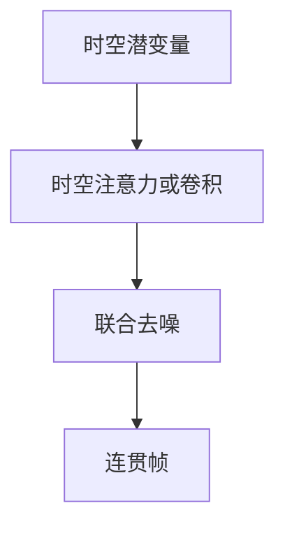

# 视频生成的时空建模

多一维时间之后，失败从「这一帧糊」变成「下一帧物体跳、光变、身份换」。生成器必须在时空上共享计算，而不是独立画每帧。

<footer>—— Ho 等 Video Diffusion Models；Blattmann 等 Align your Latents / Stable Video Diffusion</footer>

[上一课](/llm/diffusion-distillation)把单图采样步数压下去。理解侧[视频 token](/llm/video-tokens) 写的是抽帧阅读。本课缺口是生成：潜空间或像素上的时空 U-Net / Transformer，让运动连续。本单元生成基础到此；下一课改听与说。

## 问题

对每帧独立做 [DDPM](/llm/ddpm) 或文生图，时间上无耦合，闪烁是默认。Video diffusion 把噪声过程定义在 $x\in\mathbb{R}^{F\times H\times W\times C}$（或潜空间），网络用时空卷积或时空注意力。Align your Latents 在图像 LDM 上加时间层，用视频数据微调。SVD 把这条路做到可发布的图生视频。

文本只有全局句时，时间对齐弱（后课音画同步再钉）。分辨率 × 帧数 × 步数是立方账，少步与潜空间是前提，不是锦上添花。

因果时间注意力可流式出帧；双向时间更稳但必须见未来，不能边看边生成。产品要先选交互还是离线。

## 方法

骨干：在 [VAE](/llm/latent-vae) 潜格上加时间维；条件：文本、首帧、光流或姿态。训练用短 clip，推理用重叠或滑动延时，否则长视频会漂。评测：FVD、闪烁、身份保持、运动与提示遵守，不要只用单帧 FID。

## 机制

时间层让同一空间位置在相邻帧共享键值，物体才能「移动而不是重生」。若时间感受野短，只有局部光流稳、长程动作仍跳。这与理解侧记忆对称：生成器没有外挂记忆时，长程一致性必须写进层与条件（首帧、草图）。

## 边界

本课不处理口型与音轨对齐。下一单元从语音 codec 语言建模开始。

## 小结

- 视频生成要时空联合去噪，禁止独立逐帧。
- 算力是帧 × 空间 × 步数；潜空间与少步是前提。
- 长 clip 会漂，要条件与延时策略。
- 出处：Ho 等 Video Diffusion Models；Blattmann 等 SVD / Align your Latents。
