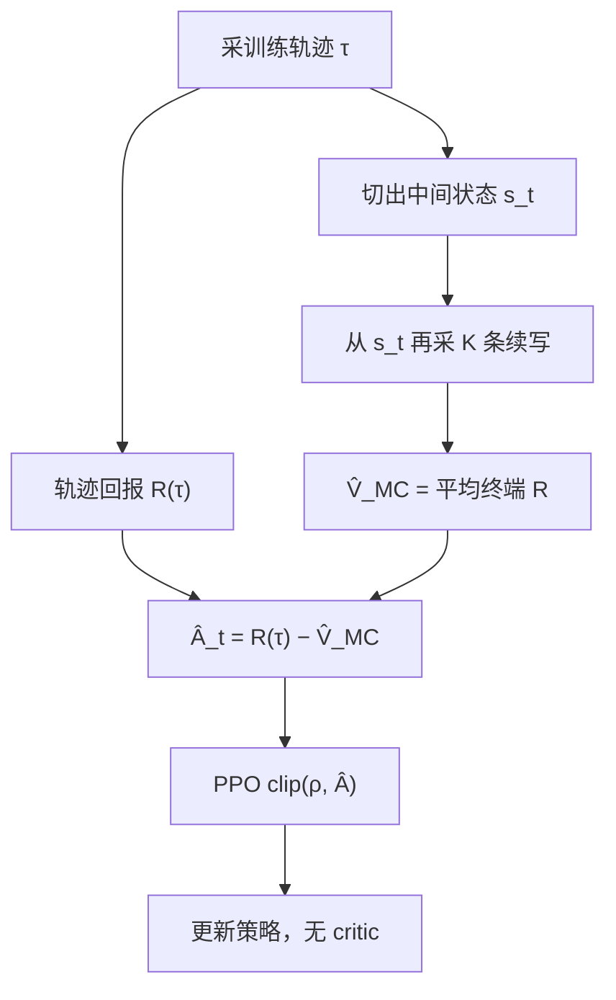

# VinePPO

    
语言环境可以从任意前缀重新生成；与其让价值网络去猜中间步骤还值多少分，不如从这些步骤再掷几次蒙特卡洛，得到无偏的信用分配。

    <footer>—— Kazemnejad 等，VinePPO: Refining Credit Assignment in RL Training of LLMs，ICML 2025</footer>

PPO 用 critic 做信用分配；[GRPO](/llm/grpo-paper) 与 [RLOO](/llm/rloo-paper) 干脆把整段当成一个动作，步骤之间不再分好坏。Kazemnejad、Aghajohari、Portelance、Sordoni、Reddy、Courville、Le Roux 问的是第三句话：若批评家在推理任务上其实猜不准，是不是应该**修好信用分配**，而不是把它扔掉？VinePPO 保留 PPO 的裁剪代理，把 $V_\phi(s_t)$ 换成从该前缀出发的 $K$ 条独立续写的平均回报。名字来自 TRPO 原文里仅适用于「可重置环境」的 Vine 变体，以及 AlphaGo 从中间局面再模拟的做法。本篇按 arXiv:2410.01679 写主张与公式。

## 问题

数学解答里，真正改变「还能不能做对」的步骤往往只有一两处：设对变量、选对引理、避开一次代数错误。其余句子是脚手架。终端奖励 $R\in\{0,1\}$ 延迟到最后一行，PPO 的价值网络要从前缀预测期望正确率。作者在 MATH 上量了这件事：把相邻步骤的优势定义为「做完这一步之后成功概率的增量」，直方图显示绝大多数步骤的增量接近 0；而 PPO 的 $V_\phi$ 在给候选下一步排序时，几乎不比随机更好。解释方差可以到 $0.7$–$0.9$，看起来 critic「训好了」，但那是拟合长度与格式，不是识别关键步骤。

于是出现一种表面上的悖论：丢掉逐步优势的 GRPO/RLOO 并不弱。作者的读法是——PPO 的逐步信号是错的，丢掉错信号当然不惨。问题变成：若换成无偏的逐步价值，PPO 骨架还能不能把推理 RL 推得更远？这需要一种不靠函数逼近、却能在中间状态估 $V(s_t)$ 的办法。

### 语言 MDP 可以重置到任意前缀

一般控制环境只允许重置到 $s_0$。Schulman 2015 的 Vine TRPO 因此在机器人上不好用。自回归生成里，状态就是已写出的 token 串：把 $s_t$ 再喂给 $\pi_\theta$，等于从该步重新开局。这与围棋从某局面再自我对弈是同一类操作，代价是额外 decode，不是再训一张与策略同样大的网。

VinePPO 不训练 PRM，也不在推理期做树搜索。蒙特卡洛发生在**训练**时的优势估计里。不要把它写成测试时 MCTS，也不要写成 Lightman 那种逐步分类器。

## 方法

先按 PPO 从当前策略采一条训练轨迹 $\tau$。在选定的中间状态 $s_t$（实验里按推理步骤切，而不是每个 token）上，再独立采 $K$ 条续写 $\eta_1,\ldots,\eta_K$，用同一终端奖励平均：

$$
\hat V_{\mathrm{MC}}(s_t)=\frac1K\sum_{k=1}^{K}R(\eta_k).
$$

该步优势用轨迹真实回报减这个估计，例如 $\hat A_t=R(\tau)-\hat V_{\mathrm{MC}}(s_t)$，再代入 PPO 的比率裁剪。$K$ 控制方差：更大则估计更稳、每轮更慢。策略损失、KL、clip $\epsilon$ 仍在；少掉的是价值头及其 MSE。

实验用公开基座：DeepSeekMath 7B 与 RhoMath 1.1B，先在 MATH / GSM8K 训练集上 SFT 得到 $\pi_{\mathrm{ref}}$，再 RL。对照包括 PPO（带价值网络）、GRPO、RLOO、RestEM、带过程信息的 DPO 变体。作者报告 VinePPO 在 MATH 与 GSM8K 的 pass@1 上持续高于这些基线，差距在更难的 MATH 上更大。每轮因 MC 采样更慢（1.1B 上相对 PPO 可到约 5 倍，7B 上约 2 倍），但达到 PPO 峰值准确率所需梯度步更少（文中写到约 9 倍与 2.8 倍），墙钟仍可更短（约 3.0 倍与 1.51 倍）。$K$ 增大，准确率跟着升。他们还画了「给定训练准确率时的测试准确率」：VinePPO 更高，即同样拟合训练集，泛化信号更强。

### 与组基线、过程奖励的分工

GRPO/RLOO 的基线是**提示级**的：同一题多条完整解答互相对照，一条之内的 token 共享同一优势。VinePPO 的基线是**前缀级**的：关键步骤之后 $V$ 升，之前的无效句优势近 0。过程奖励模型给的是分类器分数，有标注偏差；MC 给的是当前策略下的成功频率，无偏但吵。没有逐步人标、又怀疑 critic 时，VinePPO 用算力换无偏逐步 $V$。已有可靠 PRM 时，不必用 Vine 去模拟同一件事。

## 机制

### 无偏与「看起来训好了」不是一回事

价值网络最小化 $(V_\phi(s_t)-G_t)^2$。$G_t$ 在结果监督下几乎是「这题最后对不对」，与长度、套话高度相关，MSE 可以很低而逐步排序仍然随机。MC 估计的期望是 $\mathbb{E}[R\mid s_t]$ 在当前 $\pi$ 下的样本均值，偏差来自有限 $K$，不来自错误函数类。作者把 PPO 的 $V_\phi$ 与 MC 对「真值」（更多 rollout 估的 $V$）作散点：前者有偏，后者居中。这是他们主张「信用分配才是瓶颈」的主证据，绑定 MATH/GSM8K 与这两个数学模型。

$K=1$ 时 MC 价值就是一条续写的 $R$，方差等于回报本身。步骤很多时每步都 $K$ 条，成本按 $O(K\cdot L_{\mathrm{steps}})$ 涨。工程上只在步骤边界、或只在不确定的前缀上开藤，是实现选择，原文主实验按步骤切。

### 为何墙钟仍可能更短

每步更贵，但方向更对：无效步骤不再被均匀强化，KL 预算花在真正改变成功概率的 token 上。作者强调可验证推理数据稀缺，单位训练样本的测试收益更值钱。把「VinePPO 更快」写成绝对定律是错的——生成很贵、步骤极长、$K$ 很大时，墙钟优势会消失。原文的 3 倍、9 倍是 RhoMath/DeepSeekMath 那两套曲线上的读数。

## 边界与工程取舍

开放对话没有二元 $R$，MC 价值需要 RM，RM 的偏差会进入每一个前缀估计，比提示级基线放大得更碎。不可重置的工具环境（外部会话、不可克隆的浏览器）不能「再喂前缀」，Vine 假设不成立。它仍是 PPO 家族：要 clip、要 KL、要 SFT 初始化；不是 R1-Zero 那种纯规则大尺度 RL 的复述。

不要把训练期 MC 与测试期搜索混用同一张图。测试时从某步分叉是 [PRM 引导搜索](/llm/prm-guided-search)；VinePPO 分叉的目的是估 $V$，分叉结果扔掉，不进入最终答案。与 ReMax 的贪心基线也不同：贪心是提示级一条对照，Vine 是逐步多条对照。

「价值网络几乎不比随机强」是他们在候选下一步排序上的度量，不是说 PPO 在所有 RLHF 上都无效。HH 对话、短回复、稠密奖励，critic 仍可能够用。引用时带 MATH/GSM8K。

### 何时不必上 VinePPO

组采样预算已经很大、步骤短、只关心终端对错，GRPO 更简单。有逐步人标或硬检查器，直接训 PRM。decode 配额比显存更紧、无法负担逐步 $K$ 路续写时，不要用藤。需要无偏但只有提示级对照时，RLOO 足够。

## 小结

- VinePPO 用从中间前缀再采样的蒙特卡洛估计 $V(s_t)$，替换 PPO 的价值网络。
- 语言 MDP 可重置是该方法的前提；步骤边界上的 $K$ 条续写换无偏优势。
- 原文在 DeepSeekMath 7B 与 RhoMath 1.1B 的 MATH/GSM8K 上高于 PPO、GRPO、RLOO。
- 每轮更慢，但达到峰值所需步数与墙钟在文中设定下更少；数字不可外推到任意长度。
- 训练期信用分配，不是测试时树搜索，也不是过程奖励模型。
- 出处：Kazemnejad, Aghajohari, Portelance, Sordoni, Reddy, Courville, Le Roux，*VinePPO: Refining Credit Assignment in RL Training of LLMs*，ICML 2025，arXiv:2410.01679。
