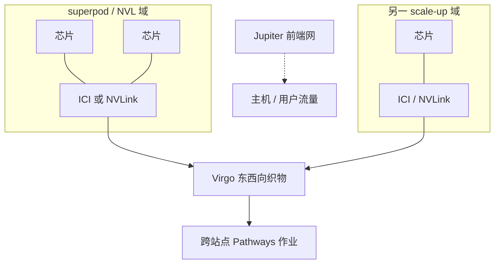

# Virgo ICI 互连

    
ICI 停在 superpod 边缘；Virgo 是数据中心东西向织物，把成千上万颗加速器收成一块逻辑超算，而不是把环面再拉长一跳。

    <footer>—— Google Cloud Next ’26：Virgo Network；第八代 TPU 博文中的 scale-out 段落</footer>

标题里的「ICI」容易读成 Virgo 替代了芯片间互连。官方分工相反：**ICI（Inter-Chip Interconnect）** 仍是 Pod / superpod 内的专用加速器网；**Virgo** 是新的数据中心 scale-out 织物，用来连接许多个 ICI 域，并同时服务 TPU 8t 与 A5X（Vera Rubin NVL72）。Jupiter 一类前端网络继续存在；Virgo 把加速器东西流量从通用 Clos 里拆出来。本篇写这层 DCN 与 ICI 的边界。单端口 Pb/s、每芯片 400 GbE 一类数字若未出现在所引官方博文，标为**公开信息有限**，不发明。

## 问题

8t 一个 superpod 已是 9600 芯片。再往上，要么做更大的 ICI 域（直径、光模块、故障域一起涨），要么在数据中心网络上把多个 superpod 连起来。后者过去走 Jupiter：多层 Clos、过订阅、与前端流量争用。官方把痛点写成 scale 与延迟：要在单数据中心连 **134,000** 颗 TPU 8t，并在多站点把 **一百万+** 芯片收成 Pathways 作业，通用数据中心网的跳数与拥塞窗口会变成训练集合的主项。

GPU 侧同一张织物：A5X 上 Virgo 支持单数据中心最多 **80,000** GPU、多站点最多 **960,000**。说明 Virgo 不是 TPU 专属协议名，而是 AI Hypercomputer 的东西向承载。问题变成：如何用更扁的交换机层次、更多平面，把加速器 RDMA 从机房前端网里隔离出来。

### ICI 与 Virgo 不要画成一条边

ICI 提供 Pod 内高带宽、短直径（8t 为 3D torus，8i 为 Boardfly）。Virgo 提供 Pod 间 / 机柜间的数据中心带宽。集合通信库若把本该留在 ICI 上的张量并行维画到 Virgo 上，逐步延迟会从专用互连变成以太网。正确的网格是：密通信维 ≤ ICI 域；数据并行、跨 Pod 流水、检查点与存储走 Virgo 或存储网。

官方 Next 博文写 Virgo 相对前代 **4×** 带宽、折叠织物以去掉「scaling tax」。134k 芯片与百万芯片是规模合同。47 Pb/s 对剖一类数字出现在行业报道，未出现在本篇所引 Google 博文正文——公开信息有限，不写入规划表。

## 方法

Cloud 产品叙述：Virgo 用高基数交换机减少网络层数，扁平两层无阻塞拓扑，多平面、独立控制域。这是标准的「为 AI 拆出东西向网」做法：控制面隔离，避免一次广播风暴打满训练织物。RDMA 是官方点名的能力。与 8t 组合时，Pathways + JAX 把跨站点作业呈现为近线性扩展——那是软件把故障、调度和数据加载补上之后的目标，不是物理层保证每跳延迟等于 ICI。

同一织物还接 A5X。规划混部时，TPU superpod 与 GPU NVL72 域都是 Virgo 上的端点，但域内集合仍走各自的 scale-up（ICI 或 NVLink 6）。不要假设 NCCL 与 XLA 会自动把跨类型设备收成一个 ICI 环。存储（Managed Lustre 的 TPUDirect/RDMA、Rapid Buckets）是另一张图：Virgo 解决加速器之间，存储有自己的绕过主机路径。

### 多平面与故障域

多平面意味着一条集合可以在平面间喷洒，单平面维护不必把 134k 端点全部打成阻塞。独立控制域降低「一次控制面错误关掉半个训练集群」的半径。对作业的含义是：重试与超时应按织物平面的 SLA 设，而不是按公有云虚拟网的默认 TCP。OCS 在 8t 博文里出现在 ICI/RAS 段（绕开坏盒）；不要和 Virgo 的电交换平面混成一个旋钮。

## 机制

从通信集合看，ICI 上的 AllReduce 是短跳、高带宽、拓扑已知；Virgo 上的 AllReduce 是数据中心 RDMA，延迟分布更宽，带宽按官方 4× 相对量抬升。XLA / Pathways 必须把 mesh 轴映射到这两种物理网上。映射错了，8t 的 121 ExaFlops 会停在等网络。跨站点百万芯片把一致性域再拉长一档：检查点、弹性重切、坏数据中心降级，都是 Pathways 的问题，不是把 ICI 协议跑在广域网上。

对推理，Virgo 很少应出现在逐步 decode 的关键路径。8i 的 Boardfly Pod 应装下延迟敏感的专家并行；跨 Pod 的 KV 或数据并行才上 DCN。若 decode 的 AllGather 已经走到 Virgo，先回头看并行度是否画错。

「Virgo ICI」作为口语，指的是 **Virgo 与 ICI 两层互连体系**，不是 Virgo 实现了 ICI 电气规范。写配置与工单时分开：Pod 内 ICI 版本/拓扑，机房侧 Virgo 平面与配额。

## 边界与工程取舍

GA 与 Cloud 区域可用性以控制台为准。每芯片注入 Virgo 的精确速率、交换机端口速率、是否 400 GbE，官方博文未给可引用的完整表——公开信息有限。不要用报道中的 47 Pb/s 去反推过订阅比。不要把 Jupiter 前端网关关掉当「已经有 Virgo」：用户流量、控制面、存储仍可能走另一张网。

### 和存储网、前端网三张图

Next 博文同时宣布 Managed Lustre 10 TB/s、Rapid Buckets、Z4M 本地盘集群。这些是喂数据与检查点的路径，TPUDirect 让数据绕过主机进加速器，并不走「芯片间 ICI」。Virgo 解决的是加速器东向西向；把检查点打到 Virgo 平面上与训练 AllReduce 争用，会把 goodput 从 97% 目标里抠掉。前端 Jupiter 仍承接用户与控制面。三张图（ICI/NVLink、Virgo、存储/前端）应分开配额与拥塞策略。混用 TPU 与 GPU 时，集合库、数值格式、故障域三条都要单独验收：同一条 Virgo 不意味着 XLA 与 NCCL 看见同一拓扑。

8i 的 Boardfly 与 8t 的 torus 都在 Virgo 之下。换芯片代数只改 scale-up 图，不自动改 DCN 规划。区域与跨城链路的时延不在 4× 带宽这句话里；百万芯片是逻辑集群规模，不是「跨洋也能逐步同步」。

出处：https://cloud.google.com/blog/products/compute/ai-infrastructure-at-next26 （134k TPU、百万芯片、A5X 80k/960k、4× 带宽）；https://blog.google/.../eighth-generation-tpu-agentic-era/ （Virgo + JAX + Pathways）。ICI 拓扑见 [TPU 8t](/llm/tpu-8t-sunfish) 与 [Boardfly](/llm/boardfly)。

## 小结

- Virgo 是数据中心 scale-out 织物；ICI 是 Pod 内芯片互连。两层不要画成一条。
- 官方规模：单数据中心 134,000 颗 8t，多站点百万级；GPU A5X 为 80k / 960k。
- 相对前代 4× 带宽、更扁的无阻塞层次；对剖 Pb/s 未在所引博文给出。
- 密通信留 ICI/NVLink；跨 Pod 与跨站点走 Virgo + Pathways。
- Decode 热路径不应落到 Virgo。
- 出处：Google Cloud Next ’26 与第八代 TPU 官方博文。
