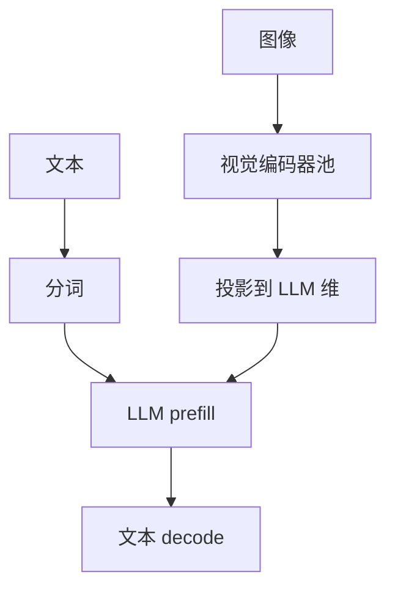

# 多模态编码器流水

图像先被视觉编码器变成一串 token，再与文本一起做语言模型 prefill；两段的屋顶不同，串行等待会把首 token 延迟写成两者之和。

<footer>—— Radford et al., CLIP；视觉指令对齐见 Liu et al., LLaVA；服务上把编码器与 LLM 分阶段调度</footer>

[上一课](/llm/tokenizer-parallel)把文本 id 并行化。多模态请求还要跑 ViT / 音频编码器。CLIP 把图像编进与文本对齐的空间；LLaVA 一类把视觉 token 投进 LLM 的 embedding 维。本课写 *流水*：编码器是算力密、形状由分辨率决定；LLM prefill 吃视觉 token 长度 $n_v$ 加文本。串行则 TTFT $=T_{\mathrm{enc}}+T_{\mathrm{prefill}}$；重叠与连续批要把编码器当成另一类 prefill 池。不重写连接器结构，见主干视觉课。

## 问题

$n_v$ 随分辨率与 patch 走，可以比文本提示还长，直接打进[长上下文曲线](/llm/long-context-memory-curve)的 KV 与二次项。编码器本身不写 LLM 的 KV，但占用 GPU。若与 decode 混在同一张卡，正在吐词的用户被一张图的 ViT 挡住。缺口是阶段拆分：视觉编码、投影、LLM prefill、decode 是否同池，以及编码器批处理（多张图拼 batch）如何与变长 $n_v$ 共存。

动态分辨率（AnyRes、切块）让 $n_v$ 请求间不同，连续批更难。会计必须用实际 $n_v$，不能用「一张图 = 256 token」的旧默认。

视觉 token 的 KV 在 LLM 侧与文本 KV 同公式。减 $n_v$（池化、压缩）是容量优化，与 CLIP 质量权衡，不是本课的核融合细节。

## 方法

独立编码器流或独立池：图在编码器上跑时，文本分词与系统前缀 KV 可并行准备。编码器输出再投影，插入 LLM prefill。连续批：编码器按图像批，LLM 按 token 批，中间有队列。失败回退：编码失败不应占着 LLM 槽。投机对视觉前缀通常只在文本生成段，视觉段是 prefill，投机收益小。

与 [FlashAttention](/llm/flashattention)：LLM prefill 的 $n=n_v+n_{\text{text}}$，二次项主要来自视觉。压缩 $n_v$ 对 TTFT 的导数往往大于再调 LLM 核。

## 机制

两段屋顶：ViT 像训练时的视觉骨干，算力绑定；随后 LLM prefill 也算力绑定，但形状是序列。拆池是为了别让 decode 带宽型工作与 ViT 抢 SM。成本模型应分列「每图编码」与「每视觉 token 的 LLM prefill」，否则定价只按输出字会亏在高分辨率上。

## 边界与工程取舍

不要在 CPU 上跑大 ViT 还期待与 GPU LLM 流水（除非刻意端侧）。不要把编码器权重与 LLM 权重轮流换入同一张显存不够的卡而不算换入延迟。下一课：没有自回归的嵌入 / 重排服务，批处理画像又不同。

出处：Radford et al., CLIP；Liu et al., LLaVA。服务调度是工程延伸，不发明论文号。

## 小结

- 视觉编码与 LLM prefill 是两段；串行 TTFT 是相加。
- $n_v$ 进入 KV 与二次注意力；分辨率是容量旋钮。
- 编码器应与 decode 分池或至少分流。
- 文本分词可与编码重叠。
- 定价要为每图 / 每视觉 token 分列。
- 下一课：嵌入与重排模型服务。
- 出处：Radford et al., CLIP；Liu et al., LLaVA。
