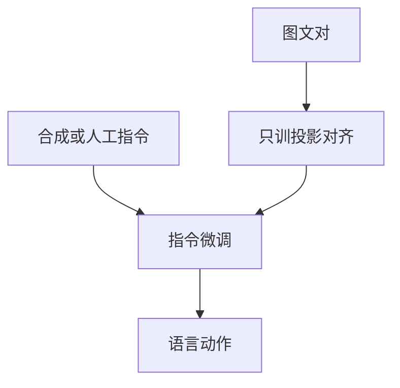

# 视觉指令数据

投影器只把格子送进词槽。模型会不会按指令谈图，取决于第二阶段看见过什么样的「用户问、助手答」。

<footer>—— Liu 等 Visual Instruction Tuning（LLaVA）；对照 [投影器](/llm/llava-projector) 的两阶段</footer>

[上一课](/llm/2d-rope)把二维格子写进注意力相位。[CLIP](/llm/clip) 与 [ViT](/llm/vit-as-encoder) 只保证图可被编码。缺口是语言动作：描述、列点、听约束、拒答。后课幻觉默认你已知道——指令数据会教模型「开口说物体」，也会教它说过头。

## 问题

图文对只监督短标题。[LLaVA 投影器](/llm/llava-projector) 第一阶段把 $H_v$ 对齐到能续写 caption；没有第二阶段，LLM 仍按纯文本对话先验说话，图前缀像一根未接线的电缆。学术 VQA 是单轮短答案，覆盖不了「按用户措辞谈这张图」。

LLaVA 的做法是把 COCO 的标题与框交给 GPT-4（当时只吃文本）合成多轮对话、细描述与复杂推理，约 158K。教师看不见像素，空间关系来自框坐标；标题没写的颜色、细字、未标物体，合成里也不会出现——这是后课物体幻觉的数据源，不是投影器算错。

指令模板必须与部署一致：图在前还是插在问题中、角色标记、是否要求先看图再答。槽位一变，第二阶段学到的「如何谈图」会错位。

## 方法

数据三类要分列，不要混成一个「视觉 SFT」桶。对齐用图–标题；指令用对话/推理；定位、OCR、GUI 必须另加带坐标或转写的监督，合成对话补不了。验收看：是否听否定（「不要列举」）、是否跟指代（「左边那个」）、是否在无物体时拒答。不要用 CLIP 检索分选指令数据配比。

## 机制

第二阶段把视觉前缀当作可被查询的键值，语言损失从回答词反传到投影（以及解冻的 LLM）。模型学会的是「看见这些 patch 时，助手分布该长什么样」，不是像素级绑定。因此同一套 [CLIP](/llm/clip) 骨干，换指令配比会换能力：多描述少定位，就擅长段落、弱于框。

## 边界

合成指令便宜，但教师偏见与标题覆盖是天花板。下一课用 POPE 把「说有物体」从真看见里拆开。

## 小结

- 视觉指令数据把格子对齐到语言动作；标题对不够。
- 教师若看不见像素，未写入标题的东西不会进入监督。
- 模板与任务配比决定会哪种谈法，不是投影器深度。
- 出处：Liu 等 LLaVA；投影路径见投影器课。
