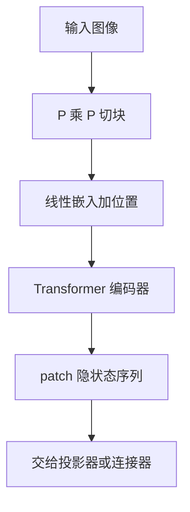

# ViT 作为视觉编码器

把图像切成固定大小的块、线性投射进 Transformer，视觉就可以和语言共用同一套注意力骨干；在足够数据上，归纳偏置可以从卷积换成大规模预训练。

<footer>—— Alexey Dosovitskiy 等, ViT, 2020</footer>

多模态模型里的「看」，今天几乎都是一个 Vision Transformer 把图变成 token 序列，再交给连接器与 LLM。Dosovitskiy 等人 2020 年的 ViT 把这套切块–嵌入–编码器写清楚；Radford 等人的 [CLIP](/llm/clip) 再把它放进图文对比空间。接到 Vicuna、Qwen、InternLM 时，分类头被丢掉，留下的是 patch 隐状态。本篇讲 ViT 作为视觉编码器时哪些结构决定会变成 VLM 的瓶颈：切块粒度、分辨率、位置编码、以及输出哪些 token。投影方式见 [LLaVA 投影器](/llm/llava-projector)，高分辨率切格见 [AnyRes](/llm/anyres)。

## 问题

卷积网络的归纳偏置适合自然照片的局部平移，但输出是特征图，接到自回归 LLM 还要再设计如何展平、如何对齐语言位置。ViT 的问题提法更硬：图像就是序列。一旦成立，视觉侧可以复用 Transformer 的缩放、残差与注意力实现，也可以直接在 patch 序列上做与文本同构的位置编码。代价是：切块把空间分辨率钉死在 $P\times P$ 的格子上，小于一块的字和边界会糊进同一个 token；输入分辨率若固定，高清图只能先被 squish。

VLM 还多一条约束：LLM 的上下文预算有限。视觉编码器吐出的 token 数 $\approx HW/P^2$，会直接占满语言上下文。编码器设计不再只对 ImageNet 准确率负责，还要对「多少个视觉 token、每个 token 多细」负责。

## 方法

### 切块、线性嵌入与编码器

$H\times W$ 的图按 $P\times P$ 切开（经典配置 $P=16$，CLIP 常用 $P=14$），每块展平为 $P^2\cdot C$ 维，乘嵌入矩阵得到 $d$ 维向量，再加位置编码，送入标准 Transformer 编码器。分类任务在序列前插 `[CLS]`；作为 VLM 编码器时，更常见的是把全部 patch 隐状态（有时加上 CLS）交给投影器，因为语言模型需要空间上铺开的证据，而不是一个全局向量。

$$
x_{i,j}=W\,e_{i,j}+p_{i,j},\qquad
z=\mathrm{Transformer}(x)
$$

其中 $e_{i,j}$ 是格子 $(i,j)$ 的原始像素块。没有卷积下采样金字塔，空间结构全靠位置编码和注意力。预训练数据不够时，ViT 会弱于 ResNet；数据与算力够时，这条序列化路径成为默认。

$P$ 是视觉侧最硬的超参。$P=32$ 省 token、毁细字；$P=8$ 保细节、把视觉序列拉到与一篇短文相当。VLM 里改 $P$ 等于同时改 OCR 能力与 LLM 上下文占用，不能只抄分类论文的 16。

### 分辨率与位置编码

ImageNet 式 ViT 用固定边长（如 224）加可学习一维位置嵌入。换分辨率必须插值位置嵌入，否则格子对不上。CLIP ViT 把常用边长抬到 224 或 336，仍然是固定画布：非方形图被 resize，文档被压扁。VLM 要高分辨率时有两条路：在固定 $P$ 下增大 $H,W$（token 数平方涨），或把图切成多块分别过同一 ViT（[AnyRes](/llm/anyres)），或按原生分辨率切块（[Qwen2-VL](/llm/qwen-vl-naive-dynamic-res)）。后两条都要求位置编码能表达二维格子，而不是假设长度为常数。

### 冻骨干还是端到端

LLaVA 一类常冻 CLIP ViT，只训投影与 LLM，视觉几何几乎不变。InternVL 把 ViT 本身做成大规模视觉基础模型并参与对齐，编码器会为生成任务改写特征。冻骨干省算力、保留 CLIP 的开放词汇；解冻才能让细字、表格线、截图 UI 进入损失。选择应由任务定：自然图像字幕可以冻；文档 VLM 往往必须让 ViT 看见更高清的输入，并允许它更新。

## 机制

ViT 能当视觉编码器，是因为它输出的已经是与 LLM 同构的 token 序列：同一套残差、同一套注意力混合。连接器不必把特征图「翻译成另一种计算」，只需做空间上的线性或浅 MLP 对齐。注意力在 patch 之间是全局的，一张图里任意两块理论上一步可达，这有利于「左上角标题与右下角合计」这类跨区域指代；也意味着复杂度随 patch 数二次，高分辨率会先打爆视觉编码器自己，而不只是 LLM。

位置编码决定模型是否知道块在哪。一维可学习 PE 把二维结构挤进一条序列顺序，对固定 raster 扫描够用；分辨率一变或切格顺序一变，就必须插值或改用二维 RoPE。VLM 的定位、OCR 读序，依赖的是「token 仍携带稳定的二维坐标」，不是 CLS 里的主题。

CLS 适合检索与对比学习的全局向量；生成式 VLM 若只把 CLS 投进 LLM，等于主动丢掉布局。LLaVA 保留 patch 序列是机制上的选择：让语言侧仍能做空间注意力。压缩视觉 token 时，删的是哪些 patch，等于删哪一块版面。

## 边界与工程取舍

固定画布会扭曲宽表、长截图、手机长图。切块不可逆：跨 patch 的细笔画被切开，要靠后续层拼回来，小字号 OCR 会先失败。视觉编码器的二次注意力在 4K 图上比 LLM 侧更早成为墙，于是才有窗口注意力、patch merge、像素 shuffle——那些是压缩与核，不是否定 ViT。

不要把「用了 ViT」理解成「用了 CLIP」。ImageNet ViT、CLIP ViT、SigLIP、InternViT 的监督不同，接到 LLM 的零样本起点不同。也不要把 patch 数当成免费的分辨率：AnyRes 多切几格，LLM 上下文线性涨，生成变慢，这是 [视觉 token 压缩](/llm/vision-token-compression) 要管的账。

评测视觉编码器时，ImageNet 或 CLIP 检索高，不保证文档 VQA 高。应在目标分辨率、目标文字大小上直接测读字，而不是只报骨干论文的分类数。

取舍：默认用 CLIP 类 ViT 出 patch 序列；分辨率策略与是否解冻，按 OCR 与上下文预算联合选。切块大小一旦为了省 token 加大，后面的连接器补不回已经混进同一 patch 的笔画。

## 小结

- ViT 把图像切成 $P\times P$ 块，线性嵌入后用 Transformer 编成 patch token 序列，作为 VLM 的视觉前端。
- VLM 通常丢分类头、保留空间上的 patch 隐状态，而不是只送 CLS。
- 分辨率、patch 大小与位置编码共同决定细字能否被看见、序列有多长。
- 固定画布会扭曲版式；高分辨率要靠切格、原生切块或更大输入，并接受 token 增长。
- 冻 CLIP 骨干省算力；文档与 UI 往往需要更高清输入并解冻编码器。
- 视觉侧自己也有二次注意力，高分辨率要另做窗口或合并，不能只催 LLM。
- 出处：Dosovitskiy et al., *An Image is Worth 16×16 Words*, 2020。对齐见 Radford et al., CLIP, 2021；接到 LLM 见 Liu et al., LLaVA, 2023。
