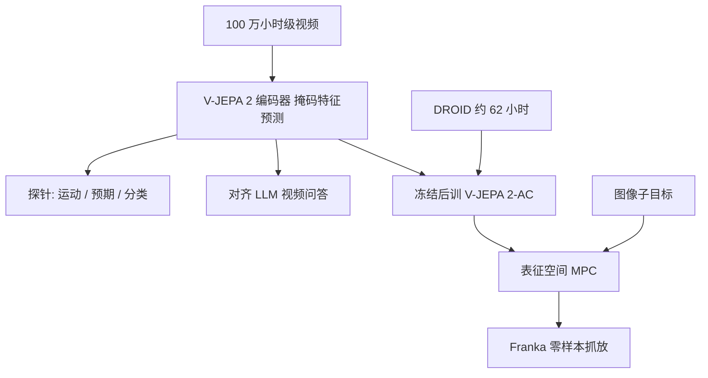

# V-JEPA 2 世界模型

    
现代人工智能的一项主要挑战，是主要靠观察来理解世界并学会行动。

    <footer>—— Assran et al., V-JEPA 2: Self-Supervised Video Models Enable Understanding, Prediction and Planning, arXiv:2506.09985</footer>

Meta FAIR 在 2025 年 6 月发布 **V-JEPA 2**（论文日期与 arXiv:2506.09985；官方博客 *Introducing the V-JEPA 2 world model and new benchmarks for physical reasoning*）。它把 Yann LeCun 的联合嵌入预测架构（JEPA）缩放到约 **12 亿**参数、超过 **100 万小时**互联网视频，用表征空间里的掩码去噪学世界，而不是生成像素。随后冻结编码器，用不到 **62 小时** DROID 无标注机器人视频训一个约 3 亿参数的动作条件预测器 **V-JEPA 2-AC**，在两个实验室的 Franka 上零样本做抓取与抓放——不采集目标机数据、不设任务奖励。本篇写这一版：观察预训练、动作后训练、以及用规划而非模仿出策略。权重与代码在 `facebookresearch/vjepa2`。

## 问题

基于交互的世界模型（Dreamer 一类）要状态—动作—奖励，真实机器人日志太少。基于视频生成的世界模型能画下一帧，规划时每一步都要出像素，算力与「不可预测细节」（草叶位置）绑在一起。JEPA 的假设是：智能体需要的是可预测结构（物体轨迹、接触），不是像素似然。第一代 V-JEPA 已在短视频上验证掩码特征预测；V-JEPA 2 要回答的是缩放之后，表征能否同时服务理解、预测与规划。

规划合同被写得很窄且很硬：单目 RGB、图像目标、模型预测控制，新物体与新房间。这与 π₀ 类 VLA 的「语言进、动作出」不同——V-JEPA 2-AC 不出开放词汇指令跟随，而出在表征空间里滚动态的动力学。

### 像素生成不是规划的必要条件

论文把视频生成路线的评价重心写成保真与观感，规划演示有限。JEPA 只在丢失的管块上对特征做 L1，EMA 目标编码器防坍缩。不可预测的纹理被编码器学着忽略，预测器就不会为了草叶浪费容量。代价是：若任务依赖那些被丢掉的细节（细纹理材质、文字），表征里可能根本没有。

博客与论文都强调：V-JEPA 2-AC 的 62 小时来自公开 DROID，部署实验室未再采数据。成功是「有图像子目标的抓取式操作」，不是语言指定的家务长程。三个新物理推理基准随模型一起发布，用来评视频模型是否懂世界，而不是再刷 Kinetics。

## 方法

预训练：视频切成 $2\times 16\times 16$ 的 tubelet，多块掩码（与 V-JEPA 相同族）。编码器 $E_\theta$ 只看见未掩码 token；预测器 $P_\phi$ 吃编码器输出与可学习掩码 token（带位置），回归 EMA 编码器在完整视频上的特征。目标为

$$
\min_{\theta,\phi,\Delta_y}\ \bigl\|P_\phi(\Delta_y,E_\theta(x))-\mathrm{sg}(E_{\bar\theta}(y))\bigr\|_1.
$$

位置编码改为 **3D-RoPE**（时间/高/宽三分特征维），以稳住最大档。缩放四件套：数据从约 2M 到 **VideoMix22M**（约 2200 万样本，含 SSv2、Kinetics、HowTo100M、经检索清洗的 YT-Temporal-1B、ImageNet 静帧当 16 帧视频）；编码器 ViT-L → ViT-g（约 10 亿级）；迭代 9 万 → 25.2 万；预热与恒定阶段用短、低分辨率，衰减阶段再升到更高空间分辨率与 64 帧。图像以 0.25 的采样权重混入，补外观覆盖。

冻结编码器之后，V-JEPA 2-AC 是新的动作条件 Transformer：块因果注意，自回归预测下一帧表征，条件于历史帧、动作与末端状态。训练数据是 DROID 上无任务标签的交互视频。控制时在表征空间做 MPC：对候选动作序列滚出未来特征，使到达图像目标的能量（表征距离）下降，再执行。论文写两个实验室的 Franka、新物体、抓与抓放。

### 对齐语言模型是理解探针，不是第二套世界模型

把 V-JEPA 2 编码器接到约 80 亿参数级 LLM 上做视频问答。官方数字：PerceptionTest 84.0、TempCompass 76.9（多项选择）、以及 MVP、TemporalBench、TOMATO 等。论点是：**没有语言监督预训练的视频编码器**仍能对齐到语言并达到该量级 SOTA，反驳「视频塔必须从语言对比学起」。这与规划路径共享编码器，不共享动作头。

## 机制

掩码去噪在特征空间迫使编码器为预测器提供「可被补全」的状态。运动理解（Something-Something v2 top-1 **77.3**）和动作预期（Epic-Kitchens-100 recall-at-5 **39.7**，相对前 SOTA 约 +44%）被当成：时间结构已经被表征吸收。分类评测一律冻编码器、训浅 attentive probe，避免把线性探针失败写成世界模型失败。

V-JEPA 2-AC 的块因果注意让同一时刻的空间块能互看，跨时刻只能看过去，符合在线规划。因为预测的是特征不是像素，MPC 的内循环是 Transformer 前向而不是扩散采样，才能在臂上实时试动作。零样本的机制含义是：DROID 的交互统计 + 互联网运动先验，足够把「爪子靠近杯子」编码成可优化的能量，而不是记住实验室桌布。

1.2B 是官方博客对发布模型的参数叙述；论文缩放曲线以 ViT-g/16 为主。写规格时用博客的 1.2B 发布档，写消融时用论文的 ViT 档位。不要把视频问答的 8B 语言模型参数加进世界模型本体。

### 规划需要子目标，策略没有自己「想任务」

图像目标由实验者给出。模型不会从「收拾桌子」推出先抓哪一只杯子。这与 Helix、π₀.₅ 的语言层正交：V-JEPA 2 证明观察预训练可以变成动力学，不证明它能替代指令跟随 VLA。能量最小化也不是奖励学习——没有任务奖励，只有表征空间里的目标距离。

## 边界与工程取舍

AC 模型约 3 亿、只在 DROID 后训练，泛化到新实验室仍限于抓取式、有视觉目标的操作。接触丰富、可变形、多步语义家务不在演示范围。JEPA 丢掉的不可预测细节，可能正是某些操作需要的。预训练数据虽来自公开源，YT-Temporal-1B 的清洗与权重是论文配方，完整 100 万小时不可由读者一键重建。博客同时发布的物理推理基准，应用那些基准上的数字，不要把 SSv2 当成「已会物理」。

不要把 V-JEPA 2 写成 Cosmos 或 Sora 的开源替代：后两者生成可观看的未来像素；前者生成（或对齐）表征与规划。也不要把 LeCun 2022 的 AMI 路线图写成已经完成——论文自己说这是「主要靠观察学习」的一步。

出处：Assran et al.，*V-JEPA 2: Self-Supervised Video Models Enable Understanding, Prediction and Planning*，arXiv:2506.09985；Meta 博客 https://ai.meta.com/blog/v-jepa-2-world-model-benchmarks ；代码 https://github.com/facebookresearch/vjepa2 。JEPA 框架见 LeCun (2022)；前代 V-JEPA 见 Bardes et al. (2024)。DROID 见 Khazatsky et al.。

## 小结

- V-JEPA 2 在特征空间做掩码预测，用约百万小时视频学观察世界模型。
- 缩放靠更大 ViT、VideoMix22M、更长训练与后期升分辨率/帧数；3D-RoPE 稳住大模型。
- 理解：SSv2 77.3、EK100 预期 39.7；对齐 LLM 后在多个视频问答集达 8B 档 SOTA。
- V-JEPA 2-AC 用约 62 小时 DROID 学动作条件动力学，MPC + 图像目标实现零样本抓放。
- 它不替代语言条件 VLA；子目标仍是外部给的。
- 出处：arXiv:2506.09985 与 Meta 官方博客。
