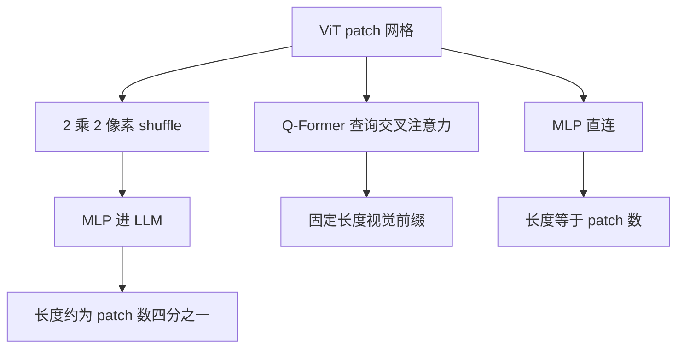

# Qwen-VL / InternVL 连接器

视觉 token 要进语言模型，可以问询压缩、可以浅投射，也可以先在像素格上重排再投射；连接器选的是信息瓶颈的位置，不是「有没有多模态」。

<footer>—— 对照 Bai 等 Qwen-VL，Chen 等 InternVL</footer>

[LLaVA 投影器](/llm/llava-projector) 把连接器减到 MLP。另一条谱系则明确承认：视觉序列太长，必须在进 LLM 之前改形状。Bai 等人 2023 年的 Qwen-VL 用带位置的视觉–语言适配器，以可学习查询做交叉注意力，把 ViT 特征压成固定长度。Chen 等人 2023–2024 年的 InternVL 把视觉骨干做到很大，连接器从对齐用的浅层走到 InternVL-1.5 的像素重排（pixel shuffle）加 MLP。本篇对照这三类：Q-Former 式查询、MLP 直连、像素 shuffle，不展开后续的原生动态分辨率。

## 问题

ViT 输出 $N_{\mathrm{vis}}\propto HW/P^2$ 个 token。336 边长已经五百以上，高清文档上千。LLM 上下文若再叠系统提示与多图，视觉前缀会先把对话挤掉。连接器必须在三种冲突里选位置：保留空间分辨率、限制进语言模型的长度、以及是否引入新的注意力模块。

查询式压缩把长度钉死，细节进瓶颈；MLP 直连把冲突转交给 LLM；像素 shuffle 用空间下采样换通道，长度降 4 倍但仍保持规则格子。Qwen-VL 与 InternVL 不是重复 LLaVA，而是把「桥」当成一等设计：前者强调固定查询与二维位置，后者强调大视觉骨干与可扩展的空间重排。

## 方法

### 查询式适配器：Qwen-VL

Qwen-VL 的视觉前端是 OpenCLIP 类 ViT。连接器是一层交叉注意力：一侧是 $M$ 个可学习查询（论文设定在固定长度，如 256 量级），另一侧是 ViT patch 键值。查询输出再作为视觉 token 进 Qwen LLM。这与 BLIP-2 的 Q-Former 同族：长度由查询个数决定，与输入分辨率解耦。Qwen-VL 还把二维位置信息注入适配器，使压缩后的 token 仍携带格子坐标，而不是变成无序的全局袋。

$$
u_m=\mathrm{CrossAttn}(q_m,\,K_{\mathrm{vis}},\,V_{\mathrm{vis}}),\quad m=1,\ldots,M
$$

输入当时以固定分辨率（如 448）为主，先 resize 再编码，再压到 $M$。适配器要学的是「这 $M$ 个槽各看图的哪一部分」。训练分多阶段：先对齐视觉–语言，再端到端。细节以 Bai 等人 2023 年论文为准，这里只钉住结构：固定查询 + 交叉注意力 + 位置。

$M$ 是压缩比旋钮。$M$ 太小，OCR 与多物体计数先死；太大，查询式连接器退化成几乎不压缩的昂贵交叉注意力。不要把 256 当成魔法常数，它是当时分辨率与 LLM 窗口之间的折中。

### MLP 直连与 InternVL 的骨干

InternVL 2023 年把 ViT 做到数十亿参数量级的视觉基础模型，与语言模型对齐。当视觉表示已经很强时，连接器可以回到浅映射：特征够用，不必靠 Q-Former 再「问」一遍。这条路与 LLaVA 相同，差别在视觉侧容量——InternViT 为通用视觉–语言任务训过，而不是只借用 CLIP 分类/检索特征。浅连接器的长度仍等于 patch 数，高分辨率压力更大，于是才有下一小节的重排。

### 像素 shuffle：在格子上降长度

InternVL 后续版本（含 2024 年动态高分辨率路线）在投影前做像素 shuffle：把 $2\times 2$ 邻接 patch 的通道拼在一起，空间格点变成原来的 $1/4$，通道变 4 倍，再经 MLP 映到 LLM 宽。

这与查询压缩不同：没有内容选择，每个 $2\times 2$ 窗口都被保留为更宽的一个 token，布局仍是规则的下采样图。实现简单、对硬件友好，信息损失是空间混叠而不是「查询没问到」。它也不同于下一篇才展开的 Qwen2-VL $2\times 2$ merge 训练细节，但同属「先改格子、再投影」家族。

## 机制

Q-Former / Qwen-VL 适配器的机制是内容相关池化：查询可以学会盯标题、人脸或表格，输出长度与图大小无关。池化不可逆，未进入任何查询注意力范围的小字会消失。MLP 直连的机制是坐标变换：每个 patch 独立映到词空间，空间选择完全交给 LLM 注意力，上限高、长度贵。像素 shuffle 的机制是固定的空间–通道重排：相邻四块被当成一个更宽的视觉词，LLM 仍看见规则二维布局，但单 token 内部的笔画已经混合，对极小字号不友好，对「整段段落作为一个阅读单元」往往够用。

三种瓶颈出现的位置不同。查询：在交叉注意力里。Shuffle：在进 MLP 之前的格子上。MLP 直连：几乎没有视觉长度瓶颈，瓶颈在 LLM 窗口。改连接器却不改评测任务，会误判：用短字幕选 Q-Former，用 OCR 选直连，本就是不同的 $M$ 与 $N_{\mathrm{vis}}$ 需求。

二维位置之所以必须写进查询式适配器，是因为压缩后顺序不再等于 raster patch 序。没有位置，LLM 无法稳定地「从左到右读」。Shuffle 与 MLP 直连则把位置留在序列几何或后续 2D RoPE 里。

## 边界与工程取舍

Qwen-VL 的固定分辨率 + 固定 $M$，在宽表、长截图上会先畸变再压缩，双重损失。InternVL-1.5 一类改为动态切格加 shuffle，是在承认这一点。不要把 2023 年的 Qwen-VL 适配器与 2024 年 Qwen2-VL 的原生切块当成同一连接器：后者把可变长度交给 ViT 格子本身，merge 另文再写。

查询模块多一套权重与核，训练更慢，服务时多一次交叉注意力。Shuffle 几乎免费，但压缩比被钉在 4 的幂，不能按内容自适应。MLP 直连最易复现，也最吃上下文。工程上常组合：先切格或升分辨率，再 shuffle 或查询，把 $N_{\mathrm{vis}}$ 落到 LLM 窗口的一个固定预算里。

复现时最常见的混名是：把任何「视觉进 LLM 的层」都叫 Q-Former。没有可学习查询、没有交叉注意力，就不是 Q-Former。只有 Linear/MLP，应叫投影器；有 2×2 重排，应叫 shuffle 或 merge。

取舍：必须钉死视觉前缀长度，用查询；必须保布局且能接受 4× 降采样，用 shuffle；数据少、要快出对话 VLM，用 LLaVA 式 MLP，并把分辨率问题留给 AnyRes。

## 小结

- 连接器决定视觉信息在哪一处被压缩：查询交叉注意力、浅 MLP，或像素格子重排。
- Qwen-VL（2023）用带二维位置的固定查询适配器，把 ViT 特征压成固定长度。
- InternVL 放大视觉骨干；后续用像素 shuffle 把 $2\times 2$ 格合成更宽 token 再 MLP。
- 查询是内容相关池化，shuffle 是规则下采样，MLP 直连几乎不减长度。
- 固定分辨率加固定查询会在文档上叠畸变与压缩；动态切格是后续工作。
- 不要把投影器、Q-Former、shuffle 混成一个词。
- 出处：Bai et al., *Qwen-VL*, 2023；Chen et al., *InternVL*, 2023 及后续 2024 动态分辨率/shuffle 路线。对照 Liu et al., LLaVA, 2023。
