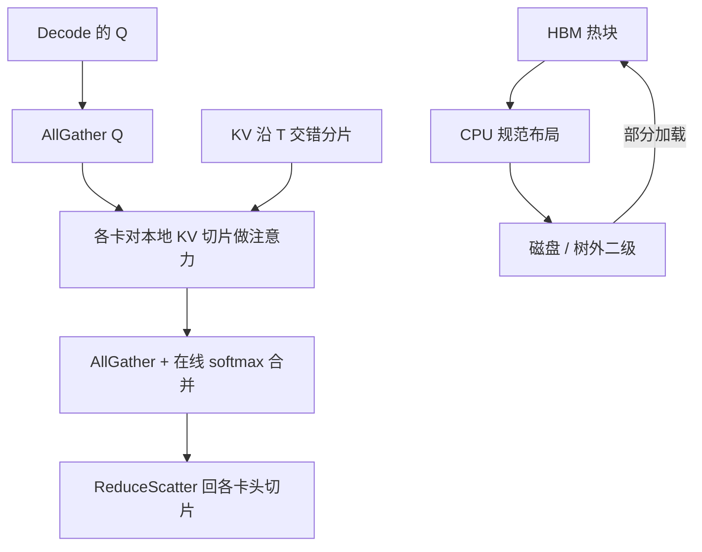

# vLLM 0.28：KV 分层与 DCP

    
张量并行把 KV 按头切，头数不够就复制；Decode Context Parallel 改按序列维切，复制变成通信。

    <footer>—— vLLM v0.28.0 发行说明；Context Parallel 部署文档</footer>

vLLM 0.28.0（2026-08-26）把两条服务侧主线写进同一版：分层 KV 卸载（含磁盘与可插拔二级介质）和 Decode Context Parallel（DCP）。前者扩容量，后者在已有 TP 设备上砍掉 KV 复制。发行说明里 DCP 与 Kimi-K3 性能工作绑在一起（#50484），分层卸载是独立的 Large Scale Serving 项。本篇只写这两条，不把同版本的 Kimi 融合核、DeepSeek V4 或投机解码写成主叙事。

## 问题

长上下文 decode 每步用很小的 Q 去读很长的 KV。张量并行按注意力头切 KV：GQA 的 KV 头数 $H$ 很小，MLA 更极端。当 `tp_size > H`，多出来的卡只能**复制**整份 KV。复制吃的是本可以拿去堆并发的 HBM，不是免费的容错。继续加 TP 会让每卡 KV 重复 `tp_size/H` 次，并发先被显存打死，吞吐再被带宽打死。

另一侧，前缀缓存与多轮会话把冷 KV 留在 GPU 里不划算。CPU 卸载早已有，但跨并行度的布局、磁盘这一层、以及卸载命中只返回部分块，都要引擎承认「二级介质可以不完整」。0.28 把磁盘、外部二级管理器、部分加载和分层指标收进同一套 offload 路径。

### 复制不是并行

并行的目标是每卡少存、少算。KV 复制是为了让每张卡都能做完整注意力，当头已经切尽时，这是正确性补丁，不是加速。DCP 的问题陈述就是：既然 decode 的 Q 很短，能不能让每张卡只存序列的 $1/N$，用一次小的 AllGather Q 换掉那份复制。

DCP 不增加 world size。文档写明它复用 TP 设备，`--decode-context-parallel-size` 只改变 KV 沿时间维的切法。把它理解成「再买一倍 GPU」是读反了。

## 方法

DCP：在现有 TP 组里沿 $T$ 切分页 KV。文档约束：`tensor_parallel_size` 必须 ≥ DCP size，且整除；对 GQA，有效上限还要过 `tp_size / H`。建议先把 TP 加到满意的计算并行，再加大 DCP 去消复制；DCP 越大，复制越少、通信越多。理论上 DCP 可以超过 `tp_size/H`，但多出来的卡在非注意力层上无事可做，实现把上限钉在这里。部署就是加 `--decode-context-parallel-size`。KV 传输（池化、PD 分离）时要把 `cp_kv_cache_interleave_size` 设成与 `block_size` 一致（常见 128），否则交错布局和远端块对不齐。

0.28 的分层卸载：SimpleCPUOffloadConnector 支持磁盘（#49644）；二级管理器可通过 `module_path` 做树外实现（#51007）；二级加载允许部分命中（#50321）；分层指标（#48798）；与并行度无关的规范 CPU 布局（#48414），避免 TP/PP 一变卸载块全部失效。指标名在本版把 `kv_offload_tiering_block_*` 改成 `*_chunk_*`（#52812），监控面板要跟着改。Mooncake 侧同版加了 store group 与租户 ID，官方轮子打进镜像——那是另一条远端对象路径，和本地磁盘分层叠放时键空间必须分开。

### 通信节奏

公开的 DCP 路径是 AllGather Q → 本地注意力 → 用 log-sum-exp 做在线 softmax 合并 → ReduceScatter 输出。Decode 时 Q 只有当前 token（或投机的一小段），AllGather 便宜；贵的是 KV 不再每卡一份。可选 `VLLM_DCP_Q_REPLICATE=1` 跳过 Q 的 AllGather，前提是布局已经把 Q 复制好。MLA 与 GQA 后端都支持 DCP；部分注意力后端还支持与 MTP 组合。不要假设所有投机路径、所有 PD 分离组合在 0.28 当天同等成熟——发行说明把 DCP 标成 Kimi-K3 主推，其它模型要看当时后端表。

## 机制

设序列长 $T$、KV 头 $H$、TP 为 $P$。无 DCP 时每卡存约 $T \times \lceil H/P \rceil$ 的 KV，当 $P>H$ 则每卡存满 $T$。DCP size 为 $D$ 时，沿 $T$ 再切 $D$ 份，每卡约 $T/D$ 再乘头维分片。容量换的是：合并注意力所需的跨卡归约。在线 softmax 必须交换分子与分母的 log-sum-exp，否则分片上的局部 softmax 不能拼成全局分布。这与训练里的 context parallel 同一数值问题，只是 decode 的 Q 长度退化成 1。

分层卸载的正确性仍是「块只读」。写只发生在追加新 token 的 HBM 分配；冷块换出不必写回脏页。部分加载意味着一次 get 可以只带回前缀若干 chunk，引擎要用细粒度前缀匹配（0.28 也修了 partial-tail reuse，#50507）接上，而不是假定二级介质原子地有整段序列。规范 CPU 布局让 TP 变化时仍能解释同一块字节，这是卸载能跨并行度存活的前提。

0.28 默认 `max_num_batched_tokens` 从 8192 提到 16384，前缀缓存对 Mamba 默认打开。这会改变你原来按 8K 批上限估的 KV 占用。分层与 DCP 都是「让同一批里能塞更多请求」的手段，调默认批大小时要一起看 HBM。

## 边界与工程取舍

DCP 增大通信，短上下文、高 QPS 小 batch 可能得不偿失。上限 `tp_size/H` 意味着 MLA（有效 $H$ 很小）从 DCP 获益最大，稠密多头相对收益小。PD 分离、投机、图执行的组合以当时文档矩阵为准，不要从发行说明的「支持」一词推出所有后端全绿。磁盘分层的尾延迟会破坏 TPOT：只适合被抢占会话与冷前缀，正在 decode 的工作集必须留在 HBM，见 [KV 卸载](/llm/kv-offload)。

### 和 PCP、TP 一起开时先看整除关系

文档把 DCP 的合法区间写成 `[1, tp_size/H]`，且 `tp_size % dcp_size == 0`。GQA 上有效的「可再切倍数」是 `tp_size / H`，不是 `tp_size` 本身。MLA 的 $H$ 很小，同样的 8 卡节点能开到的 DCP 更大，这正是 0.28 把它和 Kimi-K3 / DeepSeek 稀疏 MLA 放在同一版的原因。Prefill 侧另有 context parallel 叙事；不要把 decode 的 DCP flag 抄到 prefill worker 上当对称开关。图执行、前缀缓存、chunked prefill 的组合以当时后端表为准：发行说明列出的是能力清单，不是「所有模型 × 所有硬件全绿」。

破坏性变更同版还有：bitsandbytes 改树外插件、去掉运行时 `calculate_kv_scales` 与 `override_attention_dtype`。升级 0.28 不是只加两个 flag。分层指标改名之后，旧 Grafana 面板会静默归零，先改查询再切流量。磁盘层与 Mooncake 对象池若同时开，必须分键前缀，避免同一 hash 在两种介质上各写各的、命中时读到半截块。

出处：https://github.com/vllm-project/vllm/releases/tag/v0.28.0（Tiered KV cache offloading、DCP #50484）；vLLM *Context Parallel Deployment*（`--decode-context-parallel-size`、与 $H$ 的上限、不增加 GPU 数）。

## 小结

- 0.28 的 DCP 沿序列切 KV，消除 TP 在头数用尽后的复制，复用现有 TP 卡。
- 分层卸载加上磁盘、树外二级、部分加载和与并行无关的 CPU 布局。
- DCP 用 AllGather Q + 在线 softmax 换容量；通信随 DCP size 涨。
- 指标从 block 改名为 chunk；监控与 Helm 值要改。
- 短上下文不要为 DCP 付集合通信税；热 decode 不要落到磁盘层。
- 出处：vLLM 0.28.0 发行说明与 Context Parallel 文档。
