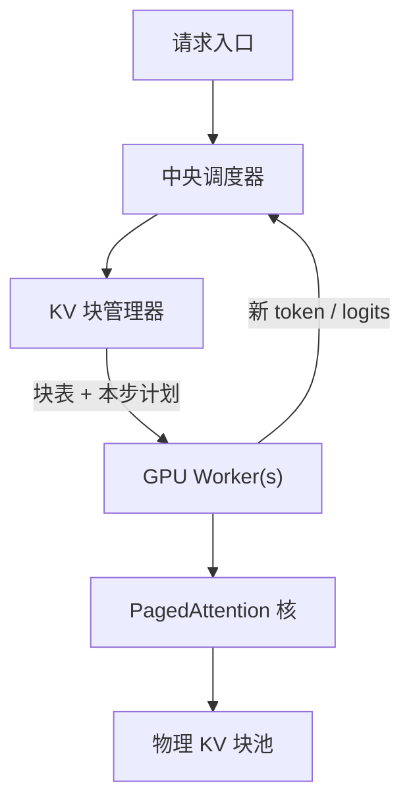

# vLLM 架构

中央调度器发指令，GPU worker 只执行；KV 按块管理，注意力核按页表去读非连续的键值。

<footer>—— Kwon 等，Efficient Memory Management for Large Language Model Serving with PagedAttention，SOSP 2023</footer>

vLLM 要同时做两件事：把尽可能多的请求叠进一次前向，以及让每条请求的 KV 按真实长度增长、结束即还。Kwon 等人把系统收成一条控制面加一条数据面——调度器与 KV 块管理器在中央，worker 在 GPU 上跑模型与 [PagedAttention](/llm/vllm-paged)。控制面决定「这一迭代算谁、用哪些物理块」；数据面不分配策略，只按块表做注意力。本篇按 SOSP 2023 论文里的架构图写这套分工，工程仓库后来的进程模型、V1 引擎会变，但「中央调度 + 分页 KV + worker」这条脊梁没有换成另一套数学。

## 问题

LLM 服务的显存账单几乎被两样东西占满：常驻的权重，以及随请求进出的 KV。13B 级模型在 A100 40GB 上，论文里的剖面是权重约 65%、KV 约 30%、激活很少。吞吐要涨，只能涨并发；并发要涨，只能让 KV 少浪费。当时的 FasterTransformer、Orca 仍按最大长度预留连续缓存，内部碎片、外部碎片和「先占着等以后用」的预留槽一起，把有效 KV 利用率压到大约两到四成。更麻烦的是束搜索、并行采样需要在序列之间共享提示段的 KV，连续张量做不到块级共享。

调度若分散到每张卡自己做，分页的全局视图就没了：块从哪张卡借、抢占谁、何时换出，必须有一个能看见所有逻辑序列的角色。vLLM 的选择是集中，而不是把虚拟内存分散成 per-GPU 的小操作系统。问题因而变成：如何让调度器以块为货币做准入，让 worker 在不知道策略的情况下仍能对非连续 KV 做正确的 [缩放点积](/llm/sdpa)。

### 控制面与数据面为何不能合成一个模块

注意力核需要的是「这块查询对应哪些物理页」。若核自己去 malloc 连续缓冲，碎片立刻回来。若调度器自己跑 GEMM，就无法把执行叠到多卡 [张量并行](/llm/tensor-parallel) 上。拆开之后，迭代的契约很窄：调度器产出一个 batch 描述（哪些序列、每条的块表、本步是 prefill 还是 decode），worker 执行一次前向，把新 token 的 KV 写进事先指定的空槽，再把 logits 交还。

「vLLM 架构」不是某一版 Python 包的类图。论文写的是调度器、KV 管理器、分布式 worker 与 PagedAttention 核四件套。后来的异步调度、多进程、分离式 serving 是在这四件套上加角色，不是把分页废除。

## 方法

中央调度器维护等待队列与运行中集合，每步做一次迭代级调度：完成的序列退出，新序列在 KV 块够用时加入，详见 [调度器](/llm/vllm-scheduler)。KV 管理器把 GPU 上的 KV 空间切成固定大小的块（论文里一块典型覆盖 16 个 token 的键与值），为每条逻辑序列维护一张块表，把逻辑块号映射到物理块号。物理块在一个全局池里分配与回收，大小一律相同，所以没有外部碎片；内部碎片最多浪费一块里尚未写满的那几个槽。

Worker 加载分片后的权重。单卡时一个 worker；模型大于单卡时，沿 Megatron 风格做张量并行，各 worker 持有一层矩阵的一片，用 NCCL 做层内 All-Reduce。PagedAttention 核按块表把 $Q$ 与散落的 $K,V$ 块做注意力，不要求 $K,V$ 在地址上连续。调度器通过指令告诉 worker：本步用哪几张块表、新 token 写进哪个空块。KV 管理器并不在 GPU 上跑策略，它在中央更新映射，再把映射下发给 worker。

### 共享发生在块表，而不是在权重里

并行采样时，多条输出序列共享同一段提示 KV：块表的前若干项指向同一组物理块，引用计数大于 1。生成段开始分叉后走 copy-on-write——要写的那一块若仍被共享，先复制再写。束搜索的共享模式随步变化，但机制相同。跨请求的完全相同前缀也可以映射到同一物理块，前提是调度器认出这份前缀；论文把这一点写成分页带来的能力，系统化的自动前缀树是 [SGLang](/llm/sglang) 后来强调的运行时。

分布式下，每张卡上的 KV 块池是该卡 TP 分片后的那一份。调度器仍然只有一个：它协调所有 worker 的同一步。不要把数据并行的多副本 vLLM 进程理解成论文里的「一个中央调度器管所有卡」——多副本是多套引擎，亲和与负载在副本之间，见 [decode 亲和](/llm/decode-affinity)。

## 机制

近零浪费来自「按需分配 + 定长块」。逻辑长度 $n$ 的序列占用 $\lceil n/B\rceil$ 个块，$B$ 为块内 token 数。预留不再按 $n_{\max}$ 一次性划出连续区间，所以「将来可能用到的槽」不必先占着。吞吐提升的因果链是：浪费下降 → 同显存能放下更大的运行中集合 → 迭代级批更大 → 权重读出被更多查询摊薄。论文在多种模型与负载上相对 FasterTransformer 与 Orca 报了约 2–4× 吞吐，长序列、大模型、复杂解码（束搜索等）时差距更大。这些数字钉在他们的评测设定上，不是任意硬件的常数。

PagedAttention 改的是 **KV 的布局与寻址**，不是注意力公式。分数仍是 $q^\top k / \sqrt{d}$，只是 $k$ 可能来自第 $i$ 块的第 $j$ 槽。核必须能按块表 gather；这比连续 `GEMM` 多一层间接，换来的是调度自由度。CPU 上的块表很小，维护开销相对 GPU 核可忽略——这是集中管理可行的原因。

准确率不变，是因为分页不量化、不丢 token、不改采样公式。变的是「这些键值放在哪几个物理页」。把 vLLM 的加速理解成「模型更狠」，会和量化、投机解码的效果混在一张表里。

### Worker 同步一步，调度器异步于请求到达

请求可以随时进等待队列；真正上场要等下一次迭代边界。这是 Orca 式 iteration-level 调度在 vLLM 里的落点。调度器在边界上看到的世界是：运行中序列的当前长度、空闲块数、是否有人该被换出。Worker 在边界之间是一次完整前向，中途不接收新块表。这个节奏让 CUDA 核形状相对稳定，也为后来的图捕获留了接口；图捕获本身不是 SOSP 论文的贡献。

## 边界与工程取舍

论文评测对照的是 2023 年的 FasterTransformer 与 Orca，不是今天的 SGLang 或 TensorRT-LLM。架构选择——集中调度、块表、TP worker——在多机 decode、专家并行、多 LoRA 同时服务时都会被加厚：调度器要看见的状态变多，中央路径可能成为瓶颈，于是出现多级调度与分离式部署。那些是后续工程，不要写回 Kwon 等人的原图。

块大小 $B$ 是碎片与核效率的折中。$B$ 太小，块表长、核间接重；$B$ 太大，内部碎片回升，接近「按上限预留」的老问题。共享粒度也是 $B$：两条序列只有整块相同才能共享，差一个 token 就要在块边界分裂。前缀复用做得更细的是 radix 树，见 [SGLang 前缀树](/llm/sglang-radix-tree)。

不要把 Hugging Face 的 `transformers` 生成循环画成 vLLM 架构。前者是模型定义加逐步 `forward`；后者是服务系统：队列、块池、抢占与分布式 worker。能 `from_pretrained` 不等于具备 PagedAttention 的内存会计。

模型覆盖随仓库增长：论文写 GPT / OPT / LLaMA；今天的引擎还要接 MoE、多模态前缀、约束解码。新结构能进 vLLM，取决于有没有对应的注意力核与块布局，而不是架构图自动泛化。ASR 解码器挂上同一套分页，是因为解码器仍是因果 LM，见 [Qwen3-ASR 与 vLLM](/llm/qwen3-asr-vllm)。

## 小结

- vLLM 的脊梁是中央调度器、KV 块管理器、GPU worker 与 PagedAttention 核。
- 控制面以块为货币做准入与共享；数据面按块表读非连续 KV，公式仍是缩放点积。
- 定长块消除外部碎片，按需分配压低预留浪费，从而抬大运行中 batch。
- 张量并行下仍是一个调度器对齐所有 worker 的同一步；多副本是多套引擎。
- 论文相对当时系统报 2–4× 吞吐；后续特性叠在这条脊梁上，不替代它。
- 出处：Kwon et al., *Efficient Memory Management for Large Language Model Serving with PagedAttention*, SOSP 2023（arXiv:2309.06180）；代码 https://github.com/vllm-project/vllm。
