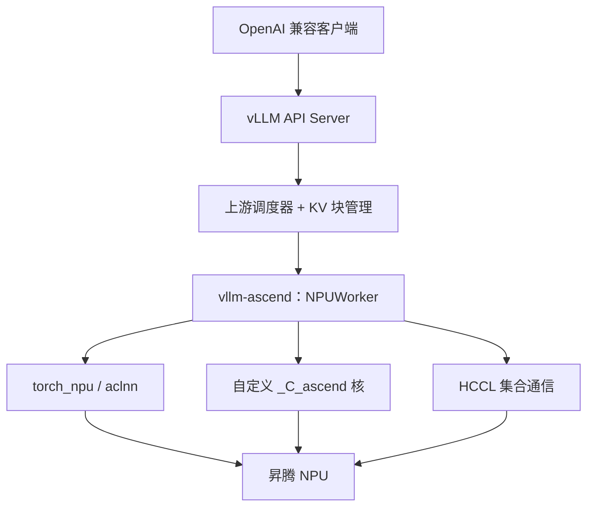

# vLLM-Ascend

    
把昇腾做成 vLLM 的一块可插拔后端：调度器与分页 KV 仍在上游，设备核与集合通信在插件里替换。

<footer>—— vLLM Hardware pluggable RFC，以及社区仓库 vllm-project/vllm-ascend</footer>

vLLM-Ascend（包名 `vllm-ascend`）是 vLLM 社区维护的昇腾硬件插件，不是把 CUDA 版 vLLM 整树 fork 成「昇腾发行版」。2024 年底起，上游用 Hardware pluggable 把设备差异从核心拆出去；2025 年 2 月社区建立 `vllm-project/vllm-ascend`，作为昇腾后端的推荐接法。它让类 Transformer、MoE、Embedding、多模态等已在 GPU 上用 vLLM 伺候的模型，在 Atlas 推理 / 训练系列 NPU 上走同一套 API 与调度概念。本篇写插件的位置和约束，不把某一 RC 的 tokens/s 写成论文，也不把 [MindIE](/llm/mindie) 的加速库冒充成这个插件。

## 问题

团队若已经按 [vLLM 架构](/llm/vllm-architecture) 运维——中央调度、块表、OpenAI 兼容入口——换昇腾时最怕两件事：一是改客户端和监控名；二是把 NCCL、CUDA Graph、FlashAttention 硬编码进业务镜像。昇腾的编程栈是 CANN、`torch_npu`、HCCL，内存接口叫 `torch.npu` 而不是 `torch.cuda`。若每来一代芯片就 fork 一次 vLLM，上游的连续批、抢占、前缀缓存会全部滞后。问题是：如何让**控制面留在 vLLM，数据面换成 NPU**，并且版本还能和上游对齐。

另一半是算子。[昇腾算子落差](/llm/cann-op-gap) 意味着 PagedAttention、MLA、MoE 分组乘往往不在 ATen 交集里。插件必须能注册 OOT `CustomOp`，把层实现换成 aclnn 或 Ascend C 核，否则「能 import」只等于在 NPU 上跑了一串碎 GEMM。

### 插件不是引擎分叉

Hardware pluggable 的契约是：设备插件实现平台探测、内存分配、工作队列和自定义 op，不改调度器的迭代语义。vLLM-Ascend 遵守这条：KV 仍按块管理，worker 仍执行「本步 batch + 块表」。变的是块落在 NPU HBM 上、注意力核按昇腾布局读页表、层内 All-Reduce 走 HCCL。把它理解成「华为版 vLLM 独立产品」，会在发版时把社区 tag 和 MindIE 发行说明混在一张表里。

插件版本与 vLLM、CANN、`torch_npu`、PyTorch 四位锁定。README 按发行说明给出组合（例如某一稳定版对齐的 CANN 与 torch 版本）。混装「新 vLLM + 旧插件」是最常见的启动失败，不是 NPU 坏了。

## 方法

安装面：Linux，Python 版本按发行说明；硬件公开支持 Atlas 800I A2 / A3 推理系列、Atlas A2 / A3 训练系列，Atlas 300I Duo 为实验性。运行前要 `source` CANN 与（若使用）NNAL/ATB 的环境脚本，用 `npu-smi info` 确认设备。集合通信用 HCCL，超时与白名单走环境变量，不要再 export 一套 NCCL 拓扑当默认真路径。

执行面：`NPUWorker` 初始化时调用 `register_ascend_customop()`，把 `CustomOp.register_oot` 登记表换成昇腾实现；C++ 扩展绑到 `torch.ops._C_ascend`，链接 `ascendcl`、`opapi` 等 CANN 库。自定义 aclnn 在构建期编进 `vllm_ascend/cann_ops_custom`，按 `SOC_VERSION` 选择 910B 或 310P 的算子集——同一份 Python 业务代码，核二进制随芯片代数变。需要图捕获时，为 op 补 meta，才能进 ACL Graph。

服务面：HTTP 仍是 vLLM 的 OpenAI 兼容服务器，见 [协议](/llm/openai-compat-api)。客户端不用改路径；探针、取消、logprobs 以**当前 vLLM × 插件**的特性表为准，不能从「兼容 OpenAI」四个字推导工具调用或视觉 part 已齐。

### 与 MindIE 两条路径

昇腾上文本推理至少两条：[MindIE](/llm/mindie) 原生 LLM（或 Turbo 加速库）把调度也放在厂商栈里；vLLM-Ascend 把调度留在开源引擎。选前者，要厂商文档里的 `config.json`、EndPoint 和精度工具；选后者，要社区的 Continuous Batching、分页参数和插件的环境变量。两者可以跑在同一代 Atlas 上，但 KV 布局、量化开关、指标名不通。已经用 vLLM 的网关、限流和 KV 感知路由，插件是迁移成本最低的路；要从零做昇腾一体交付，MindIE 更接近「一台设备一个厂商栈」。

MindIE EndPoint 也能收 vLLM 风格的 URL。那是协议皮，不是这个插件在进程里。监控若只按路径名把两种后端合成一条曲线，会把完全不同的调度器画在一起。

## 机制

控制面每步仍产出「哪些序列、哪些块、prefill 还是 decode」。数据面在 NPU 上执行：线性层走 aclnn GEMM，注意力走官方核或插件自定义核，新 token 的 KV 写入事先分配的块。分页的数学与 GPU 相同——逻辑块号映射物理块号——物理页的 stride、对齐、是否 NZ 格式由昇腾核决定。若核要求头数比为 \{32, 64, 128\} 之一，张量并行切完必须仍落在集合里，否则图模式在 tiling 检查处失败；这是公开 FAQ 写过的硬件/核约束，不是调度器随机拒绝。

HCCL 替换 NCCL 之后，进程组、设备号、网卡（若跨机）都要按 Atlas 拓扑绑。节点内走 HCCS 或 UB，跨机走 RoCE，与 [Scale-Up / Scale-Out](/llm/scale-up-vs-scale-out) 的分层一致。插件不发明一种新的并行算法，它只是把 Megatron 式 TP 的 All-Reduce 送到 HCCL。多机启动仍用各版本文档里的启动器与设备可见性变量，不要把 `CUDA_VISIBLE_DEVICES` 的脚本原样贴上再指望插件做翻译。

### 图模式与 MLA 的交叉

开启 NPU 图模式能吃掉 decode 的启动开销，但对 MLA 的查询/KV 头比更严。DeepSeek-V2-Lite 一类切完后头比不在核支持集合里的模型，公开说明里写过图模式暂不支持。此时应关图跑 eager，或改 TP 度让比值合法，而不是认定「昇腾不能跑 DeepSeek」。能跑和能进图是两件事。

## 边界与工程取舍

插件的边界首先是硬件与版本锁：没有匹配的 CANN，wheel 装上也会在运行时炸。其次是特性差集：上游 vLLM 刚合入的投机解码、某多模态 projector，要等插件登记对应 OOT op。第三是性能预期：插件优先「行为对齐 GPU vLLM」，融合深度通常不如 MindIE 面向该芯片的专用路径；要用插件当生产引擎，应在目标芯片上自测 TTFT / TPOT，不要引用未钉版本的社区博客数。

不要把 `CUDA_VISIBLE_DEVICES` 的习惯原样换成错误的设备变量而不读发行说明。不要在异构集群里把 GPU worker 和 NPU worker 塞进同一 TP 组，见 [异构集群调度](/llm/hetero-cluster)。不要给 vLLM-Ascend 编造独立 arXiv——它是工程插件，论文仍是 Kwon 等人的 PagedAttention。

引用停留在 https://github.com/vllm-project/vllm-ascend 、vLLM 文档中的 Hardware plugin / CustomOp，以及昇腾 CANN 与 `torch_npu` 发行说明。硬件支持列表以仓库当前 README 为准。

## 小结

- vLLM-Ascend 是社区硬件插件：调度与分页在上游，核与 HCCL 在插件。
- 版本必须与 vLLM、CANN、`torch_npu` 对齐；按 SoC 编译不同自定义算子。
- 文本服务与 MindIE 是两条栈，协议可以像，内核指标不能混。
- MLA / 图模式对头比有核级约束，切 TP 后仍要落在支持集合。
- 迁移已有 vLLM 业务时，插件改的是设备面，不是客户端契约。
- 出处：vllm-project/vllm-ascend、vLLM Hardware pluggable RFC 与 CustomOp 文档。
