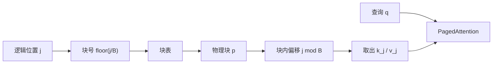

# vLLM 与 PagedAttention

把一条请求的 KV 切成定长块，块不必在物理上连续；注意力核带着块表去读，就像 CPU 带着页表访问虚拟内存。

<footer>—— Kwon 等，PagedAttention，SOSP 2023</footer>

注意力公式不要求键值张量在地址上相邻，要求的是按位置取出 $k_j,v_j$ 再与 $q$ 做 [缩放点积](/llm/sdpa)。服务系统却长期把 KV 当成一块连续缓冲，因为深度学习框架默认张量连续。于是每条请求按最大长度预留，碎片和无法共享把有效容量吃掉。PagedAttention 把 OS 的分页搬进来：逻辑序列是虚拟地址空间，定长 KV 块是页，块表是页表，物理池是 DRAM。vLLM 是建立在这套寻址上的服务引擎。本篇写块、表、共享与核，调度见 [调度器](/llm/vllm-scheduler)。

## 问题

一条序列的 KV 随解码增长，最终长度在结束前未知。连续分配若按 $n_{\max}$（例如 2048）一次划出，内部碎片是「用不到的上限」；即便知道最终长度，整段生命周期内未写满的前半仍不能借给别人，这是预留槽浪费。不同请求的预留长度不同，分配器还会留下夹在中间的外部空洞。Kwon 等人的剖面里，现有系统 KV 空间里真正存着有效 token 状态的比例可以低到约 20%–38%。

第二类损失是不能共享。并行采样时多条输出共用同一提示的 KV；束搜索里不同束在分叉前共享前缀，分叉后部分块仍相同。连续张量无法让两张「请求私有缓冲」指向同一段物理内存，除非显式拷贝。拷贝既费带宽又复制了本该只读的提示块。

### 虚拟连续、物理分页

把序列位置 $0\ldots n-1$ 切成每 $B$ 个 token 一块。逻辑块号 $i$ 对应位置 $[iB,(i+1)B)$。物理上，这些块可以落在池里任意空闲页。注意力在位置 $j$ 需要 $k_j$ 时，查块表得到物理块 $p=\mathrm{table}[\lfloor j/B\rfloor]$，再取块内偏移 $j \bmod B$。对核来说，多了一次间接；对分配器来说，所有页一样大，外部碎片消失，内部碎片上界是一块里未填满的槽。

类比要停在「页」这一层。OS 还有缺页中断、多级页表、TLB。vLLM 的块表通常是每序列一张扁平表，缺页对应调度器去分配或去抢占，不会在注意力核里走一次操作系统中断。

## 方法

物理池在每层、每个 KV 头（或按实现打包后的布局）上切成块。一块含 $B$ 个位置的键与值。论文示例常用 $B=16$。$B$ 太小，表项多、核 gather 碎；$B$ 太大，内部碎片与共享粒度一起变粗。分配发生在序列需要新位置时：当前尾块未满则只写偏移，满了才向池申请一个空闲物理块并追加到块表。释放在序列结束或抢占时：引用计数减到零的物理块回池。

Copy-on-write 处理共享。块表可以让序列 A、B 的前若干逻辑块指向同一物理页，引用计数为 2。谁先要在该页上写入（例如分叉后的第一个生成位置落在未满块里，或新块本该覆盖共享尾），就先复制该页再写，引用计数拆开。这样提示段始终只存一份，束之间的共同前缀也只存一份，直到真正分叉。

### 核必须接受非连续的 K、V

标准 SDPA 假设 $K,V$ 是形状整齐的张量。PagedAttention 的实现是：对每个查询，按块表列出本序列已写满的块加一个可能未满的尾块，在块内做局部点积，再在块间归约 softmax。FlashAttention 一类分块算法仍然适用，只是外层循环的「K 的一块」变成「物理页」而不是地址连续的切片。数值与连续实现应对齐；不对齐是实现 bug，不是分页语义。

跨请求前缀相同（同一系统提示）时，调度器若识别出公共前缀，也可以把新请求的块表前段指到已有物理页。vLLM 论文把这写成分页使能的能力；自动、按 token 序列做最长前缀匹配并在树里维护 LRU，是 [RadixAttention](/llm/sglang) 的主线。两者相容：radix 树的节点可以指向 PagedAttention 的物理块。

## 机制

近零浪费是相对「按 $n_{\max}$ 连续预留」而言。内部碎片期望大约是半块，即 $B/2$ 个 token 槽，而不是 $n_{\max}-n_{\mathrm{actual}}$。外部碎片为零（定长）。预留槽不存在：未来的生成尚未发生时，那些页仍在池里，可以借给此刻更长的别人。于是同样的 HBM，运行中序列数可以明显更多，迭代级批变大，decode 的权重读取被摊薄。这是吞吐上来的机制，不是注意力算得更快。

共享把「复杂解码更吃显存」变成「复杂解码更该用分页」。论文指出并行采样可共享提示 KV，束搜索的共享比例随解码演变，实验中束搜索场景可省下相当比例的 KV（文中提到高达约 55% 的量级，取决于负载）。没有 CoW，分页只解决碎片；有 CoW，分页才解决算法带来的重复。

OPT-13B 上一个 token 的 KV 约 800 KB（论文按隐宽 5120、40 层、FP16 计算）。$n_{\max}=2048$ 时一条请求的连续预留约 1.6 GB。块大小 16 则按需领取，结束即还。数量级说明为什么碎片不是边角料：池里多出来的几个 GB 直接变成可并发条数。

### 与虚拟内存的差异要写清

GPU 设备内存通常没有 CPU 那种透明换页。vLLM 的「换出」是调度器显式把某些序列的块拷到主机，再从块表摘掉。注意力核不会在访问缺失页时暂停去磁盘。因此 PagedAttention 不是把 CUDA 变成 Linux，而是把 **页表这个数据结构** 和 **按需分配这条政策** 借到 KV 上。透明换页若做成每次注意力都可能缺页，ITL 会不可控。

## 边界与工程取舍

分页不降低数学上的 KV 字节数：层数、头数、头维、精度仍决定下限，见 [KV 作为长上下文](/llm/kv-as-long-context)。GQA、MLA、KV 量化是改公式或改精度；分页是改布局。四者正交，可以叠，不要互相替代着宣传。

块大小与核实现绑定。服务端常用十几到几十 token 一块；若把块改成 1，共享最细，间接最重。SGLang 的 radix 描述里甚至讨论过以 token 为页的树，那是另一套索引，底层仍可落在分页池上。多模态前缀、音频 token 若长度单位不是「一个文本 token 一个槽」，块对齐要重做，不能假设文本核直接吃图像块，对照 [ASR 挂 vLLM](/llm/qwen3-asr-vllm) 时前缀增长的是音频槽。

「接近零浪费」不包括权重、激活、CUDA Graph 工作区，也不包括你为了省事把块开得太大。它比较的是 KV 池内部的碎片结构。把整卡利用率 90% 说成 PagedAttention 的功劳，会把权重常驻和池管理混为一谈。

评测数字 2–4× 相对的是当时的 FasterTransformer 与 Orca，同一延迟水平下的吞吐。今日对照 [SGLang](/llm/sglang) 或 [TensorRT-LLM](/llm/tensorrt-llm)，差的是前缀缓存、融合核、量化与投机，不是「谁还在用连续 KV」。新引擎几乎都分页了；再写一篇「分页击败连续预留」需要钉住仍在预留 $n_{\max}$ 的基线。

## 小结

- PagedAttention 用定长 KV 块加块表存储非连续键值，注意力按逻辑位置间接取值。
- 定长块消灭外部碎片；按需分配把内部碎片限制在一块之内，并取消按 $n_{\max}$ 预留。
- 块表引用计数与 CoW 使提示与束前缀可共享，复杂解码不再复制整段 KV。
- 公式仍是 SDPA；加速来自更大的可行 batch，不是更少的 FLOPs。
- 换出是调度器显式拷贝，不是 GPU 缺页中断。
- 出处：Kwon et al., *Efficient Memory Management for Large Language Model Serving with PagedAttention*, SOSP 2023（arXiv:2309.06180）。
