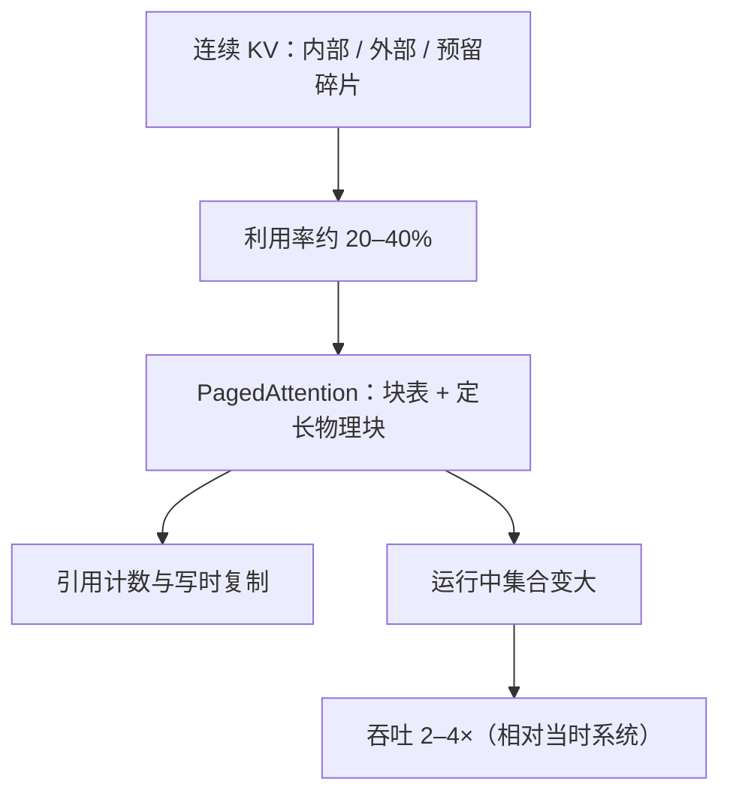

# vLLM 论文

现有系统把 KV 缓存当成连续张量，利用率只有两到四成；PagedAttention 把逻辑 token 槽映射到定长物理块，才能在迭代级调度下把显存真正变成并发。

<footer>—— Kwon et al., Efficient Memory Management for Large Language Model Serving with PagedAttention, SOSP 2023</footer>

SOSP 2023 上，Woosuk Kwon 等人把 LLM 服务的瓶颈写成内存管理问题：13B 级模型在 A100 40GB 上，权重约占 65%、KV 约占 30%，激活很少；吞吐要涨只能涨并发，并发要涨只能让 KV 少浪费。当时的 FasterTransformer 与 [Orca](/llm/orca-iteration) 已能做迭代级批，但 KV 仍按最大长度预留连续缓冲，内部碎片、外部碎片和「先占着等以后用」的预留把有效 KV 利用率压到大约 20–38%。vLLM 的论文贡献是：把浪费量化清楚，提出 PagedAttention（操作系统分页类比），以及用块表支持前缀共享与束搜索的写时复制，并在 ShareGPT 等真实轨迹上相对 Orca / FasterTransformer 报约 **2–4× 吞吐**。控制面与 worker 的架构走读见 [vLLM 架构](/llm/vllm-architecture)；分页核见 [PagedAttention](/llm/paged-attention)。本篇写 SOSP 原文的问题陈述、算法与评测，而不把后来的 V1 引擎、分离式 serving 写回 2023 年的贡献表。

## 问题

迭代级调度让请求在步间加入和离开，但若每条请求的 KV 仍是「$n_{\max} \times$ 层 $\times$ 头 $\times$ 维」的连续分配，调度器在会计上以为还有空闲字节，物理上却找不到连续段，或大量槽为尚未生成的未来 token 预留着。论文把浪费分成三类：**内部碎片**（最后一块未写满）、**外部碎片**（空闲总量够但不相邻）、**预留**（按上限一次性划出）。三者叠加，KV 的有效利用率落到两到四成，并发上不去，权重读出摊不薄。

更麻烦的是解码算法。束搜索、并行采样需要多条输出共享提示段 KV；连续张量往往整段复制。操作系统用页表解决「逻辑连续、物理不连续」和共享映射；注意力核却长期假设 $K,V$ 在序列维连续。没有对应的 gather 核，分页只是把碎片挪到「无法计算」。vLLM 的命题因此是算法加系统：块分配器 + 页表 + 能按块表读 KV 的注意力核，并与迭代级调度接在同一中央调度器上。

### 利用率数字是论文的第一张图

在写 PagedAttention 之前，原文用剖面说明：服务场景里 KV 不是边角，浪费也不是几个百分点。把「我们做了虚拟内存」说成贡献，却不报基线利用率，无法解释 2–4× 从哪来。因果链必须是：浪费下降 → 同显存更大的运行中集合 → 迭代级 batch 更大 → 吞吐上升。准确率不变，因为不量化、不丢 token、不改采样。分页不减少「正在使用的 token」对应的 KV 字节。峰值仍由并发 $\times$ 长度 $\times$ 层 $\times$ 头维决定。它消灭的是预留和碎片，不是 MLA / GQA / 量化所减的那一截宽度。SOSP 论文与压缩论文的纵轴不是同一件事。

## 方法

KV 池切成固定 token 数的块（论文典型 $B=16$）。每条逻辑序列一张块表，逻辑块号映射到物理块号。长度增长时从全局池取空块挂到表尾；结束则还回（引用计数为零时）。注意力：本步查询带着块表进入核，对逻辑位置译址，从可能不相邻的物理块 gather $K,V$，分数仍是 $q^\top k/\sqrt{d}$。调度器每迭代产出 batch 描述：哪些序列、块表、本步 prefill 还是 decode、新 token 写入哪个空槽。

共享与写时复制：并行采样时，多条输出的块表前缀指向同一物理块，引用计数大于 1；生成分叉时若要写共享块，先复制再写。束搜索的共享模式随步变化，机制相同。这是分页相对「每条请求一块连续缓冲」多出来的能力；系统化的自动前缀树是 [SGLang](/llm/sglang) 后来强调的运行时，原文把它写成分页带来的可行性。

评测用 ShareGPT、Alpaca 一类真实或近似真实的长度与到达，模型覆盖 GPT / OPT / LLaMA 等。对照 FasterTransformer 与 Orca。加速在长序列、大模型、束搜索等复杂解码上更大——这些负载下预留浪费和复制更凶，分页的相对收益更高。数字钉在 2023 年的对照栈与硬件上。

### 块大小是论文里的显式超参

$B$ 太大，内部碎片接近「按上限预留」；$B$ 太小，块表长、核间接重。16 是他们的折中，不是定理。共享粒度也是 $B$：差一个 token 就要在块边界分裂。SOSP 文本把这一点当设计权衡写出来，后续工程继续扫 $B$，见 [分页块大小](/llm/paged-kv-block-size)。

## 机制

近零外部碎片来自定长块：任何空闲块都可以给任何请求，不再要求连续虚拟区间（逻辑上仍用块表维持顺序）。预留消失来自按需分配：逻辑长度 $n$ 只占 $\lceil n/B\rceil$ 块，不必先为 $n_{\max}$ 付款。吞吐的硬件解释是：解码常受权重带宽限制，更大的瞬时 batch 把同一份权重读出摊到更多查询。PagedAttention 多一层间接，核比连续 GEMM 更绕，但换来的调度自由度在内存墙的这一侧是划算的。CPU 上的块表很小，集中管理可行。

论文把系统收成中央调度器、KV 块管理器、GPU worker 与 PagedAttention 核。这与 Orca 的「调度器 + 一步引擎」兼容：Orca 贡献迭代级成员变更，vLLM 贡献成员变更时 KV 会计不再按 $n_{\max}$ 预留。二者叠加才是 2023–2024 年开源服务的默认图像。

SOSP 论文不包含 CUDA Graph 捕获、分离式 prefill/decode、专家并行调度这些后来仓库里的角色。那些是工程续写。把今日 vLLM 的全部特性写进 Kwon 等人的贡献列表，会让 2–4× 的对照对象错位。

### 评测负载决定倍数

若全部请求同样短、同样 $n_{\max}$ 订得紧，预留浪费小，分页收益小。若长度长尾、束宽大、系统提示重复，收益大。原文用真实对话轨迹，就是为了让浪费出现在图里。复现加速比时必须声明轨迹、是否束搜索、模型与卡型；只报「vLLM 更快」没有论文信息量。

## 边界与工程取舍

对照是 2023 年的 Orca 与 FasterTransformer，不是 TensorRT-LLM 或今日的 SGLang。架构选择——集中调度、块表、张量并行 worker——在多机 decode、LoRA 多租户时会加厚，中央路径可能成为瓶颈。块表共享不能替代语义级前缀树：只有整块相同才能共享。

模型覆盖随实现增长：论文写 GPT/OPT/LLaMA；MoE 与多模态要另做核与块布局，不是分页自动泛化。准确率声明限于「同一模型、同一采样、只改 KV 布局」。量化 KV、投机解码会改质量或改变步数，必须另表，不能并进 SOSP 的吞吐柱。

Hugging Face `generate` 循环不是 vLLM 论文的基线。基线是已经做了迭代级调度、但仍连续分配 KV 的服务系统。相对请求级静态批的倍数会更大，那是 Orca 已经拿过的增益，不应算成 PagedAttention 的独家数字。

## 小结

- vLLM 论文把 LLM 服务的吞吐瓶颈量化为 KV 连续分配的三类碎片，基线利用率约两到四成。
- PagedAttention 用定长物理块与块表做逻辑连续，按需分配，并用引用计数支持共享与写时复制。
- 与迭代级调度结合后，运行中集合变大；相对当时的 Orca / FasterTransformer 约 2–4× 吞吐。
- 注意力公式不变；块大小 $B$ 是碎片与核效率的折中。
- 后续引擎特性叠在这篇的内存管理之上，不替代它的问题定义。
- 出处：Kwon et al., *Efficient Memory Management for Large Language Model Serving with PagedAttention*，SOSP 2023（arXiv:2309.06180）；代码 https://github.com/vllm-project/vllm。架构走读见 [vLLM 架构](/llm/vllm-architecture)。
