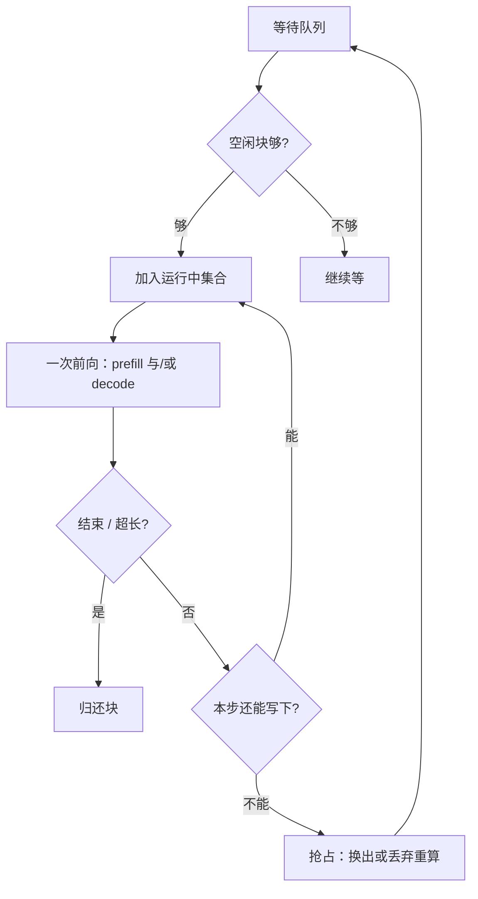

# vLLM 调度器

调度的粒度是一次模型前向，不是整条请求：每步结束即可让完成者退出、让等待者带着刚分到的 KV 块加入。

<footer>—— 对照 Kwon 等 vLLM（SOSP 2023）与 Yu 等 Orca 的 iteration-level 调度</footer>

连续批处理能提高 GPU 利用率，前提是调度器按 **迭代** 而不是按请求生命周期组批。Orca 把这条路叫 iteration-level scheduling：一次前向混着不同请求的 prefill 或 decode，前向结束就改成员。vLLM 在同一粒度上补了内存会计——准入看空闲 KV 块，不够就抢占或换出，而不是假设每条请求已经按 $n_{\max}$ 预留好连续缓冲。本篇写调度器看见的队列、每步决策和抢占，块如何映射见 [PagedAttention](/llm/vllm-paged)，进程分工见 [架构](/llm/vllm-architecture)。

## 问题

请求到达时刻不同，提示长度与生成长度事先不知道。静态批要么让先到的等齐，要么让后到的等先到的整段结束，队列延迟按「最长那条」计。补齐（padding）把短序列的计算和显存垫到和长序列一样，浪费的是本可以用来多塞几条 decode 的块。

迭代级调度解决到达与不等长，但立刻碰到第二约束：运行中集合的 KV 总量不能超过块池。一条请求的输出多走 512 个 token，就要再领 $\lceil 512/B\rceil$ 个块。若调度器只顾把等待队列倒进 GPU，池会在某一步突然耗尽，正在解码的序列写不下新键。此时必须有明确的抢占：谁让路、让路的 KV 去哪、何时回来。没有这块，分页只是换了一种碎片形状。

### 等待、运行、抢占是三个集合

调度器至少维护等待队列（已 tokenize、尚未分配够用的块或尚未首次前向）和运行中集合（本步会参与前向的序列）。第三类是被换出的序列：逻辑还活着，物理块已写到主机或丢弃待重算。每条序列还有阶段：prompt 尚未算完则是 prefill（或分块 prefill），之后是 decode。同一步可以混两类，这正是 in-flight / continuous batching 的含义；混的代价是 prefill 的大 GEMM 可能拉长 decode 的 [ITL](/llm/tpot-itl)。

FCFS 对等待队列是公平的默认，对 KV 利用不必最优。SGLang 后来按最长共享前缀排序以提高 radix 命中；那是另一种目标函数。vLLM 论文的主线是「块够不够」，不是「前缀像不像」。

## 方法

每步的循环可以写成：先从运行中集合丢掉已经 EOS 或达到长度上限的序列，归还它们的块（共享块只减引用计数）。再看空闲块数，从等待队列头部尽量装入新序列——装入条件是「当前提示（或本块 prefill）所需块 $\le$ 空闲」。然后为仍在 decode 的序列各分配至多一个新槽（通常在当前尾块未满时只写同一块）。若空闲块仍不够覆盖运行中集合本步的写入，就抢占：选一些序列，把它们的块换到 CPU 或直接丢弃。论文把换出与重算都列为应对未知输出长度的手段。

抢占策略要与分页共设计。换出保留 KV，下次调度回来不必重做提示，但 PCIe 搬运按块体积计，回来的第一步会慢。丢弃则释放最快，回来等于再 prefill，TTFT 式的成本打在一条已经开始流式的请求上，用户感知更差。实际系统往往对长前缀倾向换出、对短请求倾向重算；这是工程启发式，不是一条写进公式的定律。

### 一次前向里的成员是异构的

调度器交给 worker 的 batch 描述里，有的序列本步消耗几百个提示 token，有的只消耗 1 个新 token。核与图捕获喜欢整齐形状；调度器喜欢把能装下的都装下。张力靠上限约束：`max_num_batched_tokens` 一类预算限制本步 token 总数，避免单次迭代被一条超长 prefill 独占。分块 prefill 把长提示切开，让 decode 序列在缝隙里继续往前走，是后来引擎普遍加上的稳定 ITL 手段。SOSP 论文的核心评测仍建立在「迭代级加入/退出 + 块准入」上；分块是同一调度器上的细化。

束搜索与并行采样让「一条用户请求」对应多条序列。调度器应以序列（带共享块表前缀的 fork）为装入单位，同时在请求级统计 SLO。只按请求数限并发，会在 `n>1` 采样时把块池打满；只按序列数限，又可能饿死新用户。块数仍然是唯一硬约束。

## 机制

迭代级调度降低的是排队：新请求最多等一次前向的墙钟，而不是等整批结束。吞吐提高来自 GPU 上始终有足够的 decode 查询去摊权重读取。内存不够时，这个故事会反转——频繁抢占让 PCIe 或重算占据迭代，运行中集合的有效计算下降。调度器因此不是「越满越好」，而是把块池维持在高占用但少抖动的区间。

与 Orca 的差别主要在货币。Orca 证明了按迭代组批的可行性；vLLM 让每次加入都带着真实的、按块增长的显存账单，于是最大运行中集合可以显著大于「每条按 $n_{\max}$ 预留」时的集合。调度器看到的「能不能再塞一条」从保守的最坏长度，变成当前长度再加本步增量。输出突然变长时，账单在后续迭代补交，必要时用抢占平账。

抢占公平与吞吐是另一对张力。总抢最长的序列能立刻腾出很多块，但长上下文用户的 TBT 会周期性坍塌。总抢最新的又可能让短请求永远插不进。生产调度要在 FCFS、优先级和 SLO 类之间加策略；论文实现的是能跑通的抢占，不是一张完备的公平性定理。

### 中央调度器的一步必须与所有 worker 对齐

张量并行下，同一步的成员集合在每张卡上必须相同，否则 All-Reduce 的形状对不上。调度器因此不能让某张卡私自多塞一条序列。数据并行的多引擎副本各自有调度器，副本之间的问题变成 [decode 亲和](/llm/decode-affinity)，不再是单次迭代的成员表。

## 边界与工程取舍

论文对照系统同样做连续批，差别被归因于 KV 管理；不要把「vLLM 调度器」宣传成发明了迭代级调度。Orca（Yu et al., OSDI 2022）才是那条引用。vLLM 的贡献是让该调度器以块表为约束运行，并与抢占、共享解码共设计。

优先级、SLA、抢占公平在知识树上是后续叶子。本篇的默认模型是单模型、单优先级、FCFS 等待队列。多 LoRA、多模型共用一块 GPU 时，调度器还要在适配器热加载与 KV 池之间切预算，那不是 SOSP 原文的对象。PD 分离后，prefill 调度与 decode 调度可以是两个进程、两套 SLO（TTFT 对 TPOT）；同卡混合时，本步 token 预算是唯一能同时碰两条 SLO 的旋钮。

看板若只报 GPU 利用率，会在「调度器塞满了 prefill」时显示健康，而交互 decode 已经卡顿。应同时看运行中块占用、抢占次数、等待队列长度和 ITL 尾部。利用率不是调度目标，SLO 才是。

## 小结

- vLLM 调度器按迭代组批：每步退出完成者、按空闲块准入等待者，必要时抢占。
- 硬约束是 KV 块池，不是请求个数；并行采样要把 fork 出的序列算进块账。
- 换出保 KV、丢弃换速度；两者都会打断 TBT，需要策略而不是临时抢。
- 迭代级调度来自 Orca；vLLM 补上按需分页后的准入与抢占。
- 本步 token 预算用来限制 prefill 对 decode ITL 的伤害。
- 出处：Kwon et al., PagedAttention / vLLM, SOSP 2023（arXiv:2309.06180）；Yu et al., *Orca: A Distributed Serving System for Transformer-Based Generative Models*, OSDI 2022。
