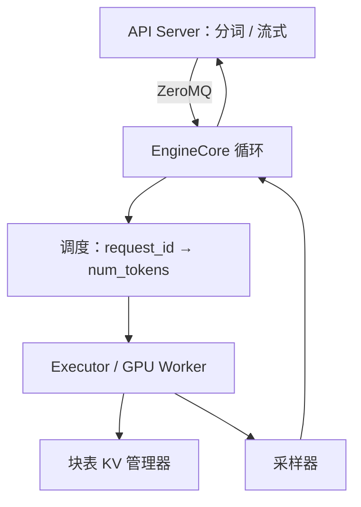

# vLLM V1 架构

调度器不再区分前填与解码阶段，只给出「这条请求本步算几个 token」；API 进程与 EngineCore 拆开，CPU 上的分词与 GPU 上的一步前向重叠。

<footer>—— vLLM 项目组，vLLM V1: A Major Upgrade to vLLM's Core Architecture，2025-01-27</footer>

SOSP 2023 的 vLLM 把控制面收成中央调度器、KV 块管理器、worker 与 PagedAttention，见 [架构](/llm/vllm-architecture) 与 [论文](/llm/vllm-paper)。那条脊梁在 V0 里逐渐被特性堆成难以改动的阶段机：前填/解码分叉、chunked prefill、前缀缓存、投机解码各走一套调度分支。V1（2025 年 1 月博客，随后成为默认引擎）重写调度器、KV 管理器、worker、采样器与 API 服务，但**复用** V0 的模型实现、GPU 核、分布式控制面。本篇写 V1 相对 V0 改了哪一层进程模型与调度表示，不把分页公式再推导一遍。

## 问题

V0 的 Python 路径上，AsyncLLM、分词、多模态预处理、反分词和流式发送与调度循环抢同一把 GIL。v0.6.0 已经用 ZeroMQ 把 HTTP API 进程拆出去，V1 要把这条多进程边界推进到引擎内部：真正的一步前向只留在 `EngineCore` 里，前端 CPU 工作与之重叠。否则核再快，调度与取样的 Python 尾巴仍会在短解码上露出来。

第二问题是调度表示。把请求标成「正在 prefill」或「正在 decode」，每加一个特性就要在两支上复制逻辑。[Chunked prefill](/llm/chunked-prefill) 要的是「这次只算提示的 $C$ 个 token」；前缀缓存要的是「跳过 $m$ 个已命中 token」；投机解码要的是「一次提交 $k$ 个草稿 token」。它们其实都是同一句话：本步每条请求的 token 预算。V0 用阶段机表达，V1 改用一张字典。

### 统一调度不是取消前填的屋顶线

前填仍然算力密、解码仍然带宽密，见 [Prefill 计算特征](/llm/prefill-compute)。V1 只是不再用阶段标签驱动控制流。硬件画像还在：token 预算过大，一步里塞进超长提示，ITL 会抖；预算过小，GEMM 变瘦。统一表示让 chunked prefill 变成「在 `max_num_batched_tokens` 下给各请求切额度」，而不是另写一套阶段调度器。

博客写明 V1 与 V0 共享核与模型实现。基准上若只换 V1 开关、核版本没变，加速主要来自调度与 CPU 重叠，不是 FlashAttention 突然换代。把 V1 说成「新的注意力算法」是错层。

## 方法

进程角色拆成四类。**API Server**：HTTP、分词、多模态加载、反分词、流式。**EngineCore**：只跑调度与执行循环，从输入队列取新请求，每步 `schedule` 再 `execute`。**GPU worker**：模型前向，与 V0 一样按 TP/PP 切。**DP coordinator**（数据并行时）：在多个 EngineCore 之间做内部负载均衡。API 与 Core 之间走 ZeroMQ；官方架构概述写成多 API 对多 Core 的网，任一前端可以把请求送到某个引擎。`AsyncLLM` 仍在前端进程里用 asyncio，但 GIL 不再挡住 Core 的一步。

调度器的输出是 `{request_id: num_tokens}`：本步每条请求处理多少 token。提示 token 与已生成 token 同等看待。固定 token 预算下，长提示被切成多步（chunked prefill），短解码可以和一块前填拼在同一步。前缀缓存默认纳入这条路径：命中的前缀不占本步预算。投机解码把草稿长度写成更大的 `num_tokens`。博客认为这张表足够覆盖上述特性，从而删掉 V0 里分叉的阶段逻辑。

KV 管理器仍按块分配，但与统一调度对齐：额度是 token 数，换算成块数在管理器里做。前缀缓存在 V1 里是一等公民，而不再是后挂的可选路径。采样器、投机逻辑随 Core 重写，以便和「一步多 token」的表示一致。启用方式在 alpha 期是 `VLLM_USE_V1=1`；随后版本改为默认 V1，V0 逐步退出。

### 异步调度把「下一步」叠进「这一步」的计算

后续 PR（如 vLLM#19970）引入 `AsyncScheduler`：调度领先执行一步，用占位输出表示「已调度、尚未生成」的 token，使调度开销与模型前向重叠。思路与 NanoFlow（Zhu et al., arXiv:2408.12757）同类。`max_concurrent_batches` 提到 2，意味着执行侧可能同时有一批在算、一批已规划。这不是 SOSP 论文的贡献，也不是 V1 alpha 博客的全部内容，但它是 V1 表示变薄之后才容易做的叠加。打开 `--async-scheduling` 要接受：块的分配与缓存插入推迟到结果返回，排障时「调度器以为已写入」与「核尚未写完」会短暂不一致。

Ubicloud 等对 V1 请求生命周期的拆解与官方概述一致：Core 内部还有把 ZeroMQ 字节搬进输入队列、把输出队列搬回 IPC 的后台线程。忙循环本身只做「取新请求 → 调度 → 执行 → 回送」。把这些后台线程画进架构图，是为了避免误以为 ZeroMQ 收发发生在 GPU 流上。

## 机制

CPU/GPU 重叠的机制是进程隔离。分词与多模态预处理在 API 进程跑的时候，Core 可以正在跑上一步的 GEMM。GIL 不再把两边串成一条 Python 时间轴。吞吐收益在「核已经很快、CPU 尾巴可见」的短上下文、高 QPS 场景最大；超长前填时核本身是墙，拆进程帮不上二次注意力。

统一 token 预算的机制是把混合批写成资源分配。一步的成本大致随本步 token 数（前填段）和解码条数（读权重）变化。调度器不必先决定「这一步是前填步还是解码步」，只需在预算内塞请求。这简化了代码，也把策略暴露成可调的 `max_num_batched_tokens`：运维调的是预算，不是阶段开关。公平性仍要另写——预算可以被长提示一次吃满，V1 并不自动等于 stall-free，chunk 大小与预算要一起设。

V1 默认打开前缀缓存，改变的是空载时的 CPU 与内存记账，不是「所有负载都更快」。无共享流量上，缓存插入与淘汰是额外工作；有共享时，少做的前填才是收益。对照实验必须声明是否关闭缓存。

### 和 SOSP 架构图的关系

Kwon 等人的四件套仍然在：调度器、KV 管理器、worker、分页核。V1 改的是调度器的**接口形状**和它们所在的**进程**。张量并行下仍是一个 Core 对齐所有 worker 的同一步；多副本是多套 Core，中间多一个 DP coordinator。不要把 V1 画成「没有中央调度器」——Core 就是中央循环，只是不再和 FastAPI 住在一起。分离式 PD、Mooncake 连接器、LMCache 是接在这套循环之外的角色，属于后续插件，不应写回 2025-01 博客的贡献表。

## 边界与工程取舍

V1 alpha 期间功能覆盖落后于 V0：部分采样参数、偏门解码、某些硬件插件是后来才迁完的。生产要以当时发行说明为准，而不是假设「架构更干净所以功能超集」。多进程调试更难：请求卡在 API、卡在 IPC、还是卡在 Core 队列，日志要带同一 `request_id` 才能对上。

异步调度与投机、约束解码、水印钩子的组合会放大「占位 token」语义：水印和文法掩码必须作用在真实 logits 上，不能作用在占位符。图捕获、CUDA Graph 的形状因一步 token 数变化而更难固定——统一调度让一步的形状更动态，这是灵活性的代价。数据并行内部负载均衡若只看队列长度、不看前缀，会打穿 V1 默认打开的前缀缓存；集群入口应配合 [SGLang Router](/llm/sglang-router) 或 Dynamo Smart Router 一类缓存感知路由。

出处钉 vLLM 博客 *vLLM V1: A Major Upgrade to vLLM's Core Architecture*（2025-01-27，https://vllm.ai/blog/2025-01-27-v1-alpha-release）与文档 Architecture Overview。分页与利用率数字仍引用 Kwon et al., SOSP 2023（arXiv:2309.06180）。异步调度另见 vLLM PR 19970 与 NanoFlow arXiv:2408.12757。

## 小结

- V1 重写调度器与进程模型，核与模型实现继承 V0；脊梁仍是中央调度 + 分页 KV + worker。
- 调度表示是 `{request_id: num_tokens}`，chunked prefill、前缀缓存、投机解码都映射到 token 额度。
- API 进程与 EngineCore 经 ZeroMQ 隔离，分词/流式与一步前向重叠，躲开 GIL。
- 异步调度让规划领先执行一步；排障要区分占位与已写入的 KV。
- 加速来自 CPU 重叠与更简单的混合批，不来自新的注意力公式。
- 出处：vLLM V1 博客与架构文档；SOSP 2023 论文描述的是被 V1 继承的分页脊梁。
