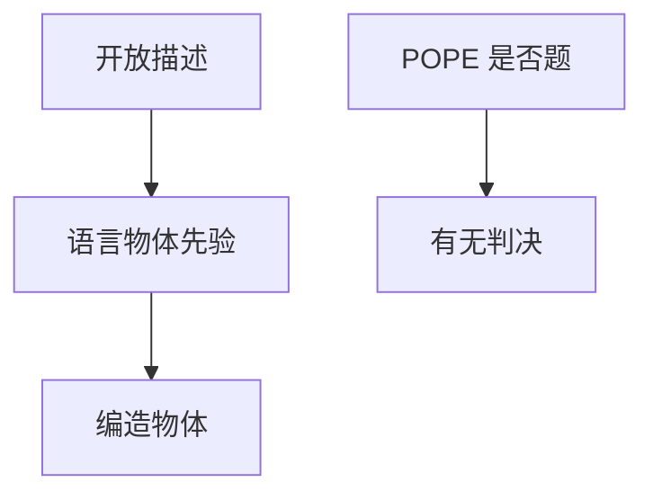

# VLM 幻觉与 POPE

语言模型擅长把「像有」说圆。视觉前缀若只提供主题级证据，物体名词会从语言先验里补出来。

<footer>—— Li 等 Evaluating Object Hallucination in Large Vision-Language Models（POPE）</footer>

[上一课](/llm/visual-instruction-data)让模型敢谈图。主干[幻觉分类](/llm/hallucination-taxonomy)写的是文本侧假话类型。本课缺口是视觉特有的物体幻觉：图中没有的东西被说成有。后课定位默认：只靠「是/否有某物」不够，还要把名词钉到格子上。

## 问题

开放描述的奖励是流畅与覆盖。指令数据里常见「图中有……」句式，语言模型会把共现物体写进回答——厕所场景就「有洗手台」，即使 [ViT](/llm/vit-as-encoder) 的 patch 没提供该证据。这与 CLIP 全局向量对不上细物体是同一病：对比空间与标题先验都偏名词，不偏「不存在」。

自由描述难以自动判假。POPE（Polling-based Object Probing Evaluation）改成探测：对图问「图中有 {object} 吗？」正例来自真实标注物体，负例来自随机、流行或对抗共现。准确率、精确率、召回、Yes 比率分开报——Yes 偏高就是乱认。

POPE 测的是物体有无，不是属性、计数、关系。描述里编造颜色或「三只」仍可在 POPE 上及格。不要用它替代 OCR 与指代评测。

## 方法

训练侧：在指令里加入否定与拒答、降低无根据列举、用存在性问答做辅助损失。解码侧：降低鼓励覆盖的采样，或对物体名词做与视觉一致的约束（后课 grounding 更硬）。评测必须含 POPE 三类负例，且与自由描述的人评分列。不要用 [CLIP](/llm/clip) 余弦当「没幻觉」的证明。

## 机制

因果 LLM 在视觉前缀之后继续写，每一步仍是词表 softmax。若视觉键值对「有没有猫」区分弱，而「室内、沙发」强烈激活猫的语言共现，Yes 与名词就会被先验带走。[LLaVA 投影器](/llm/llava-projector) 越浅、ViT 越冻，这个通道越依赖 CLIP 已经提取的概念，未提取的细物更容易被语言补全。

## 边界

压幻觉会伤召回：模型改口说「看不清」。下一课把问题改成指代与框，让「说有」必须对应空间证据。

## 小结

- 物体幻觉是语言先验在弱视觉证据上补名词。
- POPE 用是否探测把描述不可判变成可自动评。
- Yes 比率与精确率要一起看。
- 出处：Li 等 POPE；指令来源见 LLaVA。
