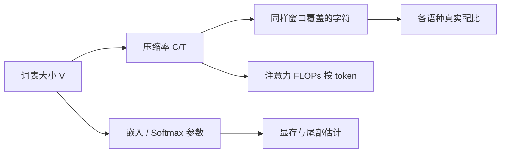

# 词表大小与压缩率

词表越大，同样字符能编成越短的整数序列；嵌入与 softmax 也越贵，且名额一旦分给高频垃圾合并，低资源语言与稀有符号就被挤出短 token。

<footer>—— 由 BPE / Unigram / ByT5 的符号设计直接推出的计算权衡</footer>

Tokenizer 选定算法之后，还要选定词表大小 $V$。$V$ 决定压缩率：平均多少字符（或字节）被收成一个 token。压缩率高，同样上下文窗口覆盖更多文本，注意力的二次成本按 token 计就会「看起来」能看更长的文档。代价是嵌入矩阵 $V\times d$ 与输出 softmax 变大，尾部词训练不足，以及多语言名额分配更苛刻。ByT5 把 $V$ 压到字节量级，压缩率按 token 计最低、按字符计最诚实。本篇写 $V$ 怎么选、压缩率如何度量、以及它如何改写代码、数学与多语言的真实配比。

## 问题

记语料字符数为 $C$，切分后 token 数为 $T$，压缩率可用 $C/T$（字符每 token）或 $T/C$ 的倒数来报。英语子词常见落在每 token 约四字符量级，中文往往接近每 token 一字，代码视标识符是否被收成原子而剧烈波动。同一 $V$，不同语言压缩率可以差一倍以上，于是「按 token 的 10% 多语言」在字符意义上完全不是 10%。配比若只盯 token，会系统性少给切得碎的语言。

$V$ 太小，序列变长：上下文窗口浪费在碎片上，长程依赖更难，训练与推理的 FLOPs 按 token 上涨。$V$ 太大，嵌入占用显存，softmax 变慢（即使有采样或分层也增加复杂度），大量符号在预训练里只出现几次，估计噪声大。还存在「假压缩」：把网页模板整句收成单 token，$C/T$ 很好看，对语言建模无益。去重之后再训 tokenizer，就是为了避免这种假压缩。

### 度量必须分桶

总体 $C/T$ 会被英语网页主导。应分语言、分代码、分数学公式报压缩率，并报百分位而不是只报均值。极端长尾（URL、base64、十六进制）会把均值拉歪。过滤掉这些垃圾（C4 / FineWeb 的启发式）会同时改善质量和压缩统计——二者纠缠，不要把过滤带来的 $C/T$ 上升全算成词表的功劳。上下文长度标称 8K token，对英语和对字节级中文覆盖的字符数可以差数倍。长上下文论文若只报 token 长度、不报字符或文档覆盖，跨词表不可比。这与缩放定律同一教训：横轴必须定义清楚。

## 方法

实践中在清洗去重后的混合物上训练若干 $V$（例如 32K、50K、100K、128K），画出：嵌入参数量、$C/T$、各语种 $C/T$、一份固定文档集上的序列长度分布、以及小模型在固定 token 预算与固定字符预算下的损失。固定 token 预算偏向高压缩词表；固定字符预算才接近「读同样多的文本」。大模型最终常在 32K 到 128K 之间折中：Llama 早期偏小词表，后来为多语言与特殊 token 放大。这不是定律，而是产品轴上的点。

ByT5 提供下界对照：$V\approx 256$ 时压缩率按 UTF-8 字节计约为 1，序列最长，嵌入最便宜。若某子词方案相对字节的加速，主要来自更短序列而不是更好的归纳偏置，那么一旦推理内存墙在 KV 而不在嵌入，$V$ 仍值得加大。反之，若模型已经很小、嵌入占参数一半，再加大 $V$ 是亏的。

### 名额分配

$V$ 的增量给谁，比 $V$ 本身更重要。BPE 把增量合并名额按全局频次分配，默认给高资源英语与模板。要给中文、代码运算符、数字完整形式留名额，必须在 tokenizer 训练集上对语言与代码做平衡采样——与 Xie 等人在预训练配比上做的事同构，只是发生在符号层。Unigram 用似然分配名额，高资源仍然占优，除非训练数据已平衡。显式保留字节回退（byte fallback）保证未登录可分解，等于永远占掉 256 个名额，换来稳健性。

数字切分值得单独政策。整年、整金额收成单 token，压缩好，但对逐位算术不友好；切成单数字，算术好，序列变长。许多模型折中为三位一组。这是任务先验写进词表，不是中性压缩。

## 机制

嵌入矩阵的参数是 $Vd$。对宽度 $d=4096$、$V=32000$，约 1.3 亿参数；$V=128000$ 则四倍。对七十亿参数模型这已可见；对千亿模型相对更小，于是大模型更能「买得起」大词表换压缩。softmax 若做满 $V$ 类，计算与 $V$ 线性；实践常把输出与嵌入绑定，并依赖矩阵乘吞吐。真正的运行时税更多来自序列长度：注意力是 $n^2$，把 $n$ 降 20% 比把 $V$ 降 20% 通常更划算——前提是 KV 与计算已经是瓶颈。

压缩改变有效深度：同样字符，更少的层间位置，意味着每个注意力头看到的「文档半径」更大。这会被误读成长上下文能力；它只是把半径的单位换成了更粗的符号。碎片化语言在同样 $n$ 下半径更短，这是多语言不公平的机制来源之一。放大 $V$ 给那些语言更多整词，是在符号层做配比补偿。

### 与假重复、合成数据的相互作用

高压缩词表会把教师模型的套话收成短路径，合成数据的模板重复在 token 空间里更密，MinHash 若按 token shingle，阈值要重校准。按字符 shingle 更稳定。Lee 式去重应在字符或字节层做一份，避免词表换代后近重复检测全部失效。合成数据若句式单一，还会「帮助」BPE 学到无意义的长合并，进一步假压缩。真实、多样的网页（FineWeb 一类）对词表健康有正面外部性。

## 边界与工程取舍

不要跨词表比较「训练了 $N$ token」。报告字符数或文档数，或至少报告平均 $C/T$。不要在评测时对模型 A 用它自己的 tokenizer 数长度、对模型 B 用另一个，再谈长上下文谁赢。ByT5 的字符覆盖天然更长计数，比较时更要统一横轴。

$V$ 不是越大越好：尾部符号梯度稀疏，可能变成几乎随机的嵌入，解码时偶发噪声。可以用最小频次门槛，把名额留给中频子词。聊天模板、工具调用、多模态哨兵会继续吃名额，应在定 $V$ 时预留，而不是事后往 32K 里塞导致冲突。Gopher、Llama 公开的词表选择服务于当时的语言中心；做多语言产品时，应重测各语种 $C/T$，而不是继承一个英语最优 $V$。

嵌入与 LM 头绑定能省参数，但迫使输入输出共用几何。大词表下尾部词既当输入又当输出，两边都学不饱。解绑能给输出更多自由度，参数再加一份 $Vd$。这是优化器与词表的交界，下一篇 AdamW 管的是怎么衰减这些参数，而不是该不该绑。

最后，压缩率优化不能伤害可解释的边界。跨词合并（无空格预分词）可能把 `New York` 收成一块，对实体好，也可能把随机高频二元收成一块。应抽查词表里最高频的若干百个多词符号，确认它们不是未去重模板。Raffel 的 C4 清洗与 Broder/Lee 去重，在这里是词表质量的上游。

## 小结

- 词表大小 $V$ 同时买压缩率（更短序列）和付嵌入 / softmax 税；最优随模型规模与语言中心移动。
- 压缩率必须分语种、分代码报告；按 token 的配比不等于按字符的配比。
- 固定 token 预算偏向大词表，固定字符预算才比较「读了同样多文本」。
- 名额分配与 tokenizer 训练集配比同构；字节回退用 256 个名额换稳健。
- ByT5 是低 $V$、低压缩的端点，用来对照子词到底省的是长度还是归纳偏置。
- 假压缩来自未去重模板与合成套话；词表训练必须放在清洗去重之后。
- 出处：Sennrich BPE；Kudo Unigram；Xue et al. ByT5；数据与去重对照 Raffel、Lee、Penedo；配比对照 Xie DoReMi 与 Gopher / Llama 的多语种实践。
