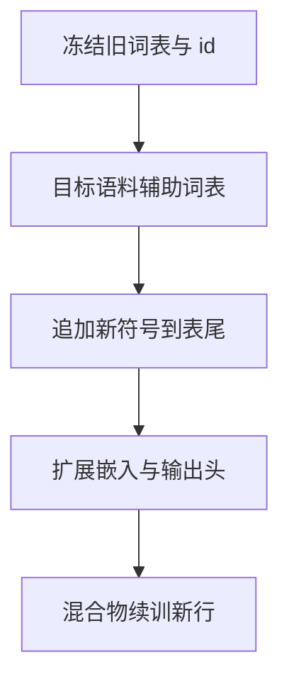

# 词表扩展与多语言

在已经训好的英文词表上继续加汉语子词，必须保持旧编号不变，只在嵌入矩阵底部接新行，再用新语料把新行热起来。

<footer>—— 据 Conneau 等 XLM-R 的多语言词表实践；对照 MiniCPM / 开源续训中的词表扩展整理</footer>

[上一课](/llm/special-tokens)把协议 id 收成冻结区间。内容词表若在英文网页上长成 32k，中文、韩文、代码会大量走 [字节回退](/llm/byte-fallback)，序列又长又贵。本课不重讲控制符抽取。缺口是：如何在不打乱旧 id 的前提下扩大 $V$，让新语言获得整子词，而不是重训一个与旧检查点不兼容的词表。后课的训练语料选择，默认你会「先扩表、再决定用什么文本练新行」。

## 问题

[分词器设计](/llm/tokenizer-design)里的 $|V|$ 是一次训练的超参。上线之后，产品要加语言或加领域，有两条坏路。一条是换全新 BPE：所有旧 token 编号漂移，检查点作废。另一条是不扩表、只加数据：模型能学语义，但上下文窗口被碎片填满，有效 token 预算被 fertility 吃掉。需要第三条路：旧符号 id 不变，新符号追加到表尾，嵌入矩阵从 $|V|\times d$ 变成 $(|V|+n)\times d$，旧 $d$ 维行原样拷贝。

多语言还带来名额分配。合并次数有限，若在联合语料上从头训，英语高频对会占满表，目标语言仍碎。扩展时应在目标语言语料上单独学一批候选子词，过滤掉已在旧表中的，再按覆盖增益插入，而不是把两份语料简单拼起来重跑 BPE。

### 编号即契约

任何已发布的检查点、缓存的 logit 处理器、约束解码词表，都假设 id 稳定。扩展只能 append。删除或重排等于换模型族。特殊 token 区间应在首次发版时留空位，以免聊天标记被新语言子词挤到新 id。

新行如何初始化不是装饰。用字节回退路径上各字节嵌入的平均，比随机初始化更容易让「新汉字」一开始就落在合理范数；随机行在训练初期容易变成 glitch。

## 方法

典型流程：冻结旧合并表与旧 id；在目标语料上训一个辅助词表；把辅助表里「能显著降低目标语料长度、且不是旧符号前缀冲突」的条目加入；为新符号指定全新 id；扩展输入/输出嵌入（以及 tying 时的那一份）；用较小的学习率或只解冻新行，在目标语言与原语言的混合物上续训，防止旧语言灾难遗忘。

XLM-R 一类从一开始就用大词表覆盖多语言，是「训前分配名额」，不是扩展。扩展是工程补丁：已有英文模型要接中文时才出现。两者都要面对同一统计事实——字符集更大的语言，同样 $|V|$ 下更吃亏，除非名额向它们倾斜。

### 与 Unigram 扩展

[Unigram](/llm/unigram-segmentation) 删词而不是焊对，扩展更像「把目标语言高频片段加回种子词表再跑几轮 EM」，同样必须锁定旧符号不被删。旧符号的概率可以继续更新，id 不能变。若 EM 强烈想删掉某个旧英文罕见词，应把它钉住：那是兼容性约束，不是似然最优。

输出头与嵌入若未 tying，两处都要加行，并在续训里对 lm_head 的新行做足够步数，否则会出现「能切出新 token、却几乎从不生成它们」。

## 机制

扩展改变的是离散基底，不是注意力公式。新子词让原来三字节回退变成一个 id，同样上下文窗口里能放下更多语义内容。旧语言路径几乎不变：同样的正则、同样的旧合并，只是某些跨语言混排句可能因为新符号的最长匹配而切法微变——这是必须用回归测试盯住的。协议 token 仍优先于最长内容匹配。

续训时新旧行的学习率可以分开：旧行保英语，新行追覆盖。配比上原语言不能降到零，否则英语子词的嵌入会漂。这已经碰到 [配比定律](/llm/data-mixture-laws) 的边；本课只要求扩展后的第一份混合物包含旧语言。

## 边界

扩展救不了错误的正则：若预分词把汉字整句当成一块，加再多汉字子词也焊不进块外。先修正则，再扩表。扩展也不是无限的：嵌入矩阵随 $|V|$ 线性涨，过大的表让最后一层与输出头成为显存主角，且罕见新词会变成后课的 glitch。对真正的新文字系统，有时从头训多语言词表比反复 append 更干净，但那是新模型族，不是本课的兼容扩展。

## 小结

- 本课不重讲特殊 token；只补内容词表如何 append。
- 旧 id 冻结、新符号表尾追加、嵌入加行，是与旧检查点兼容的唯一安全扩展。
- 名额应在目标语言上单独学，而不是让英语频率继续占满合并。
- 新行要热启动并在混合物里续训，防止旧语言漂、新语言不会生成。
- 正则错误与 glitch 风险仍在，分别交给训练语料课与 glitch 课。
- 出处：Conneau et al., *Unsupervised Cross-lingual Representation Learning at Scale* (XLM-R), 2020；Kudo & Richardson, SentencePiece, 2018；开源续训中的词表扩展实践。
