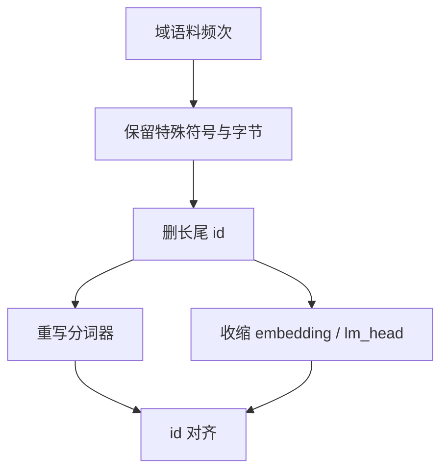

# 词表裁剪

小模型里 embedding 加 lm_head 可以占掉总参数的一大截。域适配之后，许多行从未被看见——删行必须连分词器一起删。

<footer>—— 对照 ALBERT 的因子化嵌入；域内分词器实践见 Dagan, Synnaeve, Rozière, 2024 一类工作</footer>

[上一课](/llm/prompt-compression) 减输入长度。本课减 **$|V|$**：embedding 与（通常绑定的）lm_head 是 $|V|\times d$。缺口是：权重稀疏与低秩都不碰这两张表，于是 1B 级模型压缩完仍被词表拖住。[词表规模缩放律](/llm/vocab-scaling-law) 讲过 $|V|$ 与损失的交换；本课是事后裁剪，不是从零选 $|V|$。后课权重共享是另一条减参轴。

## 问题

通用词表为多语言与代码留了大量 id。垂直域上，大量 token 频率为零，对应行在微调里也几乎无梯度，却仍占显存与 lm_head 的 GEMM。直接把这些行从检查点里删掉、推理却仍用旧分词器，会把文本映到已删 id，或落到 UNK / 字节回退上，行为未定义。缺口是 **tokenizer 与两张表同时改**，并处理残留：旧对话里的特殊 token、工具标签、保留位。

ALBERT 用因子化嵌入 $E=E_1 E_2$ 降参数，不删 id，OOV 行为不变。裁剪更狠：id 集合变小，fertility 与公平性都会变，压缩课要把它当能力风险，而不是只当存储。

绑定的 lm_head 必须与 embedding 同步删行。只瘦 embedding、头仍 $|V|$，logits 错位。Press & Wolf 的 tying 在这里是约束，不是可选项。

## 方法

统计域语料（含模板、代码、数字）上的 token 频次，保留特殊符号与字节回退所需的字节级符号，按阈值或目标 $|V'|$ 丢掉长尾。重写分词器词表与合并表，使不会再产生被删 id。检查点按 id 映射收缩两行矩阵，对仍保留的行保持原向量。短校准或继续预训练，让 lm_head 在新词表上重新校准频率。

评测：域内 PPL 会因 token 变长（fertility 升）而不可比，必须用生成式任务与字节级或词级对照。跨语言若误删脚本块，会表现为突然的字节回退爆炸，而不是轻微掉点。

## 机制

未使用行不贡献前向，删它们在域内近似无损。伤害来自边界：稀有但关键的标识符、别的语种、数字块。预分词若把数字切成单数字 token，数字 id 很热，不会被删；若整块数字是稀有合并符号，裁剪会毁掉算术——与量化课的算术崩同类，根因是符号集合。

[LoRA](/llm/lora) 打在 embedding 上时，裁剪要在合并后做，或对 $A,B$ 同样收缩行，否则秩分解的行维与表不一致。

## 边界与工程取舍

不要在通用聊天模型上按单一垂直域裁词表。不要留下「保留 1000 个空位」却无 tokenizer 对应，那是未定义 id。下一课权重共享：行还在，层间或输入输出之间共用同一组参数。

## 小结

- 词表裁剪必须同步改分词器、embedding、lm_head。
- 域内零频行可删；伤害在长尾关键符号与其它语种。
- 因子化嵌入是不删 id 的替代，OOV 行为更稳。
- 域内 PPL 因 fertility 变化不可横比，用生成任务验收。
- 出处：ALBERT 因子化嵌入；Dagan et al. 一类分词器域适配；tying 见 Press & Wolf。
