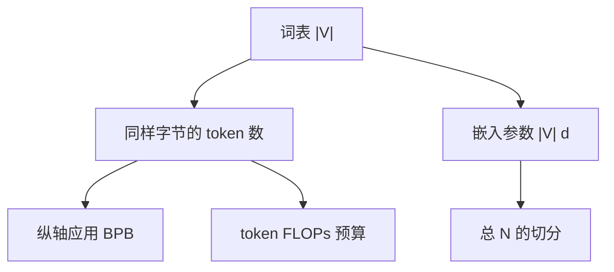

# 词表规模缩放律

词表更大，每 token 更富、序列更短，但嵌入与输出头吃掉更多参数，softmax 更贵；存在与模型和数据相匹配的词表大小，而不是「越大越细越好」。

<footer>—— Gowda & May, Finding the Optimal Vocabulary Size for Neural Machine Translation, Findings of EMNLP 2020；跨切分比较须用 BPB，见 Radford et al., GPT-2, 2019</footer>

[上一课](/llm/depth-vs-width)比较深度与宽度时，要求声明 $N$ 是否含嵌入。缺口正是 $|V|$：它既改变 $N$（两项 $|V|d$），也改变同样字节文本的 token 数 $T$，从而改变 [PPL 与 BPB](/llm/perplexity-bpb) 哪一个可比。Gowda 与 May 在翻译上扫词表大小，发现过小与过大都伤 BLEU。语言模型同构，只是指标换成 BPB 与下游。本课不重讲 BPE 规则，只写 $|V|$ 如何进入缩放账。

## 问题

固定字节语料。$|V|$ 升：平均每 token 字节数升，$T$ 降，每个预测步条件更富、分类更难；嵌入参数 $|V|d$ 升，若总 $N$ 固定则非嵌入容量下降。$|V|$ 降：相反，序列变长，注意力二次项更贵，模型把容量花在重复拼常见词。BPB 把总 NLL 摊到字节上，是这条轴的正确纵轴；token PPL 会把细词表夸成「PPL 更低」。

计算：$C\approx 6ND$ 里的 $D$ 是 **token** 数。同样字节、更大词表，$D$ 变小，若按 token 预算训练，等于少看了字节；若按字节预算训练，$D$ 随 $|V|$ 变，Chinchilla 的「20 token / 参数」不能跨词表原样贴。必须先声明预算单位是 token 还是字节。

多语言与代码把熵分布拉宽。英文为主的最优 $|V|$ 对字节级中文或混合代码不是最优。词表缩放律要按数据配比分层，不能用一份英文拟合去立法。

## 方法

扫 $|V|$ 时：

1. 固定字节评测集与训练字节预算（或明确改用 token 预算并报告换算）。
2. 固定非嵌入 $N$ 或固定总 $N$，两种实验问的问题不同：前者问「词表本身」，后者问「总参数怎么切给词表」。
3. 纵轴用 BPB 与下游，不用 PPL。
4. 输出 softmax / Cut CE 的计算随 $|V|$ 涨，墙钟单独记，不要只报 loss。

初始化与 z-loss：$\log|V|$ 变了，第 0 step CE 的健康锚点变了；α 可能要随 $|V|$ 略调（z-loss 课已警告）。不要把 32K 上的 α 贴到 256K。

近期若干工作把最优 $|V|$ 写成随 $N$ 缓增的函数：更大的模型吃得起更大词表。本课接受「最优随尺度移动」，但不把某一篇的拟合系数当常数。你的数据与分词算法（BPE vs unigram）会改系数。

## 机制

词表是输入输出的瓶颈宽度。太小：模型必须用多层把碎片拼成词，深度被浪费在拼写；太大：大量行稀疏，Adam 冷坐标与 [ε 课](/llm/adam-epsilon-update-scale) 的巨步更频繁，嵌入豁免政策更关键。tied 时 $|V|d$ 只付一次，untied 付两次，缩放账必须分开。

注意力二次项按 token 计。同样字节，小词表让 $n$ 变大，FlashAttention 更贵，序列长度预热的策略也要改。所以 $|V|$ 不是与形状无关的「预处理超参」，它进 FLOPs 与稳定性。

## 边界

字节级模型（ByT5 一类）把 $|V|\approx 256$，把拼写完全交给深度，是轴的一端，不是本课要选的默认。下一课在**已固定词表**的前提下，写学习率如何随 batch 缩放——那条定律的 $B$ 是 token batch，词表一变，同样字节的 $B$ 已变，必须先读完本课再去乘线性规则。

## 小结

- 跨 $|V|$ 比较用 BPB 与字节预算；token PPL 与「每参数 20 token」不能原样搬。
- $|V|$ 同时改 $N$ 的切分、序列长、softmax 费用与嵌入冷坐标。
- 扫时声明固定的是总 $N$ 还是非嵌入 $N$。
- 最优词表随模型尺度与数据配比移动，系数要重拟合。
- 出处：Gowda & May, Findings of EMNLP 2020；Radford et al., GPT-2, 2019。
