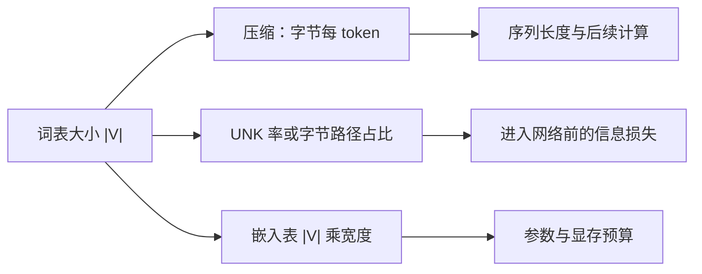

# 词表大小与 UNK

词表必须在覆盖罕见形式与控制模型规模之间折中：过小则未知符号泛滥、序列变长；过大则大量编号几乎得不到更新。

<footer>—— 据 Sennrich 等关于罕见词子词化的动机，以及后续开词表、字节兜底实践整理</footer>

[上一课](/llm/unigram-segmentation)把切分从贪心合并推进到带概率的格。本课不重讲 BPE 如何焊对、Unigram 如何 Viterbi。缺口是：无论哪一种算法，都还要选定 $|V|$，并决定未覆盖的形式去哪里。词表大小同时改变三件事——序列被压得有多短、未知符出现得有多勤、嵌入表有多贵——它们不能分开调。

## 问题

[Unigram 切分](/llm/unigram-segmentation)和 [BPE 合并规则](/llm/bpe-merge-rule)都能在给定预算下交出一张 $V$。预算本身从哪来？过小的 $V$ 迫使算法停在更碎的符号上，同样一段原文变成更长的 id 序列。后面块的计算与缓存按长度付账，压缩率（字节每 token）变差。过大的 $V$ 让大量长尾符号在训练里只出现几次，对应的嵌入行几乎是噪声，却仍占参数与显存。封闭词表还有第三项：无论 $|V|$ 多大，总有训练时没见过的字形，它们撞进同一个 UNK 编号，进入网络之前信息已经不可逆地丢了。

因此本课的问题不是「词表是什么」——[离散符号](/llm/token-as-discrete-unit)已经定义过——而是一个三维权衡：压缩、覆盖、表尺寸。UNK 率是覆盖的可测代理；字节每 token 是压缩的可测代理； $|V|\times d$ 是表尺寸，宽度 $d$ 要到嵌入课才展开，这里先把它当成与 $|V|$ 成正比的成本。

### UNK 不是一个普通符号

未知符在损失里看起来只是 $|V|$ 类中的一类。语义上它是一个碰撞桶：许多原文共享同一个 id，模型无法区分它们，生成时也只能放出这个桶，无法复现原拼写。子词与字节兜底的动机，正是把这个桶的质量降到接近零。若仍报告「我们有 UNK」，需要同时报告它在验证集上的出现率；只报 $|V|$ 没有覆盖信息。

开词表并不取消离散性。字节兜底是把 256 个字节（加上元符号）写进 $V$，使任意字节串都有一条合法路径。UNK 率可以降到零，压缩率却不一定更好：兜底路径往往更长。

## 方法

选定 $|V|$ 的经验做法是：在一块与预训练同分布的持有语料上，画出三条曲线——平均序列长度或字节每 token、UNK 率、嵌入参数量——对 $|V|$ 扫描。BPE 通过合并次数控制 $|V|$；Unigram 通过剪枝目标控制 $|V|$。常见量级从三万到十几万：再往上，多语言与代码覆盖继续改善，但收益递减，表开始明显挤占总参数。

覆盖策略分两档。封闭词表保留 UNK，适合领域极窄、可以接受把噪声塌缩掉的任务。开词表用字符或字节作叶子，使 $V$ 在叶子层已经覆盖全部编码空间，UNK 只留给真正的特殊占位（例如被刻意屏蔽的槽）。GPT-2 一类字节级 BPE 属于后者。多语言词表还要看各语种分到的有效符号数：同一个 $|V|$，高频语种吃掉合并名额后，低频语种的 UNK 或碎片率会更高。

### 压缩率怎样进入后面的计算

设原文 $B$ 字节，切分后 $n$ 个 token，压缩率 $B/n$。注意力一类按 $n^2$ 计费的算子，同样一篇文档在小词表下更贵。这不是后文 [SDPA](/llm/sdpa) 的公式问题，而是本课就要记账的长度效应：你把 $|V|$ 调小「省下的」嵌入参数，可能在每一层按长度加倍还回去。合理的比较是固定原文字节预算，看端到端的步数与损失，而不是固定 token 数比较困惑度——后者对更碎的切分更不公平。

按 token 计的困惑度不能跨词表比较。更碎的切分每步预测更「容易」的局部拼写，数值会看起来更好。要对齐到按字节或按词的负对数似然，才能说哪张 $V$ 真正更省描述长度。

## 机制

词表大小改变的是切分算法的停止点，从而改变符号的粒度分布。小表：很多中频词被拆开，短符号的嵌入更新频繁、学得稳，但模型必须用后续层把它们拼回词。大表：常见词和常见短语成为原子，第一层就已经「看见」这些块，长尾行却稀疏。UNK 则是覆盖失败时的信息瓶颈，梯度无法回到被塌缩的原文差异上。

字节兜底改变失败模式。不再有塌缩，但会出现「这条路径全是字节叶子」的句子：压缩极差，位置数暴涨，对长上下文预算不友好。于是开词表把 UNK 率换成了长度尾部：最坏文档不是不可表示，而是贵得报不出。领域迁移时两条曲线会一起动——新领域 UNK 升（若仍封闭），或字节路径占比升（若已开词表）。

### 多语言与代码的名额争夺

合并或剪枝都是在混合语料的计数上做的。英语、代码、网页标记会主导频率，低资源语种分到较少的中等粒度符号。表面上同一个 $|V|$，有效覆盖并不均。缓解手段是过采样低资源语种来造表，或为脚本保留字符叶子，而不是只把 $|V|$ 再加大一倍——加大一倍多半继续喂给已经占优的语种。

造表语料必须与预训练语料同族。用维基造表、用代码预训练，会得到一张对标识符很差的 $V$，UNK 或字节路径在仓库文本上飙升。词表是模型定义的一部分，不是通用压缩器。

## 边界

没有与任务无关的最优 $|V|$。翻译、代码补全、多语言对话对覆盖的敏感点不同。评测集若与造表语料同域，UNK 率会虚低。生成端还要记住：封闭词表一旦放出 UNK，detokenize 无法还原拼写；开词表可以还原，但用户看见的可能是怪异的碎片拼接。下一课专门处理 id 序列映回字符串时还有哪些坑，那些坑即使 UNK 率为零也存在。

自适应输入、分层词表、按频率分桶的嵌入，是在 $|V|$ 已经很大之后再省表尺寸的技术，不改变本课的三条曲线，只改变第三条的斜率。本课不把它们展开。先会看 $|V|$、压缩、UNK，后面的嵌入课才把宽度 $d$ 乘进去做成内存账。

## 小结

- 切分算法给定之后，还要选定 $|V|$；它同时驱动压缩、覆盖与表尺寸。
- UNK 是碰撞桶，信息在查找表之前丢失；开词表用字节叶子换零 UNK，但可能换来长度尾部。
- 按 token 的困惑度不能跨词表比较；应对齐到字节或词。
- 小词表省表、加长序列；大词表相反。端到端要按原文字节预算算。
- 多语言造表存在名额争夺；造表语料必须与预训练同族。
- 出处：Sennrich, Haddow, Birch, ACL 2016；字节级开词表见 GPT-2 及 SentencePiece 的兜底实践。
