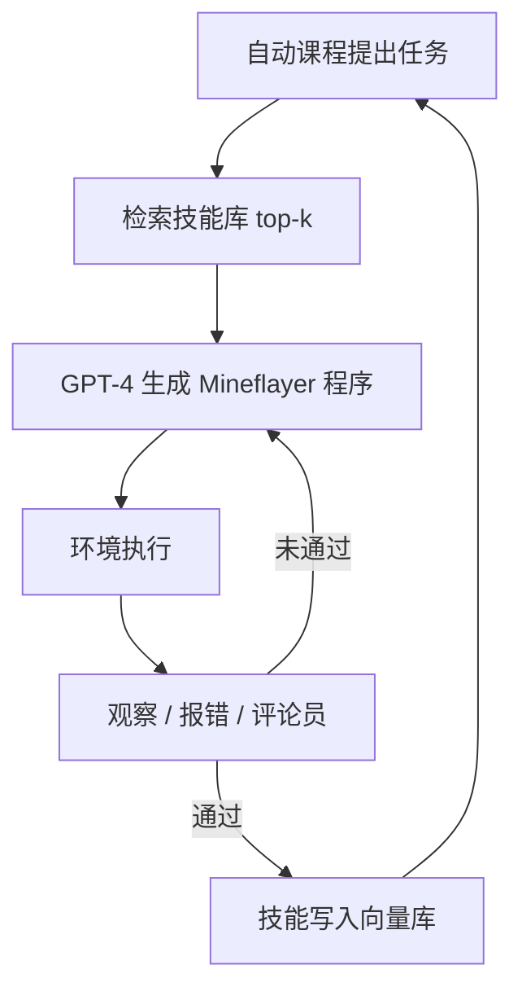

# Voyager

    
在没有通关条件的 Minecraft 里，用自动课程提出「刚刚好难一点」的目标，把成功的动作写成可检索的代码技能，再靠环境反馈与自我校验把程序改到能跑——终身学习发生在技能库里，而不是在梯度里。

    <footer>—— Wang 等，Voyager: An Open-Ended Embodied Agent with Large Language Models，arXiv:2305.16291</footer>

Guanzhi Wang、Yuqi Xie、Yunfan Jiang、Ajay Mandlekar、Chaowei Xiao、Yuke Zhu、Linxi “Jim” Fan 与 Anima Anandkumar（NVIDIA / Caltech / UT Austin / Stanford 等）的 Voyager（arXiv:2305.16291）是 Minecraft 里的开放式具身智能体：GPT-4 黑盒提示，不微调权重。三块：**自动课程**、**技能库**（可执行 JS 代码 + 向量检索）、**迭代提示**（环境观察、解释器报错、自我校验）。控制走 Mineflayer 高层 API，仿真基于 MineDojo；评测是独特物品数、科技树里程碑、探索距离，对照 ReAct、Reflexion、AutoGPT 式分解。本篇写这三块如何把「一直玩下去」做成可复用程序的累积。动作空间是游戏内采集、合成、移动等合法玩法，不讨论对服务器的攻击或作弊客户端。

## 问题

Minecraft 没有固定关卡终点，程序化地图要求智能体自己提出下一个目标。RL 在原始按键上探索难、技能不可读、换世界易忘。纯 ReAct 提示面对「发现尽可能多样的事物」这种抽象目标，会在同一级工具上打转，没有课程，也没有把「已会合成石镐」写成可调用函数。Code-as-policy 能表达长程动作，但一次性生成的程序在库存与生物群系对不上时会失败，需要把执行错误读回模型。

Voyager 要同时做到：目标难度跟着当前库存与技能走；成功策略沉淀为可组合代码；失败用解释器与评论员修程序，而不是换一条 Thought 碰运气。

### 代码是时间上扩展的动作

`craftStoneShovel()` 内部是多步 Mineflayer 调用，比「现在按右键」更适合合成树。技能入库后，新任务检索 top-5 相关函数，在上下文里组合，减轻灾难性遗忘——遗忘的是提示窗口，不是梯度覆盖。这与 [PAL](/llm/pal-pot)「生成一次脚本求数值」同类，但循环在具身环境里关着，直到自我校验通过或达到约 4 轮上限。

与像素 RL（VPT 等）不是同一评测平面：Voyager 不解决从屏幕回归鼠标。论文写明可与提供代码 API 的控制器正交组合。报「3.3× 独特物品」必须带 MineDojo + gpt-4-0314 与迭代次数。

## 方法

自动课程：GPT-4 在「发现尽可能多样的事物」指令下，看库存、装备、附近方块与实体、生物群系、生命值、已完成/失败任务，提出下一个不太难的任务。温度略高于其他模块以增加多样性。另用 GPT-3.5 自问自答补上下文，省 GPT-4 预算。

技能库：校验成功的程序由 GPT-3.5 写自然语言描述，描述嵌入为键、代码为值，存向量库。新任务时用「解决建议 + 环境反馈」查询。作者强调函数应写得可复用，以便合成更复杂技能。

迭代提示三路反馈：(1) 环境：库存与附近实体等；(2) 解释器报错；(3) 另一个 GPT-4 当评论员，判断任务是否完成，失败则给修改建议。卡住则向课程要新任务。实现：`gpt-4-0314` 写代码，`text-embedding-ada-002` 做技能检索，课程温度 0.1，其余 0。

主结果：约 160 次提示迭代内发现 63 种独特物品，约 3.3× 于对照；木/石/铁工具解锁快一个数量级（木工具约 15.3×），且唯有 Voyager 在实验里升到钻石级科技树；探索距离约 2.3×。消融：随机课程使发现量掉约 93%；无技能库后期平台期；GPT-3.5 写代码时独特物品约降到 1/5.7；去掉环境反馈、报错或自我校验都会伤探索。零样本：清空库存、新世界、未见过任务，带技能库的 Voyager 能完成，对照不能；把技能库插给 AutoGPT 也能抬分，说明库是可插拔资产。

### 课程是上下文里的新颖性搜索

下一任务既要新，又不能在缺铁锭时要求附魔台。这比手工科技树脚本更能适应当前落在沙漠还是森林。失败任务列表防止课程反复布置同一道做不到的题。温度与多样性指令是探索噪声；没有技能库时，探索噪声变不成能力复利。

## 机制

终身学习被实现为**检索时的组合**，不是 EWC 一类正则。每个技能是可执行、可解释、可再组的程序，时间上扩展，因此科技树这种必须先木后石后铁的依赖，能以函数调用体现。迭代提示把程序合成变成带环境梯度的编辑循环：报错提供语法与 API 约束，评论员提供任务级语义，环境提供库存真实性。GPT-4 相对 GPT-3.5 的跳跃被作者归因于代码能力，这限制了「任意开源 7B 换上同一提示即 Voyager」的说法。

### 技能库是可插拔资产，不是模型权重

与 [SWE-agent](/llm/swe-agent) 同属「给 LM 的接口决定上限」：那边是 IDE 式 ACI，这边是 Mineflayer 原语 + 技能函数。与 [Generative Agents](/llm/generative-agents)：那边用记忆流模拟日常社会行为，动作不必是可执行代码；这边要改游戏状态，动作必须跑通。零样本实验把同一技能库插给 AutoGPT 也能抬分，说明库的价值独立于课程循环：它是一份可检索的程序记忆。换世界时库存清空，但函数还在，智能体不必从「如何砍树」重新合成。脏技能（校验误报）会污染检索，入库前对照库存数字是必要的门。

自我校验会把「看起来完成」写成通过。评论员与执行器若共享同一幻觉（例如未真正合成却描述成已合成），技能库会进脏函数。库存观察是防呆：评论员应对照物品数量。

## 边界与工程取舍

API 费用随迭代线性涨，开放探索不是一次生成。Mineflayer 抽象掉了视觉与物理细节，换真实机器人要另接感知。技能嵌入域在 Minecraft 话术里，换游戏要重建库。课程可能提出与人类价值取向无关的「多样性」（无意义物品刷取），产品若有目标函数应外加约束。评测不要与纯像素智能体比绝对游戏分。安全上只使用官方或自有服务器、遵守游戏条款；本文不涉及破坏服务器经济或漏洞利用。

出处：Wang, Xie, Jiang, Mandlekar, Xiao, Zhu, Fan, Anandkumar，*Voyager: An Open-Ended Embodied Agent with Large Language Models*，arXiv:2305.16291。环境 MineDojo；基线 ReAct / Reflexion。项目页 voyager.minedojo.org。

## 小结

- Voyager：自动课程 + 代码技能库 + 迭代提示，GPT-4 黑盒玩开放 Minecraft。
- 技能以可执行程序沉淀，检索组合实现上下文终身学习。
- 实验在独特物品、科技树、探索距离上相对提示基线大幅领先，强依赖 GPT-4 代码能力与 Mineflayer。
- 出处：Wang et al.，arXiv:2305.16291。
