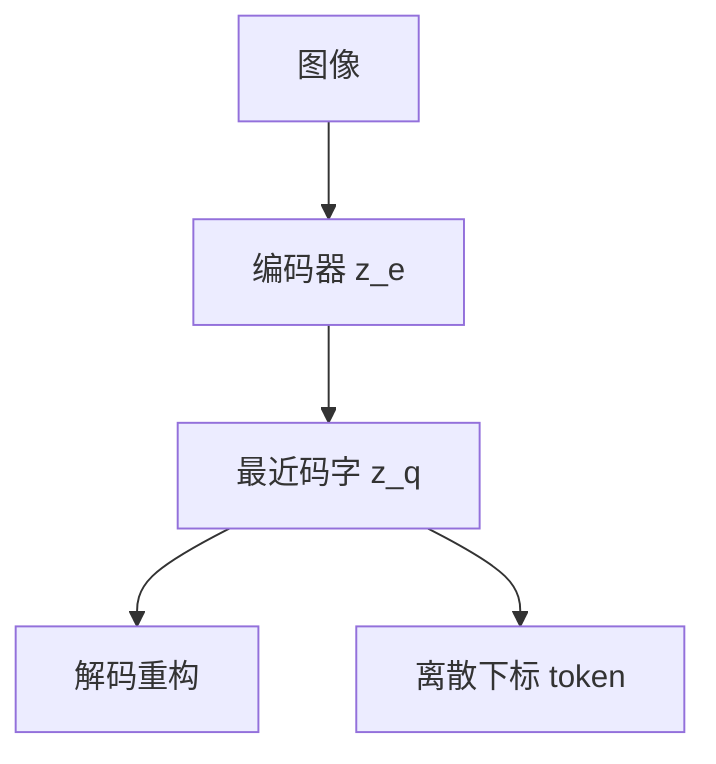

# VQ-VAE

把连续隐变量换成码本里最近的向量，编码器输出就变成可当 token 的下标。生成模型于是可以在离散序列上做似然。

<footer>—— van den Oord, Vinyals, Kavukcuoglu, VQ-VAE</footer>

[上一课](/llm/retrieval-poisoning-defense)收束检索。本课程问像素如何进（生成式）模型。主干 [ViT](/llm/vit-as-encoder) 给出连续 patch；生成还常要离散码，才能接自回归 LM。本课写 VQ-VAE。缺口是向量量化这一层，不是再讲卷积。后课 VQGAN 默认码本已经能重构，但不够锐。

## 问题

像素上直接 softmax 不可行。连续 VAE 的 $z$ 好解码、不好当词表。van den Oord 等人把编码器输出 $z_e(x)$ 量化到码本 $\{e_k\}$ 中最近项 $z_q$，解码器只看 $z_q$。下标 $k$ 就是视觉 token。训练要同时学编码器、码本、解码器，并防止码本崩溃（只用少数项）。

与检索嵌入不同：这里的离散化是为了生成与似然，不是为了余弦近邻。

直通估计器让 $z_q$ 的梯度抄到 $z_e$。码本用指数滑动平均或损失项更新。崩溃时重构还行、词表有效大小接近 1，后接 LM 会学到无信息序列。

## 方法

损失：重构 + 码本承诺（commitment）使 $z_e$ 贴近所选 $e_k$。下采样倍数决定 token 数：压得越狠，空间细节越少、序列越短。验收两件事：重构 FID/PSNR，以及码本使用率（熵、死码比例）。使用率低先修量化，再训上游 LM。

## 机制

量化把连续空间划成 Voronoi 胞腔，胞腔中心是码字。生成时 LM 只建模胞腔下标的联合，细节交给解码器。若码本太小，胞腔过大，脸与文字糊；太大则序列变长、LM 更难。这是后课连续对离散的主轴。

## 边界

VQ-VAE 重构偏糊，因为损失是像素级、没有感知对抗。下一课 VQGAN 用 GAN 与感知损失改解码器，码本才够当高质量图像 tokenizer。

## 小结

- VQ-VAE 用最近码字把图像变成离散下标，供似然模型使用。
- 必须盯码本使用率，防止崩溃。
- 像素损失导致模糊，交给 VQGAN。
- 出处：van den Oord 等 VQ-VAE。
