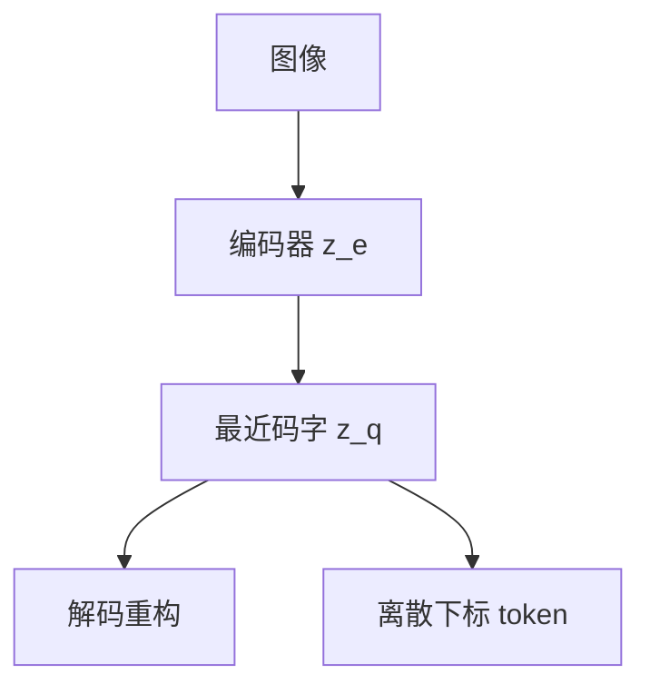

# VQ-VAE

把连续隐变量换成码本里最近的向量，编码器输出就变成可当 token 的下标。生成模型于是可以在离散序列上做似然。

<footer>—— van den Oord, Vinyals, Kavukcuoglu, VQ-VAE</footer>

[上一课](/llm/expert-granularity-law)以专家粒度给「架构进阶」收尾：同样的激活预算下，FFN 专家切到通信-计算比与路由抖动允许的最细处为止。架构问完，本课程问像素如何进（生成式）模型。主干 [ViT](/llm/vit-as-encoder) 给出连续 patch；生成还常要离散码，才能接自回归 LM。本课写 VQ-VAE。缺口是向量量化这一层，不是再讲卷积。后课 VQGAN 默认码本已经能重构，但不够锐。

## 问题

像素上直接 softmax 不可行：$H\times W\times 3$ 的连续空间没有可枚举的类别。连续 VAE 的 $z$ 好解码、不好当词表——对 $z$ 做 CE 仍要先离散化，绕回原问题。van den Oord 等人把编码器输出 $z_e(x)$ 量化到码本 $\{e_k\}$ 中最近项 $z_q$，解码器只看 $z_q$，下标 $k$ 就是视觉 token。训练要同时学编码器、码本、解码器，并防止码本崩溃（只用少数项）。三项损失各管一个对象：

$$
\mathcal L=\|x-D(z_q)\|^2+\|\mathrm{sg}(z_e)-z_q\|^2+\beta\,\|z_e-\mathrm{sg}(z_q)\|^2
$$

stop-grad 两侧各放一次、方向不同，这不是随手写的。码本项把梯度挡在 $z_e$ 外、只动码字：码字是聚心，应当追随编码器输出的分布，分配由最近邻裁决；若两侧梯度都通，编码器与码字互相追着跑，最近邻分配不停翻转，训练震荡。承诺项把梯度挡在 $z_q$ 外、只动编码器，$\beta$（原论文取 $0.25$）压低它的权重：编码器不必为迁就离散格点牺牲重构，但要被拉住不每步换胞腔——没有它，同一区域前后两步映到不同下标，下游 LM 看到的标签序列不稳定，等于在噪声标签上做语言建模。

与检索嵌入不同：这里的离散化是为了生成与似然，不是为了余弦近邻。

直通估计器让 $z_q$ 的梯度抄到 $z_e$。码本用指数滑动平均或损失项更新。崩溃时重构还行、词表有效大小接近 1，后接 LM 会学到无信息序列。

## 方法

最近邻 argmin 没有梯度，量化层对编码器不可导，码本与编码器的联动有两条路线。路线一是损失项加直通：上面的码本项把码字拉向分配到它的 $z_e$，直通估计器把解码器损失对 $z_q$ 的梯度原样抄给 $z_e$，把量化当恒等——有偏但简单，小码本下够用。路线二是指数滑动平均：不给码本写损失，按批内分配把每个码字向「分配到它的 $z_e$ 的均值」做 EMA，附 Laplace 平滑防止久未选中的码字漂死；码本更新不受编码器梯度尺度影响，大码本上更稳，代价是多一组与编码器学习率耦合的动量与平滑超参，配不平仍会崩。

验收写成两道闸门而不是一个分：重构 FID/PSNR 判码里留了多少信息，码本使用率（熵、死码比例）判离散化有没有退化。崩溃是正反馈：少数码字被选中就更靠近数据、更易再被选中，死码拿不到梯度，有效词表缩到接近 $1$；先修量化（重置死码到批内编码器输出）再训上游 LM，否则 LM 在无信息序列上白训。下采样倍数决定 token 数：压得越狠，空间细节越少、序列越短。

```mermaid
flowchart TD
  X["图像"] --> ENC["编码器 z_e"]
  ENC --> Q["最近码字 z_q"]
  Q --> DEC["解码重构"]
  Q --> ID["离散下标 token"]
```

## 机制

量化把连续空间按最近邻划成 Voronoi 胞腔，胞腔中心是码字。生成时 LM 只建模胞腔下标的联合分布，胞腔内的细节交给解码器凭码字与上下文补——「语义在码、纹理在解码器」的分工从这里开始。码本大小的两难由此可算：码本太小，胞腔过大，脸与文字糊；太大则每个下标的样本被摊薄、预测更难，还添死码风险，序列长度却分文不减。下采样倍数是另一根轴：同样码本大小，压得狠则每个 token 摊的像素多、单 token 更难预测。这是后课连续对离散的主轴。

## 边界

VQ-VAE 重构偏糊，因为损失是像素级、没有感知对抗：$\ell_2$ 在多个统计相似的纹理解上取平均，高频被抹平。下一课 VQGAN 用 GAN 与感知损失改解码器，码本才够当高质量图像 tokenizer。

## 小结

- VQ-VAE 用最近码字把图像变成离散下标，供似然模型使用。
- 码本损失与承诺损失各挡一侧梯度，分别只动码字与编码器。
- 码本更新走 STE 损失或 EMA 两条路线；必须盯使用率，防止崩溃。
- 像素损失导致模糊，交给 VQGAN。
- 出处：van den Oord 等 VQ-VAE。
