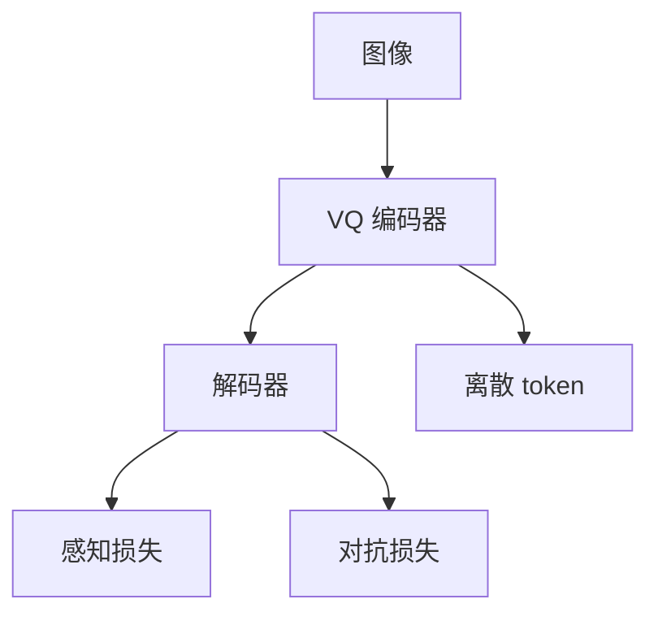

# VQGAN

同样是向量量化，解码器加上感知损失与对抗训练，重构才从「能认出」变成「能当生成器的词表」。

<footer>—— Esser, Rombach, Ommer, Taming Transformers / VQGAN</footer>

[上一课](/llm/vq-vae)的像素损失把高频细节平均掉。Esser 等人把 VQ 接到 VGG 感知距离与 PatchGAN 判别器上，得到 VQGAN。缺口是 tokenizer 的感知质量。后课 FSQ / LFQ 默认：对抗训练能锐，但不稳定、且不是唯一的量化器。

## 问题

自回归图像 Transformer 的上限受 tokenizer 重构天花板约束：LM 即使完美预测下标，解码也回不到比 VQ 解码器更好的图。VQ-VAE 的 L2 重构倾向模糊。VQGAN 改目标：在量化约束下最大化感知真实。训练更脆：GAN 与码本、重构要平衡，崩了会出纹理伪影。

它仍是离散码，空间分辨率由下采样钉死，与 ViT 的 $P$ 类似，只是目标换成生成。

VQGAN 论文的另一半是在码上训 Transformer。本课只钉 tokenizer；自回归图像生成在后一单元。

## 方法

编码器/量化/解码器骨架同 VQ-VAE，损失加感知（特征空间距离）与对抗。码本大小与下采样是图像 token 数的来源，必须与下游 LLM 上下文一起选。验收：重构 FID、人看文字与边缘、死码率。不要用 ImageNet 分类准确率当 tokenizer 分。

## 机制

对抗项迫使解码器把码字里没存下的高频「编造」得像自然图像；感知项对准人眼敏感的特征。量化仍丢信息，编造不等于恢复真细节——OCR 与精确布局会失败。这解释了为何文档 VLM 后来常走连续视觉编码器而不是 VQGAN 码。

## 边界

GAN tokenizer 训练贵、种子敏感。下一课 FSQ / LFQ 用更简单的量化网格，减轻码本学习。

## 小结

- VQGAN 用感知与对抗把 VQ 重构拉到可生成的质量。
- 下游 LM 的视觉上限受 tokenizer 天花板约束。
- 锐度不等于保真文字与布局。
- 出处：Esser, Rombach, Ommer, VQGAN。
