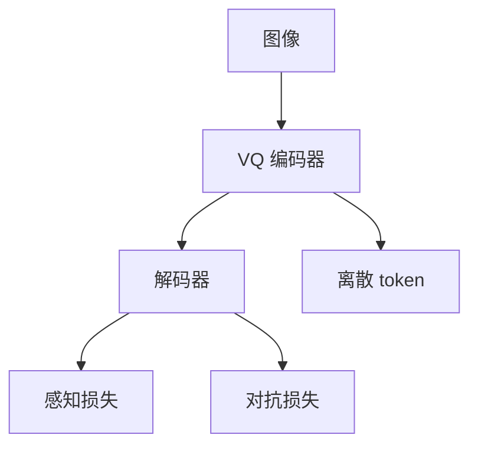

# VQGAN

同样是向量量化，解码器加上感知损失与对抗训练，重构才从「能认出」变成「能当生成器的词表」。

<footer>—— Esser, Rombach, Ommer, Taming Transformers / VQGAN</footer>

[上一课](/llm/vq-vae)的像素损失把高频细节平均掉。Esser 等人把 VQ 接到 VGG 感知距离与 PatchGAN 判别器上，得到 VQGAN。缺口是 tokenizer 的感知质量。后课 FSQ / LFQ 默认：对抗训练能锐，但不稳定、且不是唯一的量化器。

## 问题

自回归图像 Transformer 的上限受 tokenizer 重构天花板约束：LM 即使完美预测下标，解码也回不到比 VQ 解码器更好的图。VQ-VAE 的 $\ell_2$ 重构倾向模糊：像素距离在「统计相同、微观排列不同」的多个纹理解上取平均，最可防御的输出是最平的输出。VQGAN 改目标：在量化约束下最大化感知真实。感知距离把图映进 ImageNet 预训练 VGG 的多层特征，在特征空间取距离——人眼认为相同的图在特征上彼此靠近，纹理换一种微观排列不被惩罚，模糊由此换成结构对齐。对抗项补感知距离仍盖不住的一段：像不像「真的自然图像」。判别器在局部 patch 上判真伪，逼解码器把码字里没存的高频编出有统计说服力的样子。训练更脆：GAN 与码本、重构要平衡，崩了会出纹理伪影。

它仍是离散码，空间分辨率由下采样钉死，与 ViT 的 $P$ 类似，只是目标换成生成。

VQGAN 论文的另一半是在码上训 Transformer。本课只钉 tokenizer；自回归图像生成在后一单元。

## 方法

编码器/量化/解码器骨架同 VQ-VAE，总损失写成加权形式

$$
\mathcal L=\mathcal L_{\mathrm{VGG}}(x,\hat x)+\lambda\,\mathcal L_{\mathrm{GAN}}
$$

权重 $\lambda$ 不取常数，而取两项对解码器输出 $\hat x$ 的梯度范数之比，让感知与对抗的梯度落到同一量级。为什么必须自适应：判别器强弱在训练中漂移，对抗梯度尺度随之波动，固定 $\lambda$ 会让某一相独大——判别器占优时对抗项淹没重构，出纹理伪影；判别器弱时对抗项名存实亡，退回 VQ-VAE 的糊。自适应权重把这条平衡从手调超参变成逐 step 的自动配平。

码本大小与下采样是图像 token 数的来源，必须与下游 LLM 上下文一起选。验收是三道闸而不是一个分：重构 FID 给整体分，但 FID 对文字、手这类低频高权结构不敏感，要人看边缘与字形；死码率与使用熵钉码本健康——GAN 端梯度更陡，码本死锁比 VQ-VAE 来得快；不要用 ImageNet 分类准确率当 tokenizer 分：分类分高只说明语义保真，不说明纹理与布局可解码。

```mermaid
flowchart TD
  X["图像"] --> VQ["VQ 编码器"]
  VQ --> DEC["解码器"]
  DEC --> PER["感知损失"]
  DEC --> GAN["对抗损失"]
  VQ --> TOK["离散 token"]
```

## 机制

对抗项迫使解码器把码字里没存下的高频「编造」得像自然图像；感知项对准人眼敏感的特征。量化仍丢信息，编造不等于恢复真细节——OCR 与精确布局会失败。这解释了为何文档 VLM 后来常走连续视觉编码器而不是 VQGAN 码。

对抗训练的判衡在两端同时发生。判别器侧：PatchGAN 只在局部 patch 上判真伪，抓纹理统计而非全局构图——这恰好把「锐」与「构图对不对」分开，构图错误留给下游 LM 学；生成器侧：码本使用在 GAN 压力下更不均，判别器偏爱的纹理路径吸走大部分编码输出，少数码字吃掉多数分配，死码率上升，所以上一课 [VQ-VAE](/llm/vq-vae) 的手段（使用熵监测、死码重置）在这里要做得更勤。判衡失守的失败模式可辨认：纹理伪影、色彩过饱和、使用率骤降常一起出现；看到其中之一，先查判别器与 $\lambda$，再查码本。

## 边界

GAN tokenizer 训练贵、种子敏感：判衡是逐 run 的结果，超参或日程换一套，结论就换一套。下一课 FSQ / LFQ 用更简单的量化网格，减轻码本学习。

## 小结

- VQGAN 用感知与对抗把 VQ 重构拉到可生成的质量；自适应权重配平两项梯度。
- 下游 LM 的视觉上限受 tokenizer 天花板约束。
- 锐度不等于保真文字与布局。
- 出处：Esser, Rombach, Ommer, VQGAN。
