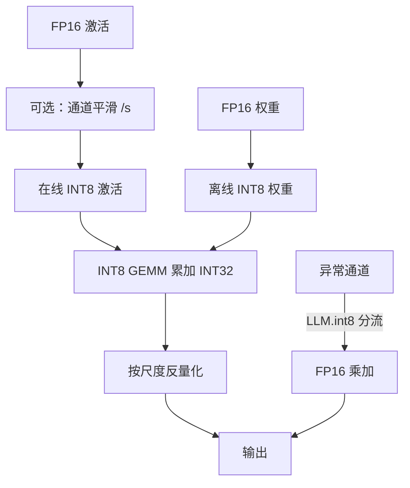

# W8A8

权重与激活都落在 8-bit 时，矩阵乘才能真正走整数 Tensor Core；只压权重而激活仍是 16-bit，省的是加载，不是算术密度。

<footer>—— 对照 Xiao et al., SmoothQuant, ICML 2023；Dettmers et al., LLM.int8(), NeurIPS 2022</footer>

量化记号 $W_xA_y$ 读作：权重 $x$ 比特、激活 $y$ 比特。W8A8 的产品含义不是「模型文件小了一半」——那只是权重侧——而是**前向里的大矩阵乘以 INT8 或 FP8 的吞吐去跑**。Prefill 长、batch 大时，算术强度高，算力墙比带宽墙更先碰到，见 [Prefill 的计算墙](/llm/prefill-compute)；这时把激活也打到 8-bit，才能吃到 [Tensor Core](/llm/tensor-core) 的整数或 FP8 管道。Decode 小 batch 时故事反过来：每步几乎只扫一遍权重，[W4A16](/llm/w4a16) 往往更划算。W8A8 与 W4A16 不是谁更先进，是激活精度换来的屋顶线切换。本篇只写 W8A8：为什么激活比权重难、两条主流解法、以及什么时候不该上它。

## 问题

一层线性 $Y=XW$。FP16 时乘加在半精度或 Tensor Core 的 TF32/BF16 管道上。要走 INT8 GEMM，必须同时给出整数权重与整数激活，累加到 INT32 再按尺度反量化。权重离线量化一次即可；激活每个 token、每个 batch 都在变，尺度要在线估或用校准统计冻结。LLM 的麻烦是激活里少数**通道异常值**：若干维度的幅度可以比中位数高一个数量级，逐张量的 max 尺度被它们绑架，其余通道等效比特远低于 8，精度先于速度崩掉。

只量化权重的 W8A16 能减加载，但 GEMM 仍按 16-bit 算，prefill 加速有限。强行对未处理的激活做 INT8，困惑度掉在「看起来像量化成功、生成已经胡言」的区间。W8A8 要解决的，是让激活的动态范围变得可 8-bit 表示，同时保持稠密整数乘，而不是退回混合精度的例外通道。

### 激活精度是屋顶线旋钮

同一套权重，激活用 16-bit 还是 8-bit，改变的是这条层落在带宽墙还是算力墙。Decode、batch=1：权重字节主导墙钟，再压激活收益小，还多一次量化核。Prefill、长上下文、大 batch：激活矩阵本身也大，$X$ 的加载与 INT8 吞吐开始值钱。所以服务栈里常见拆法是 prefill 走 W8A8、decode 走 W4A16，而不是全局一种 dtype。把「8-bit 推理」写成单一开关，会在两种阶段同时选错。

W8A8 的 8 可以是 INT8 或 FP8。INT8 要零点与尺度，硬件整数管道成熟；FP8 自带指数，动态范围更像「小浮点」，见 [FP8 推理](/llm/fp8-inference)。屋顶线论点相同：激活必须降到 8-bit，核才吃得着。不要用 FP8 训练配方直接当 INT8 推理。

## 方法

两条已经写进文献的路，对应「改分布」还是「改路径」。

第一条是离线等价变换。[SmoothQuant](/llm/smoothquant) 取正对角 $s$，令 $Y=(X\mathrm{diag}(s)^{-1})(\mathrm{diag}(s)W)$，把通道上的激活幅度压平、把难度迁到权重。权重相对平滑，8-bit 仍吃得下；然后两边做常规仿射 INT8。变换可以融进 LayerNorm 或上一层输出，推理图是标准 W8A8 GEMM。校准只用来估 $\max(|X_j|)$ 与超参 $\alpha$，不回传。

第二条是在线分流。Dettmers 等人的 LLM.int8() 发现异常值集中在少数特征维，把那些维拆到 FP16，其余走 INT8 向量乘，再在输出处相加。精度好，因为难通道根本没进 8-bit 格子。代价是核变成「稠密 INT8 + 稀疏 FP16」，异常通道比例一高，就退回几乎全 FP16，吞吐承诺消失。它证明了 W8A8 的精度障碍是通道结构，不是「8-bit 数学不能表示 Transformer」。

### 尺度放在哪一层粒度

逐张量一个尺度最便宜，也最容易被异常值绑死。逐 token 尺度能跟踪时间轴上的突变，decode 每步都要带。逐通道或逐 token×通道更准，元数据与反量化开销上升。W8A8 的工程往往是：权重用逐通道对称 INT8（离线），激活用逐 token 对称 INT8（在线），再靠 SmoothQuant 把通道轴先抹平，以免逐 token 仍被固定大通道支配。粒度是误差与内核复杂度的契约，换引擎不能只改权重文件。

累加必须高于 8-bit。INT8×INT8 的部分和会超出 8-bit 范围，硬件用 INT32 累加再缩放，是整数管道能准的前提。先把两边反量化回 FP16 再乘，只得到一份「看起来像 8-bit」的存储，算术密度与 FP16 相同，W8A8 名存实亡。

## 机制

INT8 格子是均匀的。激活若近似亚高斯，8-bit 的信噪比足够让一层线性的相对误差落在 Transformer 残差能吞下的范围；异常值破坏的是「近似亚高斯」这条假设。平滑是把非高斯的尾巴改写成权重侧的较大系数；分流是把尾巴留在 FP16。两者都承认：问题不在 8-bit 这个位宽，而在**共享一个尺度的那群元素是否同质**。

与 [W4A16](/llm/w4a16) 对比：4-bit 权重的误差发生在 $W$ 上，激活仍精细，decode 每步少搬一半以上权重字节；8-bit 激活的误差发生在 $X$ 上，每一层输入都有一份量化噪声，会沿深度累积。所以 W8A8 对层数深、残差尺度不稳的模型更敏感，常常要把注意力的 softmax 输入、RMSNorm 内部留在较高精度，只把 GEMM 的操作数降到 8-bit。这不是「没量化干净」，是把非线性留在浮点——Jacob 等人的整数推理理想图在 LLM 里通常只实现到线性层。

KV 缓存另算。把 K、V 存成 INT8 或 FP8 是带宽与容量问题，见 KV 量化专文；它不自动把注意力分数的 GEMM 变成 W8A8。Q 仍可能是 16-bit。不要用「模型是 8-bit」一句话同时覆盖权重、激活、KV 三张表。

### 为何 prefill 更爱 W8A8

Prefill 的 $X$ 行数等于序列长度，GEMM 接近方阵，算术强度高。INT8 Tensor Core 的峰值吞吐高于 BF16，墙钟跟算术走。Decode 的 $X$ 行数等于 batch，常常是 1，GEMM 退化成「巨大 $W$ 乘一根向量」，墙钟跟加载 $W$ 走。同一 W8A8 检查点，在 prefill 上可能显示 1.3–2×，在 batch=1 decode 上接近 1.0× 甚至变慢（多了量化核）。评测必须拆阶段，不能只报综合 tokens/s。

## 边界与工程取舍

没有 INT8/FP8 GEMM 核的设备上，W8A8 只省权重存储。NPU 与 GPU 的算子覆盖不同，见厂商栈；SmoothQuant 的 $s$ 必须能融进现有归一化，否则多一次逐通道除法会吃掉加速。校准 $\alpha$ 对 OPT 一类与对后来的 RMSNorm 模型不一定能共用，要按家族扫，不能抄论文默认。

W8A8 与 LoRA 服务：适配器若在 FP16 基座上训，接到 INT8 基座上要合并后再量化，或在量化后的数值空间里重训。多 LoRA 热切换时，基座是一份 W8A8，$BAx$ 仍常走 16-bit，输出相加。不要假设 INT8 核会自动吃掉低秩增量。

### 不要用 W8A8 去打 decode 的显存墙

显存墙的主体往往是 KV，其次才是权重。W8A8 把权重减半（相对 FP16），对 70B 有帮助，但不如 W4 来得狠，也几乎不减 KV。若产品瓶颈是长上下文槽位，应先看 KV 量化与分页，而不是把所有希望寄托在激活 INT8。W8A8 的正当目标是 **prefill 延迟与大 batch 吞吐**。

「几乎不掉点」永远带着校准域。SmoothQuant 论文在 OPT/BLOOM 上的数字，不能直接写到指令微调后的对话模型上。签字要用生成质量与领域集，和权重量化同一纪律。

## 小结

- W8A8 要求权重与激活都是 8-bit，目的是让 GEMM 走整数或 FP8 管道，而不只是缩小权重文件。
- 激活通道异常值是精度瓶颈；SmoothQuant 迁难度，LLM.int8() 把难通道留在 FP16。
- 累加要在更高精度里做；先反量化再乘不是 W8A8。
- 与 W4A16 的差别是屋顶线：prefill/大 batch 偏 W8A8，小 batch decode 偏更低比特权重。
- 非线性与注意力内部常留浮点；KV 是另一张表。
- 核、融合与校准家族绑在一起，换模型要重扫 $\alpha$ 与尺度粒度。
- 出处：Xiao et al., *SmoothQuant*, ICML 2023；Dettmers et al., *LLM.int8(): 8-bit Matrix Multiplication for Transformers at Scale*, NeurIPS 2022。
