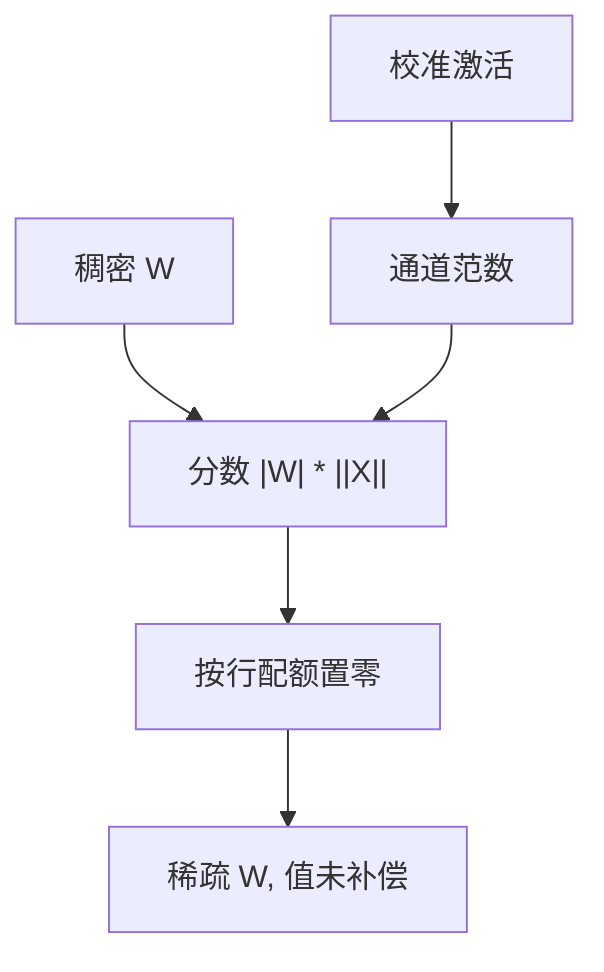

# Wanda

不必解 Hessian：权重的幅度乘上校准激活的范数，已经能给 LLM 一张够用的剪枝分数。贵的是校准前向，不是二阶补偿。

<footer>—— Sun, Liu, Bair, Kolter, A Simple and Effective Pruning Approach for Large Language Models, ICLR 2024</footer>

[上一课](/llm/sparsegpt) 把 GPTQ 的二次重建改成置零，留下的非零被 squirt 过。本课丢掉补偿，只留打分。缺口是：**一次性剪枝是否必须二阶。** Wanda（pruning by Weights AND Activations）给出更便宜的是：$s_{ij}=|W_{ij}|\cdot \|X_j\|_2$。后课 2:4 要的是分数能被 N:M 约束吃进去；本课先把无 Hessian 的基线立住。不重推 [GPTQ](/llm/gptq)。

## 问题

SparseGPT 每层要形成 $XX^\top$、做 Cholesky、按列补偿，175B 可跑，但实现重、对数值与块大小敏感。幅度剪枝 $|W|$ 完全不要校准，却会误删「权小、激活大」的连接——[非结构化稀疏](/llm/unstructured-sparsity) 已经警告过。缺口是中间物：用一次校准前向读 $\|X\|$，按元素乘到 $|W|$ 上，组内比较后置零。没有牛顿步，留下的非零就是原值。

比较必须锁稀疏度、校准条数与是否允许重训。Wanda 论文的主张是：在中等稀疏、不重训时，与 SparseGPT 接近，墙钟低一个数量级。不要把这句话外推到 2:4 加速或 90% 稀疏。

比较在输出神经元内部做：每个 row 单独按分数排序置零，避免某一行被全局阈值删光。这是结构化程度极弱的「按行配额」，还不是通道剪枝。

## 方法

对一层线性 $Y=WX$，用校准激活组成 $X$。对输入通道 $j$ 计 $\|X_j\|_2$（或均值绝对值，实现可变），分数 $s_{ij}=|W_{ij}|\,\|X_j\|_2$。每个输出通道保留分数最高的那一段，其余置零。无需迭代、无需更新留下的值。量化若还要做，应在剪完后用真实稀疏前向重校准，不能拿稠密 $X$ 去跑 [GPTQ](/llm/gptq)。

与 SparseGPT 的分工：要极高稀疏、或已经有 GPTQ 代码路径，用补偿；要快扫、要当 2:4 的打分器，用 Wanda。二者都不是 QAT。

## 机制

$|w|\,\|x\|$ 是对 $|w x|$ 的粗糙上界：激活长期大的通道，即使权重小也被保护。这与 AWQ 的「激活大则权重要更准」同一直觉，动作从改格子变成留连接。没有二阶，删掉的误差不会被邻居吸收，所以同一稀疏度下重建 MSE 通常差于 SparseGPT；下游是否可感，取决于该层误差是否被残差消化。

校准域同样决定谁被当成大激活。代码通道若没进校准，会被当成可删。签字纪律与量化退化课相同：分能力，不单看 PPL。

## 边界与工程取舍

不要期望 Wanda 的非结构掩码在 GPU 上加速。不要把「接近 SparseGPT」写成「替代 Hessian」。留下的值未被更新，不能把 Wanda 检查点当成 SparseGPT 的压缩版互相加载。下一课 2:4：把分数变成硬件认的模式。

## 小结

- Wanda：一次性、按 $|W|\cdot\|X\|$ 打分，无 Hessian 补偿。
- 便宜的是二阶，不是校准；校准域仍决定掩码。
- 中等稀疏、不重训时是强基线；极端稀疏仍看 SparseGPT。
- 按行配额不等于结构化剪枝，也不等于有核。
- 出处：Sun et al., ICLR 2024。
