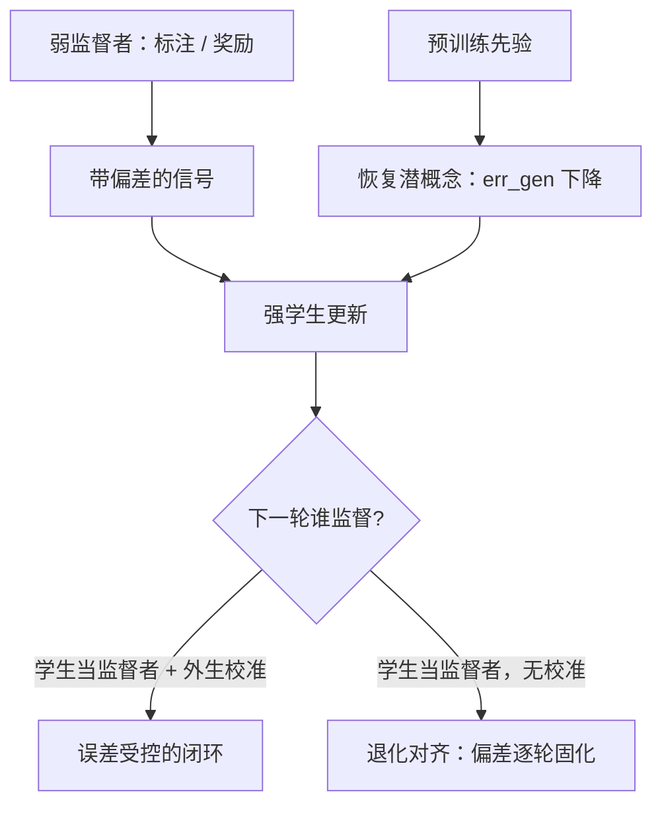
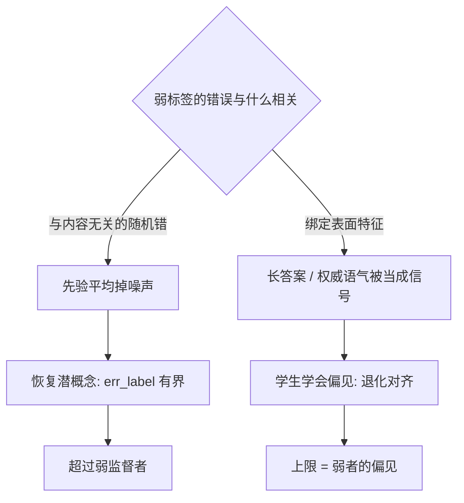

# 弱到强闭环

监督不必与被监督者一样强，但奖励里的错误不会自动蒸发；弱到强泛化赌的是强模型先验里存着正确答案的影子。

<footer>—— Burns 等, Weak-to-Strong Generalization（2023）</footer>

[上一课](/llm/self-reward-debate)的结论是循环依赖需要外生锚，但锚不一定要与选手同样强。Burns 等人 2023 年问：弱得多的监督者给强模型提供标签或奖励，强模型能不能超过监督者？这对自训练闭环是根本问题：回路里的监督者通常是上一轮的自己或同族小模型，天然弱于策略的全部潜力。本课写弱到强泛化成立的条件、它失败时的退化对齐，以及它如何收窄上一课的裁判困境——外生性不足时，监督强度问题不会消失，只会换形状。

## 问题

naive 做法直接成立吗？Burns 等人的主实验：GPT-2 级弱模型微调成标注器或奖励器，学生是 GPT-4 级预训练模型。若学生只模仿标签，上限就是弱者水平——把强模型对齐到弱者的错误上。实测学生确实超过监督者，但距强监督上限的差距很大；加一个辅助置信损失（让学生与弱者的置信结构对齐，防止过度自信地复制标签）能收回其中一部分。为什么是这样：泛化来自学生预训练先验里已经存在的潜概念，弱标签只负责指认方向。不这么做会错在哪：把「超过弱监督者」读成「对齐成功」，会漏掉学生仍大量继承标签偏差的事实。

术语翻译：弱到强泛化就是「用差老师带出好学生」。弱监督者只保证给方向大致正确的标签（还会时常标错），强学生靠预训练时已经建立的判断力把这些噪声标签「翻译」回正确概念——最终水平超过老师，但天花板仍受标签质量限制。

## 方法

把学生误差拆成两项：$\mathrm{err}=\mathrm{err}_{\mathrm{label}}+\mathrm{err}_{\mathrm{gen}}$。第一项是弱标签的系统性偏差，照抄就继承；第二项是学生从先验恢复潜概念自身的估计误差。弱到强泛化发生，当第二项的下降快于第一项被吸收；退化对齐发生，当学生把标签噪声当成要学的信号。闭环版本是把学生变成下一轮监督者：每轮的奖励质量取决于上一轮学生，没有外生校准时两类误差一起滚。可验证奖励是极限情形——[RLVR](/llm/rlvr) 的程序真值与监督者智力无关，监督强度问题在可验证域直接消失；不可验证域则必须报告弱监督与强监督两条曲线的差距，把它当残余风险。

## 机制

为什么能超过？潜概念在表示里已经线性可读时，带噪声的弱标签仍够学生把它恢复出来——先验提供容量，弱监督只提供选择。失败模式同样清楚：标签错误若与表面特征相关（长答案对、权威语气对），学生学到的恰是这些特征。退化对齐不是「没学」，是把监督者的偏见学得更瓷实：它同时解释了弱到强的上限与上一课循环依赖的成因——self-rewarding 正是弱到强退化为自我模仿的特例，监督者与策略同分布时 $\mathrm{err}_{\mathrm{label}}$ 完全由策略自己的口味构成。锚越外生，标签偏差越不受被优化对象影响，这是两条课共享的结构结论。

泛化还是退化，取决于标签错误长在哪：错误若随机、与内容无关，学生的先验可以把它「平均掉」；错误若与表面特征绑定，先验无从分辨特征与概念，照单全收。

直觉类比：一位只懂基本规则的下棋爱好者给职业棋手摆参考谱——偶尔摆错一步，棋手凭棋感仍能下得比爱好者高明（泛化）；但如果爱好者的错误有规律，比如「总把车摆在边上」，而棋手被要求严格照谱走，那棋手就会把这毛病学得比爱好者还标准（退化对齐）。区别全在错误是「噪声」还是「伪规律」。

Burns 等的弱监督者是 GPT-2 级模型微调出的标注/奖励器，学生是 GPT-4 预训练模型；naive 弱监督的学生只略超监督者，辅助置信损失在部分任务上收回可观一截差距。这不是「弱监督免费」，是「强先验垫底」。

## 边界

实验都在学生先验充足的 NLP 任务上；对长程智能体行为、学生也没见过的前沿能力，弱到强没有同等证据，辅助损失也不是通用解。方向不要与蒸馏混淆：[推理蒸馏到小模型](/llm/reasoning-distill-small)是强教师训弱学生，这里反过来——弱标签训强学生，学的是超越标签的潜概念，不是模仿教师分布。弱到强更不是替罪羊：「监督不了所以随便给奖励」只会制造退化对齐；诚实做法是把弱监督上限当公开的已知缺口，而不是宣布泛化已经替你解决。

## 小结

- 弱监督者能激发强模型，但 naive 情形离强监督上限很远。
- 学生误差 = 弱标签偏差 + 先验恢复误差；退化对齐即前者压过后者。
- 闭环里学生当下一轮监督者，误差逐轮复合，需外生校准。
- 可验证域里监督强度问题消失；不可验证域必须报告残余差距。
- 出处：Burns 等 Weak-to-Strong Generalization（2023）；对照强教师训弱学生的方向见 [推理蒸馏到小模型](/llm/reasoning-distill-small)。
